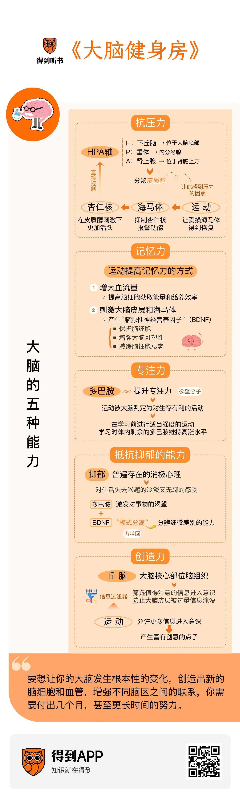
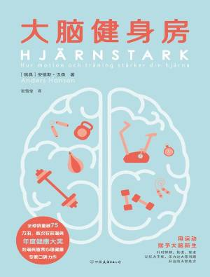

# 《大脑健身房》：体育运动如何帮你的大脑变强？

## 前言

&emsp;&emsp;你好，欢迎每天听本书，我是邓一丁。

&emsp;&emsp;我们的用户调研显示，有不少得到同学喜欢在运动的同时听书。如果你现在正好在跑步机上，那我要恭喜你了，接下来你将听到的内容会让你跑得更起劲。要是你没在运动，当然也没关系，听完今天的这本书，你可能会多一个很棒的开始健身的理由。

今天的这本书叫《大脑健身房》。一听书名就知道，这本书讲的是脑科学方面的知识。脑科学在咱们得到站内可是个热门的话题，这也不奇怪，对于一群具备科学素养，又关心个人成长的人来说，脑科学的吸引力实在是太大了。

我们的大脑真是个神奇的装置。它只有两个拳头的体积，一盒牛奶的重量，却包含了一千亿个神经元，和整个银河系里恒星的数量差不多。说我们每个人的大脑里都有一个小宇宙，一点也不夸张。从出生以来，你体验过的一切、养成的一切习惯、人格的各个方面、所有的记忆，以及学到的全部知识，包括读过的每一本书、听过的每一期听书，比如你正在听的这一期，都储存在你的大脑里。在我们已知的事物里，大脑很可能是结构最复杂的，可是它的能耗却比一只灯泡还要低。鉴于这些事实，今天这本书的作者在书的一开头就感慨地写道：“如果一个人对大脑不感兴趣，那恐怕也没有其他事情能令他着迷了。”

这本书的作者是一位瑞典的精神健康专家，名叫安德斯·汉森。他是脑科学领域很有影响力的一位科普作家。他陆续出版的几本有关脑科学的书籍在全球范围内卖出了超过300万册，在瑞典国内，差不多每十个人里就有一个读过他写的书，而其中最有影响力的就是咱们今天要读的这本《大脑健身房》。这本书在豆瓣的热门健身类图书榜上排在前十名中的第四位，也是这十本书里唯一一本讨论脑科学的。它的核心观点是一个好消息：运动能够改善我们的大脑功能。说得再直白一点，当你健身的时候，你的大脑也在变得更聪明。

这个结论乍一听有一点怪。我们今天的人去健身房里锻炼，多半是为了拥有好身材，或者增强心肺功能，提高身体的柔韧性，让自己活得更健康。要是有谁说，我去健身房是为了锻炼我的大脑，你大概会觉得这话有点莫名其妙。因为我们都知道，健身遵循的是一个“练哪儿长哪儿”的原则。你想拥有更粗壮的手臂，那就去练哑铃弯举，想拥有更挺括的肩背，那就去练引体向上，那同样的道理，要想拥有更聪明的大脑，你应该去做那些思维训练才对呀？比如去玩一玩填字游戏，做点记忆练习，填几盘数独。今天这本书告诉我们，这些所谓的思维训练，对大脑能力的提升作用非常有限。可是有意思的是，散步、跑步，以及常规的力量训练，这些看似纯粹是身体上的运动，却能够有效地开发我们的大脑功能。我们甚至可以说，***大脑是你全身的器官里从体育运动中受益最大的一个***。

具体都有哪些方面受益呢？作者安德斯·汉森在书里主要讨论了大脑的五种能力，分别是：抗压力、专注力、抵抗抑郁的能力、记忆力，还有创造力。近十几年来的脑科学研究显示，体育运动对这五种能力都有提升作用。这个结论听起来就挺激动人心的。当然，我们得搞清楚背后的科学原理。在接下来的内容里，我会分别为你说明，体育运动是如何提升这五方面的大脑功能的。由于这背后的原理各有不同，所以具体要怎么运动才能提升这五种能力，也有微妙的差别。在听书的最后一部分，我会为你整体梳理一遍书中给出的具体建议，帮你采取合适的运动方法来提升你的大脑表现。所以，真的很希望你听到最后。

好，接下来，我们就来走进《大脑健身房》。

## 抗压力

我们先来说说，运动是怎么增强大脑的抗压能力的。

要回答这个问题，我们得先搞清楚，当我们感受到压力的时候，我们的大脑里都发生了哪些事情。这涉及一种叫作“HPA轴”的调节机制。要是你熟悉脑科学的原理，那接下来这两分钟你就当是复习了。我会尽量讲得简单一点、清楚一点。

首先，什么是“HPA轴”呢？“H”指的是下丘脑，“P”指的是垂体，“A”指的是肾上腺。这三个部位在我们的身体里排列的顺序是自上而下的。下丘脑是脑组织的一部分，位于整个大脑的底部。在它下面紧挨着的就是垂体，这是一个内分泌腺。而肾上腺位于我们的肾脏上方。当你的大脑监测到一个来自外部世界的威胁，比如，有一只饥饿的狮子正向你走过来，你的下丘脑就会向垂体发出信号。垂体收到信号后，会立即分泌一种激素，通过血液传递到你的肾上腺。肾上腺就会分泌出皮质醇，让你的心脏快速、有力地跳动起来，这是为了让你的身体进入紧张状态，准备战斗或者逃跑。这整个过程发生得非常快，从你看到狮子，到心跳加速，只需要一秒左右的时间。

简单来说，肾上腺分泌的皮质醇就是让你感到压力的因素。我们刚才说的这个遇到狮子的例子，多半只会发生在史前时代的祖先在非洲草原上狩猎的时候。不过在现代世界，我们仍然会感受到皮质醇带来的压力，而且比史前时代更频繁。这是因为现代生活中，会被我们的大脑识别为“威胁”的事物更多，尽管这些事物中的绝大多数都不会真的危及我们的生命，但它们带来的压力却是实打实的。比如，贷款的压力、领导的批评、家人的催促，等等。和草原上的狮子相比，这些现代世界的压力来源还有个特点，就是它们消散的周期很长。遇到狮子，你要么打，要么跑，打赢了，或者跑掉了，危机就解除了，皮质醇不久就会降下来，让你的身心恢复到放松的状态。可是现代世界的压力来源很多都弥散在相当长的时间里，就说贷款吧，动辄十来二十年，在这期间，它会有一搭没一搭地出现在你的头脑里。尽管它没有狮子那么可怕，却好像比狮子更难缠。

咱们这么一比较，你会发现一个问题，在现代生活的大多数场景里，皮质醇其实是没必要的。当你面对狮子的时候，战斗或者逃跑，确实需要你的身体进入相当紧张的状态。可是当你想到贷款，想到下个月的一场考试、明天要做的一场当众演讲，你的心怦怦地跳起来，其实对解决问题没什么帮助，可能反倒会搅得你的头脑乱糟糟的，影响你的表现。那问题就来了，怎么才能让你的HPA轴不那么大惊小怪，别遇到点什么事都分泌那么多皮质醇呢？
其实，大惊小怪的不是你的HPA轴。我们还得再往上看一层。在我们的大脑里，有一个直接控制HPA轴的部位，叫作“杏仁核”。简单来说，杏仁核就是一个时刻处于机警状态的哨兵。当它判断我们遇到了威胁，就会释放信号，通知下丘脑启动HPA轴。到这一步还没什么，可是杏仁核有一个特点，它会在皮质醇的刺激下变得更加活跃。也就是说，当它启动了HPA轴，HPA轴生成的皮质醇又会反过来刺激它，让它更加紧张地催促HPA轴产出更多的皮质醇。这样一来，杏仁核和HPA轴就形成了一种循环发力的关系。要是我们的大脑里

只有这么一组机制，那它们就会在彼此的刺激下越转越快，直到转成一个飞轮。我们的大脑就会被皮质醇淹没，陷入越来越深重的恐惧之中。
其实，这种情况正是很多恐惧类型的心理疾病的成因。在健康的大脑里，杏仁核的报警功能必须能够得到抑制。而直接负责这项任务的脑组织就是我们的海马体。海马体和杏仁核就好比是刹车和油门，每当杏仁核警铃大作，吵着要生产皮质醇的时候，海马体就会出来安抚它，帮它平静下来。在正常情况下，海马体的安抚总是有效的。危机解除后，杏仁核就会在海马体的作用下停止报警，皮质醇也会回归到正常的水平。可是就像我们刚才提到的，现代生活的压力来源无处不在，而且持续的周期很长。在这种情况下，杏仁核报警的频率比我们的祖先生活在非洲草原上的时候要高了很多。油门不停地踩，刹车可就辛苦了。我们的海马体会在长年累月和杏仁核较劲的过程中遭到损耗。而我们都知道，海马体另有一项重要的功能，就是储存我们的记忆。这就是为什么很多长期处于焦虑状态的人会感觉自己的记性越来越差了，常常忘带东西，见到熟人也叫不出名字。其实这就是因为，他们的海马体作为杏仁核的刹车片，已经受到了磨损。
磨损的刹车片可以修复吗？这就是今天这本书要告诉我们的好消息了。实验证明，体育运动能够让受损的海马体得到恢复，并且变得更强。
在正常情况下，我们的大脑会随着年龄的增长逐渐萎缩。这个过程大致开始于25岁左右。在接下来的每一年里，大脑的体积平均会比上一年缩小0.5%—1%。海马体作为大脑的一部分，也会自然地萎缩，平均速率是比上一年缩小1%。上了年纪的人，记性越来越差，主要就是海马体的萎缩导致的。
了解了这个前提，请你听听接下来的这个实验。在2011年，美国匹兹堡大学的研究团队组织了120名55岁到80岁的被试，将他们随机地平均分为两组。其中一组要在接下来的一年里规律地进行耐力训练，也就是每周三次，每次40分钟的散步。而另一组也要以相同的频率做运动，只不过强度要小得多，运动时的心率不会有明显的波动。在这一年开始和结束的时候，研究人员分别测量了这些被试的海马体大小。他们发现，作为对照组，运动时心率不怎么变化的60名被试，海马体的体积平均缩小了1.4%。考虑到他们的年龄，这是一个正常的数值。而真正让人兴奋的是，持续做了一年耐力训练的人，海马体非但没有萎缩，反倒长大了2%！也就是说，经过一年的体育锻炼，这些人的海马体不是老了一岁，而是年轻了两岁。更有意思的是，在这60人当中，身体越强壮的人，海马体增长的幅度就越大。

这个实验做得很严谨，还上了当年美国科学促进会的年度报告。从这以后，世界各国的科研机构都做过类似的实验，实验的结果是一致的：***规律的有氧运动可以延缓，甚至是扭转海马体的萎缩***。这就有意思了，咱们刚才谈到，海马体和杏仁核就像刹车和油门。规律的有氧运动能够促进海马体的生长，这就让它可以更有效地对杏仁核发起制动。海马体越健壮，杏仁核在面对危机时就表现得越镇定。它不会过度反应，产出多余的皮质醇让人陷入压力之中。这就是运动提高抗压能力的原理。我们常说那些顶尖的运动员拥有一颗“大心脏”，即便在世界级的赛事上打到了关键分，也不会心慌手抖，造成失误。其实，从脑科学的角度讲，说他们拥有“大心脏”并不贴切，更合理的说法是，他们脑中的“大海马体”赋予了他们临危不乱的能力。

## 记忆力

既然聊到了海马体，咱们接下来就说说记忆力。

海马体是大脑里的记忆中心。运动能够促进海马体的生长，这对我们的记忆力当然是件好事情。但这还只是运动提高记忆力的多种方式中的一种。

除此之外，运动至少还能从两个方面帮我们记住新东西。首先，运动会增大单位时间内通过大脑的血流量。这就意味着脑细胞可以更高效地获得能量和给养，处理信息的效率也会更高。不过这里我得提醒你注意，要想让大脑进入这种活跃的状态，你需要把运动强度控制在一个合理的范围内，不宜过强。如果你选择的是大重量的力量训练，也就是健身中用来增加肌肉维度的那一类，那当你举铁的时候，你的血液就会更多地流向发力部位的肌肉，流经大脑的血流量反倒会减少。这就起不到增强记忆的作用了。

除了增大血流量，运动还会在我们的大脑中产生一种非常有益的效用，这就是刺激大脑皮层和海马体，制造出一种神奇的蛋白质。这种蛋白质叫作“脑源性神经营养因子”，英文缩写是“BDNF”。这些名词听着怪吓人的，你别担心，咱们不会深入生物化学方面的细节。你只需要知道，BDNF是个好东西，对我们的大脑有多方面的好处。比如，它可以保护脑细胞，尤其是新生的脑细胞，避免它们受到有害物质的伤害，还能让它们在大脑缺氧或者低血糖的状况下存活下来。它还能增强大脑的可塑性，减缓脑细胞的衰老。《大脑健身房》的作者说，我们可以把BDNF想象成一种“大脑的自然肥料”，它的功能很全面，在大脑的许多活动中都扮演着重要的角色。

在记忆力方面，BDNF也发挥着关键的作用。要明白这一点，我们首先得搞清楚大脑构建记忆的方法。这里我们少说点脑科学的术语，我试着打一个比方：如果我们把大脑想象成一片浩瀚的宇宙，其中的每一个脑细胞就好比一颗恒星，而记忆的片段就好像是这些恒星连成的一个个星座。当我们需要调用一段记忆的时候，脑海中的某一个星座，也就是脑细胞连成的一张立体的网络，就会被激活，存储在其中的信息就能够被我们提取出来。

有意思的是，在我们的大脑中，用于存储记忆的细胞网络往往并不稳固。我们需要通过学习和训练不断地巩固这些网络，细胞间的连接才会逐渐稳定下来。而在这个过程中，BDNF就好像是一种有力的黏合剂。它能在脑细胞间建立牢固的连接，帮我们在构建记忆的过程中事半功倍。

明白了这个原理，我们来看一个实际的应用。在书里，作者安德斯·汉森提了一个有趣的问题：跑步能帮你把钢琴弹好吗？这个问题乍一听有点无厘头，但是现在，你知道了BDNF的作用原理，也就会明白，***在学习任何一种新知识、新技能之前，适量的运动都有助于提高你的学习效率***。因为运动会帮你准备好用于构建记忆的BDNF。我说一个有点傻的比喻，这就好比在砌墙之前先和好了水泥，当你做完了运动，开始学习的时候，面对成堆的知识的砖块，也不会感觉无所适从了。

## 专注力

说完了运动对记忆力的好处，接下来我们再来看看，运动如何影响我们的专注力。

这方面的脑科学原理，要比前面提到的那些简单一点。一句话来概括，***运动会产生多巴胺，多巴胺可以提升专注力。***

多巴胺可能是人体的激素当中最有名的一种了。关于多巴胺，得到听书解读过一本《贪婪的多巴胺》，书中系统地讲解了多巴胺作用于人体的生理机制，还谈到了多巴胺对个人和人类社会的影响，感兴趣的话，欢迎你去听一听。《贪婪的多巴胺》这个书名很能说明问题。多巴胺本质上是一种“欲望分子”。它会让我们对高热量的食物，以及异性之类的对象产生渴望，而我们渴望的东西多半对我们的生存和繁衍有利。

那这里就有一个问题，运动为什么会产生多巴胺呢？表面上看，运动会消耗我们的体能，还会增加我们受伤的概率，似乎对生存有害无利，多巴胺为什么要奖励这种行为呢？《大脑健身房》的作者解释说，这可能是因为，运动是我们的祖先探索世界的方式。生活在史前时代的人可没有我们今天这样便利的条件，饿了点个外卖，食物就会送上门来。他们必须长途跋涉，在茫茫的草原上寻找猎物，找到之后，还得使出浑身解数，把猎物制服，这才能有东西可吃。在这种生存方式下，诸如长途奔跑还有搏斗这类的运动就被大脑判定成了对生存有利的活动。尽管今天，我们运动已经不再是为了狩猎，很多时候反倒是为了消耗掉对生存十分宝贵的脂肪，但我们的大脑还没有反应过来，仍然在我们运动的时候和肾脏一起分泌多巴胺，鼓励我们跑得再快一点。

那多巴胺和专注力之间，又有怎样的关系呢？其实在运动的例子里，你已经看出来了，分泌多巴胺的细胞就像是我们身体里的一支啦啦队，当它为我们加油鼓劲的时候，我们就会对手头的事情欲罢不能。这时候，我们的专注力当然就很强。但这支啦啦队有它自己的喜好，它只会为它感兴趣的事情摇旗呐喊。如果它判定，我们在做的事跟生存和繁衍没什么关系，它就会失去兴趣，变得士气低落。这时候，听不到啦啦队的呼声，我们的大脑就会对手头的事情失去干劲，转而去寻找其他的事情，以便重新获得啦啦队的关注。这时候，我们的注意力就会变得涣散，开始走神了。

那问题就来了，像读书、学习这类的事，啦啦队很多时候是看不懂的。我们怎么才能在这些事情上保持专注呢？这时候，运动给我们提供了一个方案，它能帮我们提前造个势。分泌多巴胺的细胞喜欢看到我们做运动，所以我们可以在学习之前，先给它们“表演”一段。这时候的运动可以适当上点强度，让你的大脑和肾脏分泌更多的多巴胺。等我们坐下来，开始学习的时候，身体里的多巴胺还有很多没被消耗掉。我们的大脑还能听到响亮的掌声和欢呼声，这就让它对眼前的任务干劲十足。只要你运动得足够充分，你身体里的多巴胺可以连续几个小时维持在高涨的水平，在这段时间里，专注学习对你来说就不是什么难事了。

## 抵抗抑郁的能力

理解了前面这些原理，现在我告诉你，运动还能帮我们抵抗抑郁，你应该也不会感到意外了。

抑郁是现代人中间相当普遍的一种消极心理。它倒不见得会伴随着悲伤、愤怒这类强烈的负面情绪。更多时候，抑郁是一种对生活失去兴趣的冷淡又无聊的感受。什么东西能激发我们对生活的兴趣呢？从脑科学的角度，我们刚才已经提到了两种，多巴胺和BDNF。

多巴胺是“欲望分子”，它能激发我们对某些事物的渴望，这倒不奇怪。BDNF为什么也能发挥类似的作用呢？

这就要说到一种有意思的脑科学原理，叫作“模式分离”。这个词听着挺唬人，其实说的事情很简单。所谓的“模式分离”，就是分辨细微差别的能力。在今天这本书里，作者举了一个这样的例子：有一天，你去参加一场酒会，酒会上有个人让你觉得很面熟，你几乎可以肯定，你之前见过他一两面，却又怎么都想不起来他到底是谁。

他到底是谁呢？当你琢磨这件事的时候，你的大脑正在把这个人的面孔和你记忆库里的每一个相似的人进行比对。这时候，发挥关键作用的是海马体里的一个部位，叫作“齿状回”，也就是牙齿形状的一个突起。齿状回最擅长的事情就是模式分离，也就是发现相似的事物之间微小的差别。你小时候可能玩过一种游戏，要从两幅几乎完全一样的画面上找出几处不同的地方，当你玩这类游戏的时候，你的大脑里最活跃的部分，大概就是齿状回了。

之所以谈到齿状回和它进行模式分离的能力，是因为抑郁症患者恰恰缺少了这种能力。在抑郁症患者的眼里，周遭的世界变得沉闷而灰暗，好像糊成了一团。这正是因为他们齿状回的功能发生了退化，难以注意到事物之间微妙的差别。怎么才能让他们的齿状回恢复活力呢？咱们前面提到了，运动产生的BDNF可以有效地促进脑细胞再生。当BDNF作用于海马体的时候，齿状回会迅速回应BDNF的刺激，生成新的脑细胞。抑郁症患者的模式分离能力也会重新变得敏锐起来。***他们会再次看到世间万物丰富多姿的样子，这对他们走出抑郁症是很有帮助的。***

## 创造力

最后，咱们再来说说，运动如何提高大脑的创造力。

这方面的例子，你可能已经听过不少了。日本作家村上春树就写过一本书，《当我谈跑步时我谈些什么》。在这本书里，村上春树分享了他在写作一本书期间的作息安排。他会在凌晨4点起床，工作到上午10点，吃过午饭后，他会跑10公里，接着游泳。等他做完了运动，在这一天剩下的时间里，他会阅读和听音乐，然后在晚上9点准时上床睡觉。他相信，规律的运动能帮他保持体能，并给他带来创作的灵感。

村上春树的经验当然不是个例。许多从事创意类工作的成功者都相信，在运动中，他们能想出更多的好点子。爱因斯坦、贝多芬、达尔文、康德，这些不同领域的顶尖思想者都有长途散步的习惯，并且都在散步的过程中产生了极具创意的想法。在距离我们更近的时代，乔布斯开创了苹果公司步行会议的传统，脸书的创始人扎克伯格和推特的创始人多尔西也都借鉴了这种做法，他们都觉得，边走边开会，效率会更高。

像散步这类的运动真的能提高我们的创造力吗？斯坦福大学的一项研究证实，确实如此。他们对176名被试进行了分组实验，结果显示，经过一段时间的散步，人们提出创意性的想法和进行头脑风暴的能力提升了60%。这背后的原理是什么呢？目前，脑科学家们提出了一个值得进一步验证的猜想。他们猜测，运动可以改变丘脑的工作方式。

丘脑是一个非常重要的脑组织，位于大脑的核心部位。它的作用是充当信息的过滤器。当外部世界的信息通过我们的感官传递到丘脑时，丘脑会从海量的信息中筛选出值得我们注意的一小部分，允许它们进入我们的意识。这一层筛选是很有必要的，它可以防止我们的大脑皮层被过量的信息淹没，陷入宕机。可是在运动中，丘脑过滤信息的尺度似乎变得开放了一点。它会允许比平时更多的信息进入我们的意识，很多富有创意的点子就这样产生了。目前，运动究竟如何影响了丘脑的工作方式，这个问题还处在探索的阶段，等到脑科学在这方面取得了新的进展，我再来向你汇报。

## 结语

好，到这里，这本《大脑健身房》的核心内容，我就差不多介绍完了。本期听书的结尾，我不打算重复前面讲过的脑科学原理，咱们来做一个更实用的总结。我从书里找到了下面这几条具体的实操建议，希望能帮助你用最适合大脑的方式进行体育锻炼：

1. 要想真正体验到运动对大脑功能的提升，你每次锻炼的时间必须超过30分钟，45分钟是一个比较合适的时长。
2. 理想的锻炼频率是每周三次。
3. 运动时必须保证你的心率加快。仅就改善注意力而言，你的心率应该达到自身极限值的70%—75%。这里有两个参考值，对于40岁左右的人，运动时的心率不应低于每分钟130—140次；对于50岁左右的人，心率也不应低于每分钟125次。
4. 你要做的是有氧运动。力量训练对大脑也有一定的好处，但研究的结果还不明朗。咱们今天提到的五种大脑功能，主要都是靠有氧运动来提升的。
5. 避免做强度过大的运动。如果你在运动后感到非常疲惫，你的记忆力和创造力也不会有明显的改善。
6. 最后，运动需要长期有规律的坚持。要想让你的大脑发生根本性的变化，创造出新的脑细胞和血管，增强不同脑区之间的联系，你需要付出几个月，甚至更长时间的努力。现实一点讲，保持每周三次的运动频率，坚持六个月以上，你很可能会体验到大脑功能的改善。

最后，祝愿你从运动中收获乐趣、健康和智慧。

以上就是本期听书的全部内容。你可以点击音频下方的“文稿”，查收我们为你准备的全文和脑图。你还可以点击右上角的“分享”按钮，把这本书免费分享给你热爱运动的朋友。恭喜你，又听完了一本书。

撰稿：邓一丁
转述：邓一丁
脑图：刘艳思维导图工坊

## 源文

> 来源（得到听书文稿）
>
> - 《大脑健身房》：体育运动如何帮你的大脑变强？：[链接](https://www.dedao.cn/share/packet?packetId=42WwaGbxlzrbL5J3UnVLT8znkq97VXRB&uid=bAoFoz2zVkga9OLUUuPI_g&trace=eyJzX3BpZCI6IjY2MjMiLCJzX3B0eXBlIjoiMTMiLCJzX3VpZCI6Mjk4ODg2ODR9)

电子书
