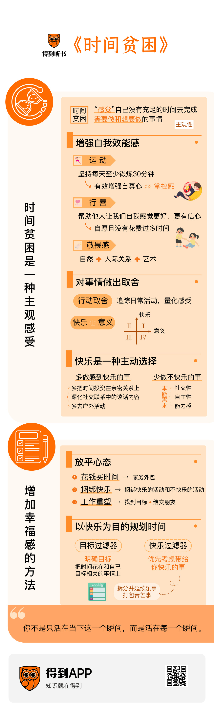
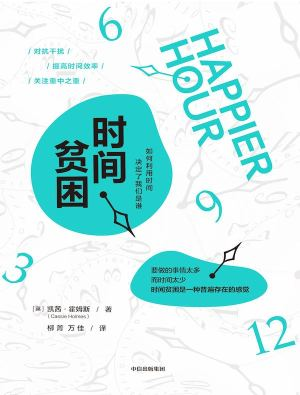

# 《时间贫困》：现代人缺乏幸福感的根源，是没有属于自己的时间

## 前言

你好，欢迎每天听本书，我是于理。今天我要为你解读的书叫《时间贫困》，是2023年12月出版的一本书。“时间贫困”这个名字是什么意思呢？它指的是一种没有自己的时间的感受，这种感受我相信大家都不陌生。现代人早晨被闹钟叫醒后就忙着洗漱、吃早饭、上班，下班后经过漫长的通勤回到家，可能还要处理各种琐事。如果是家长的话还要照顾孩子、辅导孩子功课、哄孩子上床睡觉。不知不觉时间就来到深夜了，躺在床上，我们享受着难得的属于自己一个人的时间，有时甚至不舍得睡觉。`感觉没有属于自己的时间就是时间贫困，而它让我们的生活缺乏幸福感`。

在写这本书之前，作者也苦于这种时间贫困的感受中。作者叫凯茜·霍姆斯，加州大学的管理学教授。作为一名教授加上四个月大孩子的妈妈，作者每天的日子都极其繁忙，每分每秒都在和时间赛跑，她感到非常疲惫，甚至想干脆辞职了事。但在这之前，作者想搞清楚一件事，那就是如果她辞掉工作，拥有大把的闲暇时间后，她真的会对生活更满意吗？

为了搞清楚这件事，作者和团队一起建立了一个数据库，记录了数万美国人一天的生活和他们的生活满意度。借助这些数据，作者想知道人的日均可支配时间和幸福感之间的关系。这个日均可支配时间，指的是做自己想做的事情的时间，包括放空、看电视、运动、和家人散步等等，不包括做家务、跑腿、就诊之类的必要事务。**结果发现，如果一个人日均可支配时间少于 `2小时`，那么他的幸福感就会比较低**。但另一方面，**如果日均可支配时间太长，超过 `5个小时`，人的幸福感也会降低**。可见，太忙、太闲都不是件好事，太忙碌会让人陷入时间贫困的苦闷感，而太闲也会让人缺少目标感和成就感。也就是说，每天能有 `2—5小时的可自由支配时间，是最幸福的状态`。

于是，作者认识到，辞职不一定会给她带来快乐。同时，每天给自己2小时的可支配时间，对作者来说是完全可实现的，她不需要为此做出辞职这样巨大的改变。其实对大多数人来说，每天拥有2小时的可自由支配时间，并不是一件特别难的事情。可见，时间贫困可能是一种主观上的感受。排除时间太多和太少的极端情况，想要在生活中获得更多满足感，重点不在于我们拥有的时间长短，而在于我们如何利用已有的时间。

多年来，作者进行了十几项研究，探究幸福感与金钱和时间的关系，结果都是一致的，那就是不管一个人拥有多少时间或金钱，更重视时间的人更幸福。因此，作为一名商学院教授，作者改变了她的教学内容，从对金钱和利润的关注转向了幸福感，并开设了一门叫“如何将幸福科学运用于人生设计”的课程，她的学生们也称她为“幸福教授”。在这本书里，作者分享了她这些年来教授幸福科学的经验，教我们怎样充分利用时间。这本书是一本讲时间管理的书，但它的目标不是提高生产力，而是提升幸福感。

在接下来的解读中，我们首先来仔细分析一下时间贫困这个概念，聊聊时间与幸福感之间的关系，然后我们再来谈谈如何充分利用时间，如何放平心态做那些不得不做的事情，如何以快乐为目的来规划时间。在书中，作者给出了很多实用的方法，在解读中我也会一一和你分享。

好，下面，我们就正式进入这本书。

## 正文

### 时间贫困是一种主观感受

我们刚刚说到，时间贫困，是“感觉”自己没有充足的时间去完成需要做和想要做的事情。在这句话中，有两个部分是有主观性的，一个是“感觉”，是在已有的时间内，你完成所有事情的信心；另一个部分是你想要做的，以及你认为自己需要做的事情。

我们先来分析一下第一部分：在已有时间内，你完成所有事情的信心。每个人每天都有24小时的时间，这是客观规律，但每个人对时间的感受是主观的。两个小时在有的人眼里很长，在有的人眼里就很短；有的人对于今天能完成所有任务充满信心，有的人则总是感觉时间紧巴巴的。在心理上，这被称为“**自我效能感**”，它指的就是你相不相信自己能有效地完成所有事情。研究表明，当人们自我效能感更强时，他们也会认为自己拥有更多时间。简单来说，增强自我效能感，是减轻时间贫困感的方法之一。

那么，有**哪些办法能增强自我效能感呢**？

在书里，作者给出了**三个方法**。

**第一个方法，是运动。** 很多人都有运动的习惯，但当生活变得忙碌时，运动是最容易被我们丢弃的一项活动。作者就因为生活太过忙碌，考虑过要不要把晨跑项目取消掉。但最终作者决定保留晨跑活动，并且把起床的闹钟提前了30分钟。通过晨跑，作者的一天可以直接进入忙碌和兴奋状态。跑步时，她也会感到更自信，相信自己能高效地搞定今天的一切任务。实际上，运动才是那个你不应该舍弃的活动。有研究表明，运动能有效地增强人的自尊心，不仅仅是对自己身材的自尊心，它还能让你更加自信，对生活更有掌控感。所以，作者的第一个建议就是坚持每天至少锻炼30分钟，除了在健康上的好处之外，它能让你觉得自己拥有的时间变多了，你起码能在这30分钟内，做自己身体和时间的主人。

**第二个增强自我效能感的方法，是去帮助他人。** 这一点乍一听有点玄，帮助别人为什么会让我觉得自己时间变多了呢？当我们感到时间贫困时，我们通常会放弃花在别人身上的时间。作者团队做了一项实验，向100多名参与者随机布置了两项任务，一些人要在晚上10点之前，花30分钟为别人做一件事，另一些人则用这30分钟为自己做一件事。随后，作者进行了跟进调查，了解每个人如何利用这30分钟，以及他们感觉自己时间的充裕程度。在把时间花在别人身上的人中，有的人选择为爱人做一顿晚饭，有的人铲掉了邻居家门廊上的雪，有的人帮朋友照顾了宠物。在那些把时间花在自己身上的人中，有的人做了个精致的身体护理，有的人看了半小时电视。结果发现，那些把时间花在他人身上的人，感觉自己的时间要更充裕。随后作者又采取了更严格的标准设计了其他实验，结果也是如此。我们直觉认为，把时间花在自己身上会让我们感觉时间更充裕，但实际上把时间花在他人身上反而能增强自我效能感，或许这是因为它能让我们自我感觉更好、更有信心。当然，前提是你是自愿的，且没有花费过多时间。所以，你也可以试试这样的办法，抽出半小时时间给朋友打个电话，关心他的近况，或者花上几秒钟为后面的人扶一下门，我们不仅会感到更幸福，还会觉得时间更充裕。

**增强自我效能感的第三个办法，是敬畏感。** 所谓敬畏感，是一种当你接触到某种盛大的事物时所产生的感觉。有研究发现，敬畏之心会让人们感到自己的时间变多了。因为在一些产生敬畏感的时刻，我们会感觉没有任何事情能限制住自己，那些日程表上的琐碎之事也不再重要了。敬畏感的一种比较常见的来源，是自然。当我们看到壮丽的自然景观，比如壮阔的山河、无垠的大海、炫目的极光时，我们会油然生出一种对自然的敬畏感，那些平凡琐事似乎都烟消云散了。当然，我们不是每天都有机会去旅行，也不是住在国家公园里，但我们依然可以想办法到户外去，比如周末去徒步、爬山，比如在家附近的公园散散步，又或者只是驻足欣赏一会儿日落时的霞光，偶尔抬头看看月亮，这也能让你感到不那么匆忙。

除了自然，敬畏感还可以来源于和他人之间深刻的联系，比如温柔的身体接触，比如一场深度的对话，比如轻轻抱着一个婴儿。人际关系也能让我们超越自身的界限，与他人的感情和思想相连接。你**还可以从艺术中寻找敬畏感**，_去听音乐会，去看艺术展，美好的艺术也能让你获得忘我的体验_。这也是艺术存在的意义之一，让身处平凡生活中的我们，也能偶尔从他人的创造力中获得超越平凡的感受。

**运动、行善和敬畏感**，都能增强我们的自我效能感，减轻我们时间贫困的感觉，这是我们要聊的时间感中的一个主观成分。另一个主观成分，是我们如何决定自己想要做和需要做的事情。在有限的时间里，我们需要对事情做出取舍。那么，我们可以做的，就是去定位哪些活动能真正给自己带来快乐，而哪些活动不值得浪费时间。

在书中，作者建议我们花上两周时间，追踪我们的日常活动和感受。你可以**制作出一个详细的活动追踪表**，具体到每天的每个小时，你都在做什么事情，并且量化这件事给你带来的感受。通过这个表格，你可能会发现自己在某些没那么重要的事上浪费了太多时间，比如刷短视频，或者打游戏。同时，你也能通过这个表格找到真正快乐的事。很多研究者都用过这种方法，比如诺贝尔经济学奖获得者、《思考，快与慢》的作者丹尼尔·卡尼曼。他带领团队做了一项著名研究，追踪了约900位职业女性一天中的情绪起伏。结果发现，**人们在有_身体上的亲密接触，或者和朋友、家人交往_时感到最快乐，而那些占据了我们一天中大部分时间的活动让人们_感到最不快乐，比如通勤、上班和做家务_**。

不过，卡尼曼团队只关注到了“快乐”这一个维度。作者提醒我们，我们还需要关注的另一个维度是“意义”。有时，快乐不只是即刻的享受。爬山的过程可能是痛苦的，但你也能从中获得乐趣；学习的过程可能是痛苦的，但你能从中收获意义。所以，我们可以建立起一个这样的坐标轴，横轴是意义，纵轴是快乐，这样我们**每天做的事情可以划分为四个象限**，**第一象限是快乐且有意义的事，比如冥想、锻炼、社交、亲密行为**；第二象限是快乐但相对来说无意义的事，比如看电视、进食；第三象限是无意义且不快乐的事，比如购物、回邮件、做家务、通勤；第四象限是有意义但不快乐的事，比如上班。值得注意的是，以上这些结果是研究人员对一部分人群调查后得出的结果，并不代表每个人对这四个象限的划分都是如此。重要的是你要找到属于自己的那个坐标系，并且把时间更多地投资到那些既快乐，又有意义感的事情上。

从世界各地关于幸福的研究成果中，我们能得到一些启发。
**首先，快乐是一种主动选择**，你要多做那些让你感到快乐的事。**比如**，多把时间投资在亲密关系上。如果你愿意花点时间回顾一下过去的两周，你会发现你最快乐的时刻中，至少有一次是和你在乎的人一起度过的。亲密关系是快乐的必要条件，有朋友并不能百分之百保证你会快乐，但要想变得快乐，你需要朋友。**再比如**，在社交联系中深化谈话内容。亲密关系加深的一个重要特征，是双方的自我表露不断升级。和朋友插科打诨固然能让人放松，但深度的对话和自我表露，能让关系更亲密且有意义。最后，多去户外。有一项关于地理位置的研究，调查了2万名英国人的快乐程度和他们的即时位置之间的关系，结果发现人们在户外时更快乐。可惜的是，现代人一天中大约85%的时间都是在室内度过的。我们能做的，**是尽量把一些活动挪到户外，比如比起在健身房里跑步，就不如去户外跑步，这样你的心情会变得更好**。
除了多做那些让你感到快乐的事，你也要少做那些让你不快乐的事。我们有三种本能的需求，分别是**社交性、自主性，以及感觉自己有能力**。如果一项活动阻碍了其中任何一种需求，都可能会让你感到不快乐。比如我们有自主性需求，需要在生活中感受到掌控感，所以我们就不喜欢由别人告诉我们应该做什么，而是想要自己支配时间，这也是为什么工作、家务会让我们感到不快乐。但现实情况是，我们不能随心所欲，我们不得不去做一些没有幸福感的事情。那么，我们要怎样放平心态去做这些不得不做的事情呢？

### 怎么放平心态做那些不得不做的事情

对于这个问题，作者给了我们一些建议。
**第一个建议，是花钱买时间**，比如把能外包的家务活外包出去。很多人可能会觉得把自己也能做了的家务外包出去是浪费钱，但作者指出，这可能是因为他们还没意识到这么做的话，他们能把腾出来的时间花在更有意义的事情上。如果你确实有闲钱能把一些家务外包出去，就能增加自己的可支配时间，幸福感也会提高。
作者给出的**第二个建议，是捆绑快乐**，意思是说，把你不喜欢的活动和一些你喜欢的活动捆绑在一起，这能让你在做不喜欢的事情时没那么痛苦。如果你每天都要在通勤上花很长时间，那么你_可以利用这个时间听书、听播客，或者带本书上地铁_。很多人现在就是这么做的，比如我猜听到这里的你，就可能在通勤的路上。如果你住得离公司不远，能走路或骑车去上班，那你的通勤时间还能和户外锻炼的快乐捆绑在一起。有时，_下班后，听着音乐、溜达着走路回家，也是一种享受_。再比如，做家务的时候，你也可以打开音响，边听音乐边叠衣服，或者给朋友打个电话聊聊天。捆绑快乐，是一种非常有用的做法。家务、通勤上的时间不能白白浪费掉，只要多花一点心思，你就可以把这些看似浪费掉的时间变成一种享受。
**第三个建议，是工作重塑**。要知道，对很多人来说，没有幸福感但不得不做的事情之一，就是工作，很多人不喜欢自己的工作。但现实是，工作占据了我们生活中的绝大部分时间，我们得想办法让工作时间变得快乐一些。有什么办法呢？

没有完美的工作，但如果你能把你的工作和你的价值观、你的优势、你的爱好中的任意一个结合起来，你就会更有动力，对工作和生活的总体满意度也会提高。所以，你要去思考的一个问题，就是你为什么要从事现在这份工作？我们在这里说的工作是广义上的工作，是你投入时间、精力和才能的领域。如果你的回答是“为了赚钱”，作者建议再去找一个更高层次的目标。`有研究曾调查过不同职业、不同职级和不同收入水平的员工，发现那些把赚钱视为首要目标的人对工作和生活的整体满意度更低`。意义和幸福感紧密相连，我们要给自己的工作找到一个意义，比如创造，比如学习，比如帮助他人。深入挖掘你的答案，有一个方法是问自己五遍“为什么”。你为什么要从事现在的工作？为什么它是重要的？你为什么在乎这一点？这样一层层不断地问下去，你就能知道你现在这份工作，或者你想要去做的工作的根本原因，这就是你的目标。

除了找到目标之外，**让工作变得更快乐的另一个方法是结交朋友**。盖洛普调查中有这么一个问题：“你在工作中有最好的朋友吗？”这个问题乍一听有点幼稚，但它其实很有深度，根据人们对这个问题的回答，研究人员就能预测他们的快乐程度。盖洛普分析显示，在美国，只有五分之一的员工在工作中有一位好朋友，而这五分之一的人对工作的投入程度是其他人的两倍多。虽然人们常说，不能在工作场合付出真心，但作者不认同这一观念。作者指出，人们一天中最不快乐的时间是工作时间，最快乐的时间是社交时间，那么我们就需要在工作时间内开展一些人际交往活动，中和工作的痛苦。因此，作者建议我们在工作中多交朋友。

### 如何以快乐为目的规划时间

好了，到这里，我们深入分析了时间贫困的概念，也给出了一些增加幸福感的方法。接下来，我们就来聊聊，如何**规划时间、制定计划**。我相信，我们很多用户都听过不少从提高生产力的角度讲时间管理的书，今天我们放松一下，从快乐的目的出发，来谈谈规划时间的方法。

首先，我们来听一个故事。一位教授把一个透明的大罐子放在讲台上，然后倒进了一盒高尔夫球，他问学生：“罐子满了吗？”学生们看到最上面的高尔夫球已经挨到了罐口，纷纷点头说：“满了。”教授接着拿出了一些小石子，放进了罐子里，小石子填满了高尔夫球之间的缝隙。教授又问：“现在满了吗？”学生们点头说：“满了。”接着，教授又拿出了一罐细沙，又倒进了罐子里，接着问：“现在呢？满了吗？”学生们纷纷点头，也理解了教授的意思。罐子这次真的满了，教授的演示似乎也该结束了，但他又拿出了两瓶啤酒。看到这里，全班都笑了。教授把啤酒倒进了罐子里，并且向学生们解释道：“这个罐子代表你的生活，高尔夫球代表着重要的事，比如你的家人、朋友、健康。小石子是另一些重要的事，比如事业、爱好。沙子是其他小事。如果你先把细沙倒进罐子里，就没地方放高尔夫球和小石子了。`人生也是如此，如果你把所有精力和时间都花在小事上，你就没有时间做真正重要的事。一定要先放最重要的高尔夫球，因为除了最重要的事情，其他事情都如细沙般渺小。`”这时，有个学生举手提问：“教授，那啤酒代表什么呢？”教授笑着回答说：“啤酒代表的是，无论你的生活看起来多么忙碌，总有跟朋友一起喝上几杯的时间。”

我们拥有的时间和罐子一样有限，所以我们要警惕细沙陷阱，把时间花在真正重要的事情上。有两个方法，一个是用目标过滤器过滤掉沙子，明确自己的目标，把时间花在和自己目标相关的事情上。有些和自己目标无关的事，我们该拒绝就得拒绝。人都有过度承诺的倾向，当有人问你：能帮我个忙吗？你能在这个小组会议上发言吗？你能协调我们下个月的活动吗？我们很容易同意。直到回过神来，才发现自己被各种琐事淹没了。有研究就调查过人的过度承诺倾向，并且发现，每个人都觉得自己下个月的空闲时间会比现在多，然而事实并非如此。我们会因为事先答应别人的请求，而承诺超过自己能力范围的事情。一个简单的解决办法是，牢记你储时罐的空间是有限的，在给出答复前谨慎考虑。

另一个过滤器是**快乐过滤器**，我们在前面已经追踪出了那些让自己快乐的事情，那么我们就要在规划时间时优先考虑它们。如何享受生活？很简单，就是优先考虑带给你快乐的事。`快乐不是我们的本能，它是后天主动管理的能力`。人的本能是生存，并不是追求快乐。在行为决策领域，大部分研究都在教人们如何延迟满足，但有人可能陷入相反的困境，总是牺牲眼前的快乐。研究者称之为“远视现象”，只选未来不顾现在。把苹果当零食确实比巧克力更健康，但如果你每次都选苹果，你就永远吃不到巧克力了。所以，快乐是一种主动选择，我们要主动给自己制造快乐。

好，接下来我们就可以**开始制作自己的周计划表了**。在周计划的画布上，
第一步是安排固定活动，比如上班、通勤、接孩子上下学，这是时间固定的必做选项。
第二步，就是我们上面说的，优先安排快乐日程，比如你要给自己的兴趣爱好安排时间。
此外，你还要给自己留出一些随意支配的时间，特别是对于需要照顾孩子的父母来说，一些属于自己的时间非常重要。父母早上要帮孩子穿衣服、给孩子做早饭、送孩子去上学，有的父母可能会分工合作，而作者和她丈夫采取的方法是“早晨离岗”，把工作日的早晨均摊，各自负责几天，每天有一个人“在岗”，一个人“离岗”。“离岗”的那个人的早晨就是完全属于自己的，他也不能干预另一方照顾孩子的方式。有自己的时间和空间是非常重要的，不要因为拥有自己独享的时间而感到内疚。只有照顾好自己后，你才能照顾好所爱的人。飞机上戴氧气面罩的顺序就是最好的例子。在给孩子戴上面罩之前，大人们得先给自己戴上面罩。

在你安排自己的计划表时，**还有一些小技巧**。一个小技巧是拆分并延续乐事。人们有享乐适应的倾向，一件让人快乐的事也有它的有效期，比如吃蛋糕的时候，第一口总是最美味的。所以，你可以把一些快乐的事情拆开，分散到一周中的不同时间里。比如，比起一口气追完一部电视剧，你可以拆分成每天追两集。还有一个小技巧是打包苦差事，对于那些你不喜欢但又必须做的事情，采取的就不是拆分策略了，而是打包策略。有人认为，把一件艰难的工作，拆分成每天做一点，会没那么困难。但事实上，它可能会让你这一整周都弥漫着不得不开始做苦差事的烦恼。再考虑到启动成本的问题，把苦差事集中到一个时间段内完成可能更好。比如，有的人会把周六上午固定为家务时间，把所有家务一口气完成。比起每天都做点家务，这样效果可能会更好。

制定这样的周计划时间表，除了能让你更有效地利用时间之外，还有一个更重要的作用，那就是它能给你带来一个关键的心态转变，让你意识到，`你不是只活在当下这一个瞬间，而是活在每一个瞬间`。当你某天决定把晚上的时间花在工作上而不是陪伴家人时，你可能会感到内疚。但如果你退后一步看你的计划表，你就能看到，你可能在两天后安排了一些陪伴家人的时间。当下的这件事情不能定义你是谁，你的时间和生活有更大的图景。制定周计划，你的关注点就会从“要不要做这件事”变成“什么时候做这件事”。看这张画布时，你能清楚地看到你哪些时间用于工作，哪些时间陪伴孩子，你的画布是丰富且充实的。你很难在每时每刻都面面俱到，但你起码可以在一周的时间里，科学地分配你的时间。用这种心态展望未来的一周，能减轻你的焦虑和内疚感。糟糕的几个小时、糟糕的一天、糟糕的一年总会过去，一份错误的工作、一段错误的关系也终会结束。之后，你的画布上仍有新的空间留给新的开始。

## 结语

好了，到这里，这本书我就和你分享完了。今天我们讨论了一种普遍的感受：**时间贫困**。现代人生活的不幸福感，很大程度上来自没有属于自己的时间。时间贫困是一种主观感受，因此，除了对生活做出一些像是辞职之类的大刀阔斧的改变，我们可以采取的更温和的方法，是更有效地利用现有的时间。

一方面，我们可以通过一些方法增强自我效能感，增强自己在已有时间内完成所有事情的信心。
另一方面，我们可以追踪自己平时都把时间花在了哪些事情上，重新管理时间，把时间更多地花在那些让你感到快乐，并且有意义的事情上。面对那些不快乐又不得不做的事情，我们也可以通过花钱外包、捆绑快乐等策略，来让自己没那么痛苦。

具体到制定周计划表上，我们要首先意识到自己储时罐的有限性，用目标和快乐过滤器对事件做好重要性排序。然后，我们可以通过一些小技巧，比如拆分并延续乐事、打包苦差事，让自己更快乐地度过这一周。更重要的是，你要意识到，你不是只活在当下这一个瞬间，而是活在每一个瞬间。只要科学合理地规划好你的一周、一个月甚至一年，你就没必要为当下而感到焦虑。

在这本书前90%的内容里，作者都在给出各种各样具体的建议，让我们能把有限的时间变得更快乐。在这本书的最后，作者尝试着把视角拉高，让我们从鸟瞰视角观察人生。从全局思考人生，我们能更容易地明确真正重要的事。比如，有一个方法，是想想生命的尽头，想象自己的悼词。你希望人们怎样回忆你？你实现了什么目标？创造了什么？贡献了什么？考虑自己的悼词，可能会让人感到不适，但它能帮助你弄清楚你最重视的是什么，你到底想如何度过今天、明天和接下来的每一天，帮助你过上想要的生活。

## 备注

撰稿、讲述：于理
脑图：刘艳思维导图工坊

## 源文

> 来源（得到听书文稿）
> 《时间贫困》：现代人缺乏幸福感的根源，是没有属于自己的时间：[链接](https://www.dedao.cn/share/packet?packetId=yQV96plqnZG8mw0lU9yrFQzkJ2jrR1Wo&uid=bAoFoz2zVkga9OLUUuPI_g)
