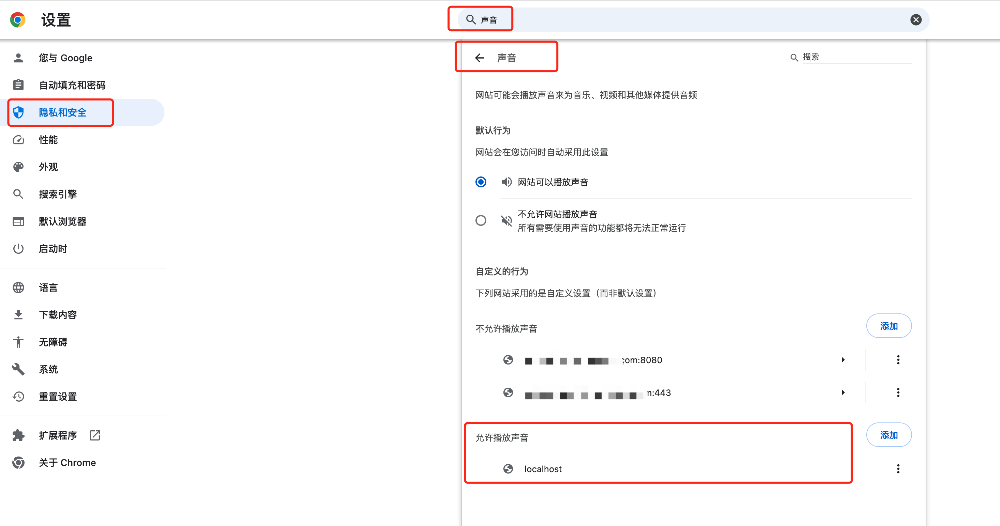

# Chrome设置.音频自动播放.的方法
## 说明
`chrome`浏览器最新隐私和安全策略，默认不允许客户端自动播放音频。
如开发客户端内置的H5需求时，通常需要开启浏览器的音频自动播放设置。

## 方法
①：（仅前端通过chrome测试时）开启支持默认播放声音（audio）的方法
`设置-隐私和安全-网站设置-内容-更多内容设置-声音`


② 在Android上，如果你使用的是WebView，你可以通过设置WebSettings来启动自动播放音频。以下是一个示例代码片段：
```java
WebView myWebView = (WebView) findViewById(R.id.webview);
WebSettings webSettings = myWebView.getSettings();

// 允许JavaScript执行
webSettings.setJavaScriptEnabled(true);

// 如果API等级大于等于17，可以使用此方法允许自动播放
if (Build.VERSION.SDK_INT >= Build.VERSION_CODES.JELLY_BEAN_MR1) {
    webSettings.setMediaPlaybackRequiresUserGesture(false);
}

myWebView.loadUrl("http://www.yourwebsite.com");

```
③ 在iOS上，你可以通过修改WKWebView的configuration属性来允许自动播放音频。以下是一个示例代码片段：
```swift
import WebKit

// ...

let webView = WKWebView(frame: .zero, configuration: WKWebViewConfiguration())
let preferences = WKPreferences()
preferences.javaScriptEnabled = true

// 自动播放音频
webView.configuration.preferences = preferences
webView.configuration.allowsInlineMediaPlayback = true // 允许内联播放
webView.configuration.mediaTypesRequiringUserActionForPlayback = []

let url = URL(string: "http://www.yourwebsite.com")!
webView.load(URLRequest(url: url))

// ...
```
在iOS中，mediaTypesRequiringUserActionForPlayback属性决定了哪些类型的媒体可以自动播放。在iOS 10及以上版本中，你可以将这个属性设置为空数组[]来允许所有类型的媒体（音频和视频）在没有用户交互的情况下自动播放。

备注：
请注意，即使你设置了允许自动播放，某些浏览器和操作系统的政策仍可能阻止自动播放，特别是在移动设备上。此外，为了提供良好的用户体验，建议在设计Web内容时考虑到用户对自动播放的可能反感，并提供一个容易访问的播放控制选项。
