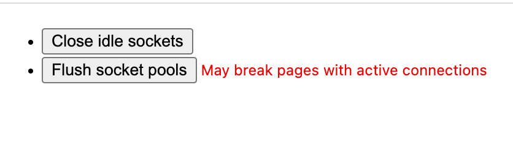

---
title: Chrome强制清除缓存的方法
date: 2024-03-16
tags:
	- chrome
  - cache
  - 缓存
categories:
	- 工程化
---
# 强制清空缓存的方法chr

地址输入 `chrome://net-internals/#sockets`
点击如下两个按钮“close idle sockets” 和 "flush socket pools"

