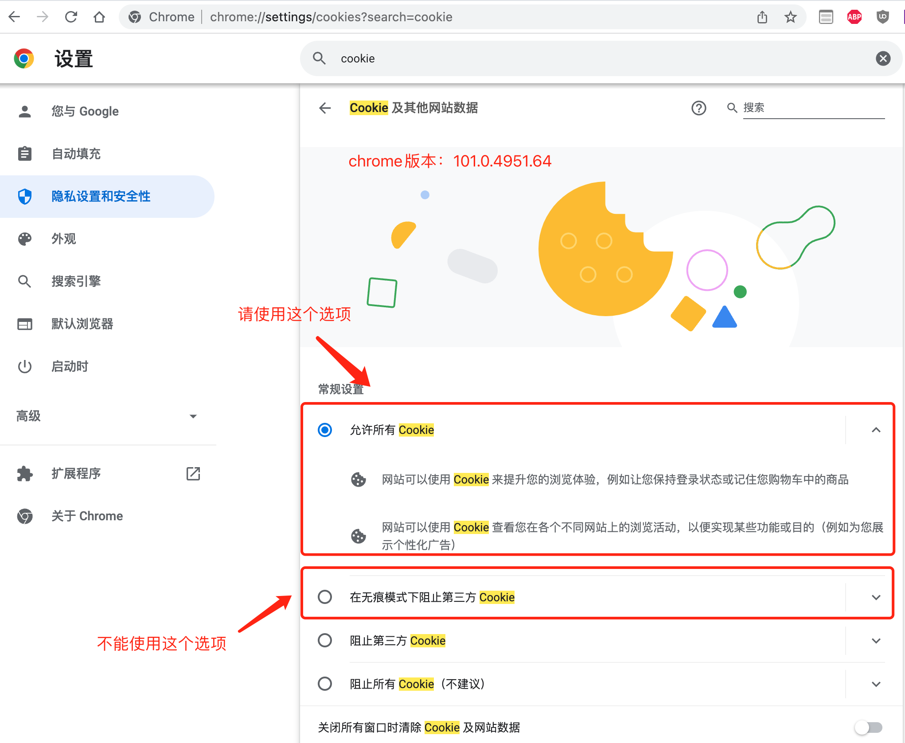
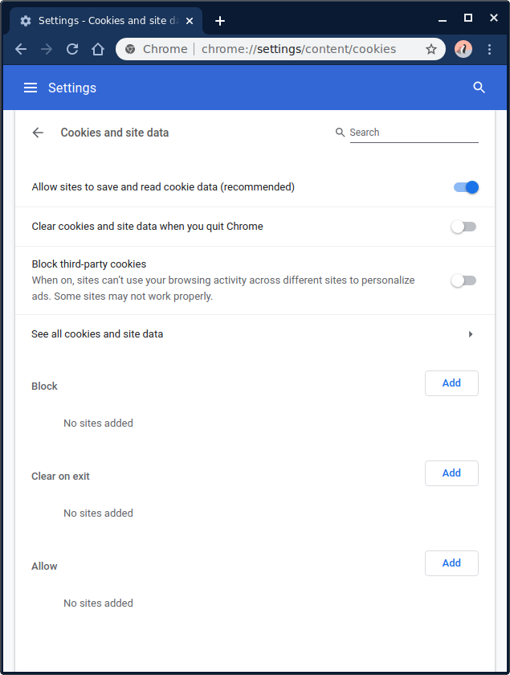

# 无痕模式无法使用cookie的解决方法

## 背景描述

时间时间：2022-05-22
Chrome浏览器版本：101.0.4951.64
描述：

- chrome浏览器无痕模式页面无法使用使用cookie
- 开发者工具提示：`This set-cookie was not stored due to user preference`

## 解决方法

1. chrome浏览器地址栏输入：`chrome://settings/cookies?search=cookie`
2. 按下图所示修改

3. 老版本chrome请参考下图操作

