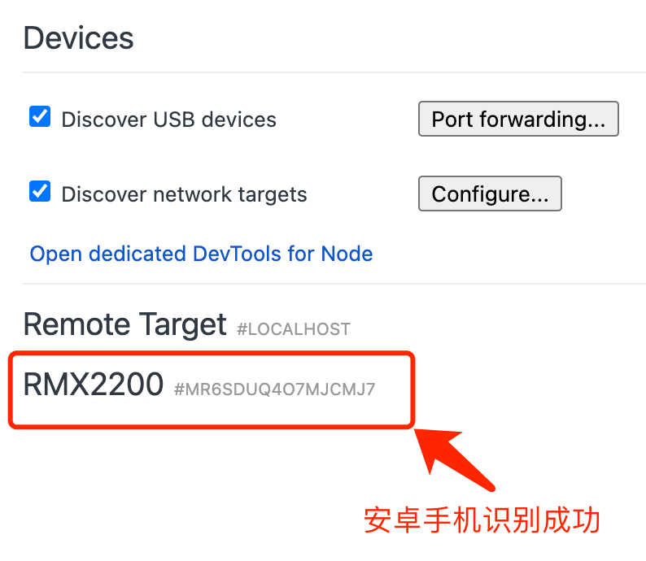
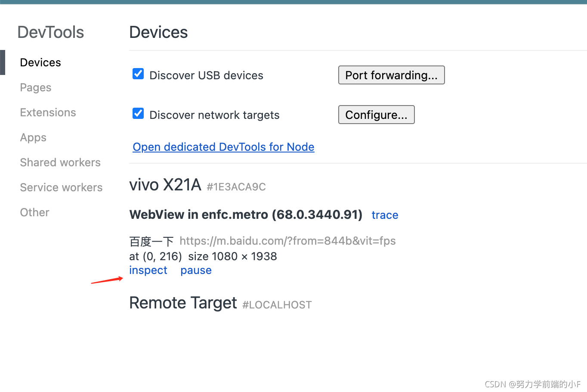

# 电脑端浏览器调试Android端网页

## 一、谷歌浏览器 Chrome (需要梯子)

#### ① USB连接电脑并开启USB调试

(以vivo为例，其他手机找到**版本号**多次点击/连续点击10次+)
“设置--更多设置--关于手机--多次点击软件版本号(开启开发者模式)--开发者选项--开启USB调试”

1. 打开：“USB”调试模式
2. 重置：“撤销USB调试授权”
3. 选择：“默认USB”配置
   1. _选项“文件传输、USB网络共享、MIDI、仅充电”_
   2. _点击/重新点击：“文件传输”（如电脑端无法识别，可选择其他选项后再切换到“文件传输”）_
4. 选择：“选择调试应用”，选择自己要调试的应用，例如“百度”

#### ② 电脑调试

1. 将手机 **_通过usb数据线_** 和电脑连接
   1. **注意1：**电脑必须使用梯子翻墙（可访问google），如不具备翻墙条件，可选择下载**“Microsoft Edge Web”** 浏览器，操作方法类似
   2. **注意2：** 电脑和手机必须使用可进行数据传输的数据线物理连接
2. 浏览器地址栏输入："chrome://inspect/#devices"
   

通过**上图**会看到所连接的设备的名称和信息。如果没有显示设备信息，则表示没有连接好，可以**插拔手机**或**重新开启USB调试、重新选择USB配置“文件传输”**

#### ③ 手机上打开一个网页，webview形式的网页一般都可以

- 通过上图回看到连接设备上可以用于在电脑上调试的页面的信息，地址、标题、网页大小
- 点击 `inspect`就可以启动调试窗口
- 可将调试窗口地址栏内网址修改为自己的开发环境地址，例如：“[http://10.29.111.33:5173/](http://10.29.111.33:5173/)”

## 二、谷歌内核的Edge浏览器

_优势：不需要翻墙_

- 新版 `edge`下载地址: 下载 `Microsoft Edge Web` 浏览器，[下载地址](https://www.microsoft.com/zh-cn/edge/download)
- 操作原理同Chrome，访问地址更改为 `edge://inspect/#devices`

## 三、其他注意事项

- 调试窗口白屏
  - 如使用chrome浏览器，需确认是否开启了梯子模式
  - 手机调试的app及页面必须是**打开状态**，**屏幕常亮**

## 四、参考文档

- [https://blog.csdn.net/u013505589/article/details/120954570](https://blog.csdn.net/u013505589/article/details/120954570)
