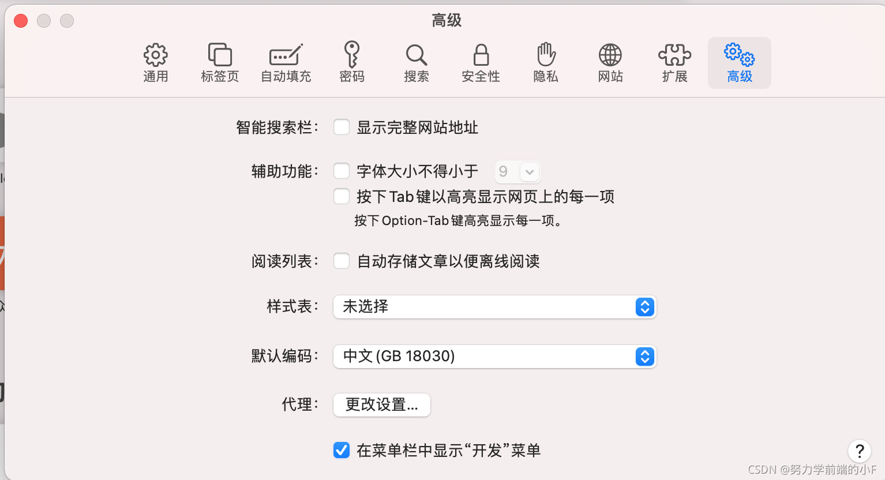
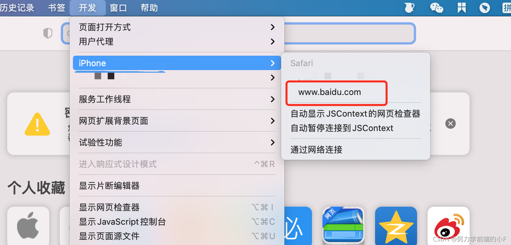
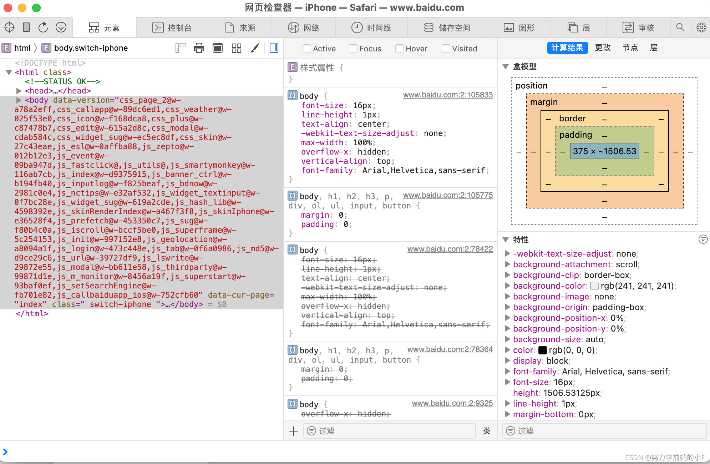

# 电脑端浏览器调试ios、iphone、ipad

### 一、Mac端Safari浏览器

#### ① iPhone端开启网页检查器

设置-- Safari浏览器--高级--开启网页检查器

#### ② 开启电脑端"开发"选项

注意：如果使用电脑调试APP内置的H5页面，需要使用APP的开发包，且电脑端可能需要安装APP指定的证书

mac Safari浏览器--偏好设置--高级--在菜单栏中显示"开发"菜单


#### ③ USB连接Mac，在Safari开发选项中选中设备和页面



 可以对“ **元素，接口请求，网络”** 等进行调整


### 二、其他注意事项

修改地址栏地址的方法
控制台使用js代码：

```javascript
// 自己电脑的开发地址: http://10.29.111.33:5173/
location.href="http://10.29.111.33:5173/" 

```

## 三、参考文档

- [https://blog.csdn.net/u013505589/article/details/120954570](https://blog.csdn.net/u013505589/article/details/120954570)
