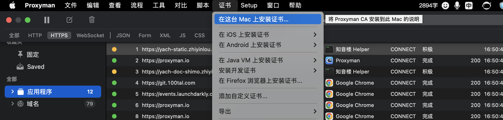
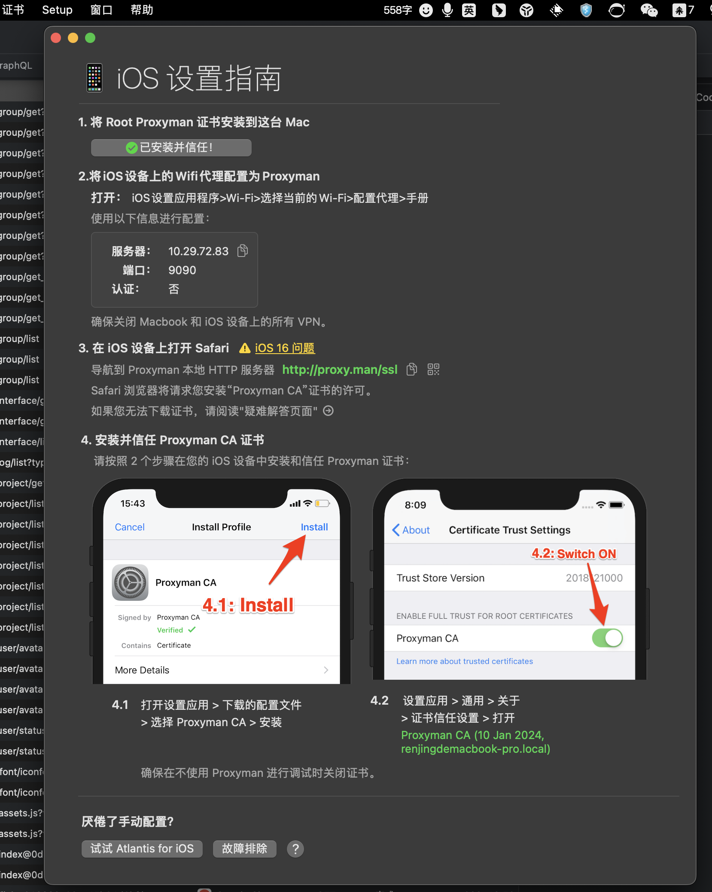
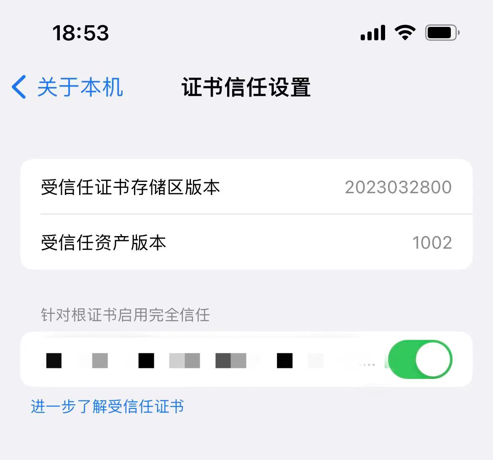
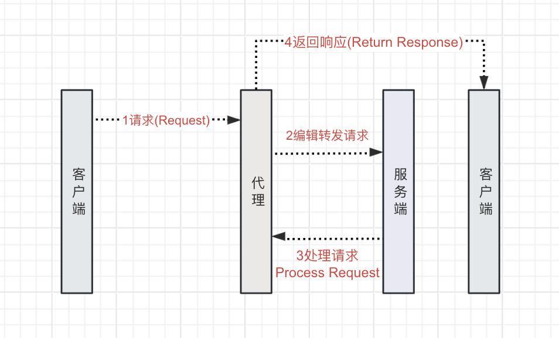
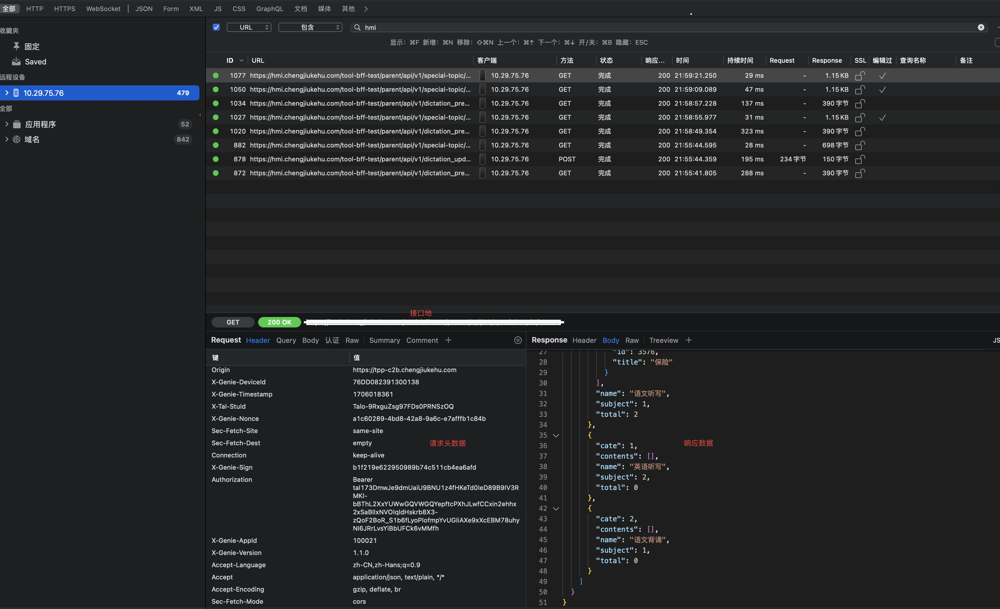
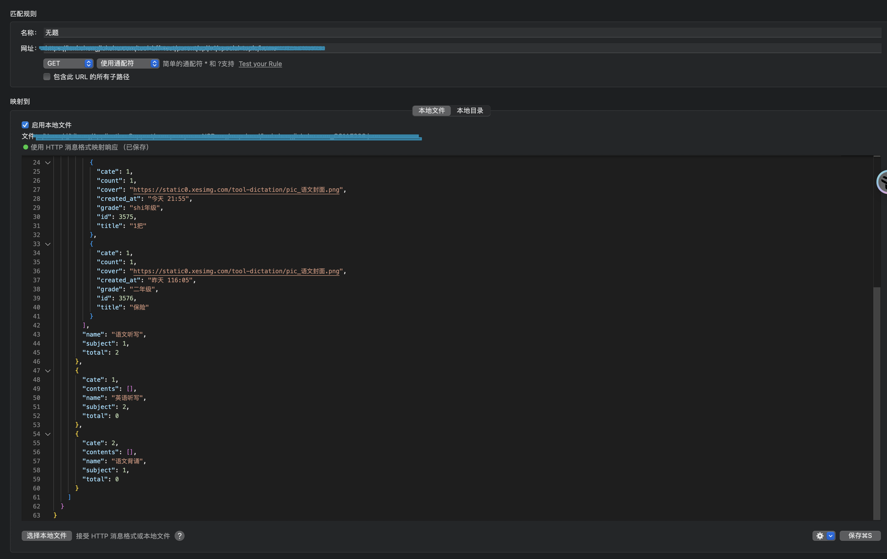
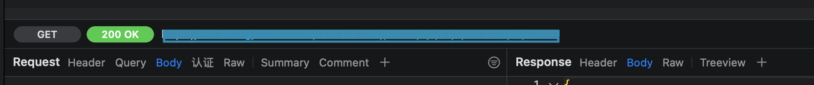

# proxyman代理抓包使用简介

### 一、介绍

Proxyman 是一款现代且强大的网络代理和拦截工具，它允许开发人员查看和操纵 HTTP/HTTPS 网络请求。Proxyman 旨在提供一个直观的用户界面，让开发者能够轻松监控、调试和模拟 API 请求和响应。

### 二、下载安装

#### 2.1、下载地址

[Proxyman Proxyman - macOS, iOS, Windows and Linux](https://proxyman.io/download)

#### 2.2、官方文档

[Overview - Proxyman Documentation](https://docs.proxyman.io/)

#### 2.3、安装

##### 2.3.1  电脑上安装证书

##### 2.3.2  ios设备证书认证

##### 2.3.3  手机端查看证书安装是否成功

### 三、proxyman的代理原理

#### 3.1  实现代理的基本原理

##### **3.1.1 网络配置**

在计算机上安装并运行 Proxyman 时，它会配置系统的网络设置，将自己设为系统的代理服务器。这意味着所有的网络请求都会通过 Proxyman。

##### **3.1.2 拦截请求**

当一个应用程序发出网络请求时（例如，一个HTTP请求去获取一个网页），这个请求会首先发送到 Proxyman。由于 Proxyman 被设置为系统代理，因此它可以捕获到这些请求，进行拦截。

##### **3.1.3 SSL 解密**

对于加密的HTTPS请求，Proxyman 需要解密这些请求才能查看内容。为此，Proxyman 会生成一个自签名的SSL证书，并要求用户信任该证书。当应用程序发出HTTPS请求时，Proxyman 会使用这个自签名证书来解密请求，使其可以查看和修改请求内容。

##### 3.1.4 Http与Https

###### HTTP

当Proxyman捕获HTTP请求时，它可以直接读取和修改请求和响应的内容，因为这些数据是未加密的,开发者可以查看请求的URL、头信息、方法（GET、POST等）、以及请求和响应的正文。

###### HTTPS

HTTPS在HTTP的基础上增加了SSL/TLS协议，用于在客户端和服务器之间建立加密连接。这保证了数据传输的安全性和完整性，防止了数据在传输过程中被窃听或篡改，Proxyman必须首先安装一个本地证书，并且用户必须信任这个证书，以便Proxyman可以作为中间人来解密和查看HTTPS流量。
这个过程通常称为MITM（中间人攻击）代理。用户的设备和Proxyman之间建立加密的HTTPS连接，Proxyman解密请求，然后重新加密并将其转发给目标服务器，服务器的响应也会通过相同的方式被Proxyman解密，然后再次加密后传送回客户端。

##### 3.1.5 **修改请求/响应**

在 Proxyman 中，开发者可以查看请求的详细信息，包括请求头、请求体等。如果需要，开发者还可以修改请求，然后再将其发送到服务器。同样，开发者也可以修改服务器返回的响应。

##### 3.1.6 **转发请求**

修改后的请求将被转发到目标服务器。服务器处理请求并返回响应。

##### **3.1.7显示和记录**

Proxyman 会捕获并显示返回的响应，包括状态码、响应头、响应体等。开发者可以检查响应，确认数据是否正确，或者进行进一步的调试。

##### 3.1.8 简易流程图

### 四、Proxyman 编辑使用

#### 4.1  查找设备上发出的请求接口

#### 4.2 编辑请求数据同步到客户端，实现调试模拟

##### 4.2.1 双击接口地址-> 选择工具->本地映射->点击链接

##### 4.2.2  编辑上图文本，点击保存按钮，校验设备端变化

### 五、了解Proxyman界面组成

#### 5.1 接口请求组成

##### 5.1.1 GET | POST

###### **GET 请求**通常用于请求数据，它将参数编码到URL中。GET请求应该是幂等的，意味着多次执行相同的GET请求应该得到相同的结果，并且不会对服务器上的资源产生副作用。

###### **POST 请求**通常用于提交数据到服务器，比如表单数据。它将数据作为请求体发送。POST请求不是幂等的，意味着多次执行相同的POST请求可能会每次都对服务器上的资源产生副作用（比如在数据库中创建记录）。

###### GET和POST之间的区别和关键点：

1. **参数位置**：
   1. GET请求的参数附加在URL中。
   2. POST请求的参数放在请求体中。
2. **数据大小**：
   - GET请求通过URL传递，因此受URL长度限制，不能传递大量数据。
   - POST请求没有这样的限制，可以传送大量数据。
3. **安全性**：
   - GET请求的参数在URL中，更容易被截获。
   - POST请求的参数在请求体中，相对更安全。
4. **缓存和历史记录**：
   - GET请求可以被缓存，也会留在浏览器历史记录中。
   - POST请求不会被缓存，也不会留在浏览器历史记录中。
5. **用途**：
   - GET请求一般用于数据检索。
   - POST请求一般用于更新数据。

##### 5.1.2  **Request Components（请求头）**

###### **Header**

> 请求头包含了关于请求的元数据，例如Content-Type、User-Agent、Accept等
>
> - **User-Agent**: 发起请求的客户端软件信息。
> - **Accept**: 客户端能够接收的内容类型。
> - **Accept-Language**: 客户端能够理解的语言。
> - **Accept-Encoding**: 客户端能够理解的内容编码（比如gzip）。
> - **Authorization**: 认证信息，用于资源的认证。
> - **Content-Type**: 请求体的媒体类型（在POST和PUT请求中常见）。
> - **Content-Length**: 请求体的长度。
> - **Cookie**: 服务器之前设置的HTTP cookie。
> - **Connection**: 控制不同网络请求之间的连接复用，常见值有keep-alive和close。
> - **Cache-Control**: 指示请求和响应遵循的缓存机制。

###### **Query**

> 查询参数通常用于GET请求，附加在URL后面，用于提供额外的请求信息或参数。

###### **Body**

> 请求体，GET请求通常没有请求体，因为它们用于获取数据而不是提交。

###### **认证**

> 可能指的是用于验证请求合法性的认证信息，比如OAuth、Bearer Token等

###### **Raw**

> 这通常指的是在HTTP请求体中未经处理的数据。例如，如果你直接发送纯文本或JSON字符串，这些数据就可以被称为“raw”数据

###### **Summary**

> 请求的摘要信息，可能包含请求的方法、URL、响应状态码等概览信息。

###### **Comment**

> ###### 关于请求的注释或说明。

##### 5.1.3  **Response Components（响应头）**

###### **Header**

> 响应头包括服务器返回的元数据，如Content-Type、Cache-Control、ETag等。
>
> - Date: 响应生成的日期和时间。
> - Content-Type: 响应内容的类型，这里是application/json，表明返回的内容是JSON格式。
> - Connection: 控制网络连接的选项，这里的close意味着服务器完成响应后将关闭TCP连接。
> - Vary: 告诉缓存机制，响应是根据哪些请求头的值来变化的。
> - Access-Control-Allow-Origin: 指定了哪些网页可以进行跨源访问。
> - Access-Control-Allow-Credentials: 表示是否允许发送cookies。
> - Access-Control-Allow-Methods: 指定了服务器支持的所有HTTP请求方法。
> - Access-Control-Allow-Headers: 允许客户端在实际请求中使用的HTTP头列表。
> - Content-Encoding: 内容编码，gzip表示内容使用了Gzip压缩。
> - Server: 服务器的软件信息，通常包含服务器的名称和版本。在这里，iZ2ze7v68j1airm5l5exprZ似乎是服务器名称的一部分，但这不是一个标准的服务器名称。它可能是服务器的主机名或者服务器在内部网络中的标识。

###### **Body**

> 响应体包含了服务器返回的实际数据。

###### **Raw**

> 通常指的是在HTTP请求体中未经处理的数据。例如，如果你直接发送纯文本或JSON字符串，这些数据就可以被称为“raw”数据

###### **Treeview**

> 一种以树状结构显示响应体的方式，有助于理解嵌套的数据格式

### 六、Proxyman和其他代理工具相比的优缺点

#### 5.1 proxyman

| 优点 | 缺点 |
| ---- | ---- |
| 用户界面: Proxyman拥有现代化的用户界面，相对更加直观和易于使用。| 平台限制: 仅适用于macOS，不支持Windows或Linux。| 
| 性能: 专为Mac优化，性能通常比跨平台工具更好。| 年轻: 相对于Charles和Fiddler，Proxyman是一个较新的工具，可能在某些特性上不如竞争对手成熟。|
| 集成: 它与iOS模拟器和真实设备的集成较为无缝，便于iOS开发者使用。||
| 原生应用: 作为一个原生应用，它在macOS系统中运行得更加流畅。||

#### 5.2 Charles

| 优点 | 缺点 |
| ---- | ---- |
| 跨平台：可以在多种操作系统上运行，适用性广。| 用户界面：用户界面相对陈旧，新用户可能需要一段时间来熟悉。|
| 功能丰富: 提供了广泛的功能，包括SSL代理/解密、带宽节流、AJAX调试等。| 性能: 在某些情况下，特别是处理大量数据时，可能不如专为特定平台设计的工具性能好。|
| 成熟稳定: 作为市场上的老牌工具，Charles拥有稳定的用户群和丰富的文档资源。   |价格: 相对于其他一些工具，Charles的价格可能略高。|

#### 5.3 Fiddler

| 优点 | 缺点 |
| ---- | ---- |
| 价格: Fiddler的基本版本是免费的，对于预算有限的用户来说是一个很大的优点。| 用户界面: Fiddler的用户界面也不是最现代化的，可能需要一定的学习曲线。| 功能丰富: 提供了包括自定义脚本、性能测试、数据捕获和修改等功能。| 跨平台支持: 虽然有Fiddler Everywhere，但它的功能和性能可能还没有完全达到原始Windows版本的水平。|
| 社区和插件: 拥有一个活跃的社区和丰富的插件生态系统，可以扩展其功能。|复杂性: 对于新手来说，功能的丰富性可能会导致使用上的复杂性。|

### 七、总结

Proxyman提供了一个干净、有组织的界面，使得监控网络请求变得简单明了，用户可以拦截请求和响应，并在它们到达服务器或客户端之前修改它们，这个功能允许将远程文件映射到本地文件，还可以通过断点来暂停网络，并且还提供了搜索和过滤功能，以便于快速测试和开发。

:::warning

#### 💡  可以查看 Proxyman 的官方网站或最新的发布说明以获得最新信息

:::

### 八、鸣谢
>  来源：@任静 的整理与分享