# 线上环境代理到开发环境(本地开发环境使用https)

> 参考文档：
> webpack中文文档：[https://webpack.docschina.org/configuration/dev-server/](https://webpack.docschina.org/configuration/dev-server/)
> webpack官方文档：[https://webpack.js.org/configuration/dev-server/](https://webpack.js.org/configuration/dev-server/)
> Mkcert：[https://github.com/FiloSottile/mkcert](https://github.com/FiloSottile/mkcert)
> anyproxy官网中文文档：[https://anyproxy.io/cn/](https://anyproxy.io/cn/)
> openssl 生成证书：[https://ningyu1.github.io/site/post/51-ssl-cert/](https://ningyu1.github.io/site/post/51-ssl-cert/)

## 背景描述

在接手新项目或修复线上bug时，经常遇到本地开发环境没有数据而导致无法复现线上bug的场景。
期望：前端使用本地开发环境，接口使用线上环境(http/https)的接口，并携带cookie

 备注：跨域请求携带cookie请参考如下文档
[浏览器之跨域详解](https://www.yuque.com/geng.ff/hiur8n/xnr4zk?view=doc_embed&inner=oXYvJ)

## 解决方案

核心诉求

1. 使用_本地的前端开发环境_
2. 使用_线上的数据接口_

## 操作方法

### 说明

以下步骤中使用的基本信息描述如下

> 本地开发机IP：127.0.0.1 对应的局域网IP：192.168.10.41
> 测试项目使用的端口为：8080
> 测试用的本地域名：interaction.vdyoo-feifei.com

### 前置：本地证书安装及设置方法见文后

如线上使用 `https`，本地开发环境也许安装证书并签名后，才可以开启 `https`
关键词：秒建受信任的本地SSL证书
生成本地证书：Mkcert（[https://github.com/FiloSottile/mkcert](https://github.com/FiloSottile/mkcert)）

> 使用方法参考：[https://www.i4k.xyz/article/easylife206/101443143](https://www.i4k.xyz/article/easylife206/101443143)

#### 不同平台安装Mkcert

1. **如何在 Ubuntu / Debian 上安装 mkcert**

要在任何 Ubuntu 或 Debian 系统上安装 mkcert，首先要安装 certutil 依赖项：

```shell
sudo apt-get updatesudo apt install wget libnss3-tools
```

安装完成后，下载 mkcert 来自 Github 的二进制包。检查 mkcert 发布页面以获取最新版本。在撰写本文时，最新版本是。v1.4.0

```shell
$ export VER="v1.4.0" && wget -O mkcert https://github.com/FiloSottile/mkcert/releases/download/${VER}/mkcert-${VER}-linux-amd64
```

下载文件后，使文件可执行并将二进制文件放在 /usr/local/bin 下面。

```shell
chmod +x  mkcert
sudo mv mkcert /usr/local/bin
```

2. **如何在 CentOS / Fedora 上安装 mkcert**

在 CentOS 和 Fedora 上安装 mkcert 类似于 Ubuntu / Debian 安装，您只需要先安装 nss-tools工具。
安装 nss-tools

```shell
sudo yum install nss-tools
```

安装完成后，下载 mkcert 二进制包，就像安装 Ubuntu 一样。

```shell
export VER="v1.4.0" && wget -O mkcert https://github.com/FiloSottile/mkcert/releases/download/${VER}/mkcert-${VER}-linux-amd64
```

下载文件后，使文件可执行并将二进制文件放在 /usr/local/bin 下面。

```shell
chmod +x  mkcert
sudo mv mkcert /usr/local/bin
```

3. **如何在 Arch Linux 上安装 mkcert**

对于 Arch Linux，您可以使用上述过程或使用 AUR 安装 mkcert。对于通过 AUR 安装你需要使用 AUR 助手，推荐 yay。yay 是 Arch Linux / Manjaro 的最佳 AUR 助手。
安装 yay 后，使用以下命令安装 mkcert。

```shell
yay -S --noconfirm --needed go
yay -S --noconfirm --needed mkcert
```

4. **如何在 macOS 上安装 mkcert**

对于 macOS 用户，您可以下载二进制包或者从中 brew 安装 mkcert。

> macOS安装Mkcert可通过Homebrew工具
> 国内Homebrew快速安装的方法：
>
> - [https://brew.idayer.com/guide/start/](https://brew.idayer.com/guide/start/)
> - [https://github.com/ineo6/homebrew-install](https://github.com/ineo6/homebrew-install)

```shell
brew install mkcert
brew install nss # if you use Firefox
```

对于二进制安装：

```shell
export VER="v1.4.0" && wget -O mkcert https://github.com/FiloSottile/mkcert/releases/download/${VER}/mkcert-${VER}-linux-amd64
```

下载文件后，使文件可执行并将二进制文件放在 /usr/local/bin 下面。

```shell
chmod +x  mkcert
sudo mv mkcert /usr/local/bin
```

#### 使用 mkcert 生成本地受信任的 SSL 证书

##### 前置说明

mkcert 支持以下根存储：

- macOS system store
- Windows system store
- update-ca-trust （Fedora、RHEL、CentOS）
- update-ca-certificates （Ubuntu、Debian）
- Firefox（仅限macOS和Linux）
- Chrome and Chromium
- Java（ JAVA_HOME ）

要获取 mkcert 的帮助页面，请传递该选项 --help。

```shell
Usage of mkcert:

mkcert -install #安装本地CA根证书
  Install the local CA in the system trust store.

mkcert -CAROOT #查看本地根目录跟证书所在目录
 
mkcert example.org	# 生成本地证书
  Generate "example.org.pem" and "example.org-key.pem".

mkcert example.com myapp.dev localhost 127.0.0.1 ::1
  Generate "example.com+4.pem" and "example.com+4-key.pem".

mkcert '*.example.com'
  Generate "_wildcard.example.com.pem" and "_wildcard.example.com-key.pem".

mkcert -pkcs12 example.com
  Generate "example.com.p12" instead of a PEM file.

mkcert -uninstall
  Uninstall the local CA (but do not delete it).

Change the CA certificate and key storage location by setting $CAROOT,
  print it with "mkcert -CAROOT".


```

##### 在系统信任库中安装本地 CA

```shell
mkcert -install
```

##### 生成本地证书

完成后，您可以开始为您的域名生成 SSL 证书。例如，我将生成一个对以下名称有效的新证书。

```
"mydomain.com"
"*.mydomain.co"
"myapp.net"
"localhost"
"127.0.0.1"
"::1"
```

使用如下命令对上面的域名生成证书

```shell
mkcert mydomain.com '*.mydomain.co' myapp.net localhost 127.0.0.1 ::1
```

命令执行后，会输出以下内容

```
Using the local CA at "/root/.local/share/mkcert" 


Created a new certificate valid for the following names ?
- "mydomain.com"
- "*.mydomain.co"
- "myapp.net"
- "localhost"
- "127.0.0.1"
- "::1"
The certificate is at "./mydomain.com+5.pem" and the key at "./mydomain.com+5-key.pem" 

```

证书生成完后，你也可以查看证书的内容。

```
cat ./mydomain.com+5.pem
```

##### 测试 mkcert 证书

现在让我们使用一个简单的 Nginx 配置文件测试 mkcert 证书。这个例子是在 Ubuntu 16.04 系统上完成的

1. 安装一个 Nginx 服务器

```shell
sudo apt-get install nginx
```

2. 创建一个简单的网页

```shell
echo 'Hello Hi-Linux.com !' > /var/www/test/index.html
```

3. 配置一个简单的 HTTPS 服务器

```shell
cat /etc/nginx/conf.d/test.conf 

server {
   listen 80;
   server_name mydomain.com myapp.net;
   root /var/www/test;
}

server {
   listen *:443 ssl http2;
   root /var/www/test;
   server_name mydomain.com myapp.net;
   ssl_certificate /home/jmutai/mydomain.com+5.pem; 
   ssl_certificate_key /home/jmutai/mydomain.com+5-key.pem;
}
```

4. 确保您的 /etc/hosts 文件包含已使用域名的记录

```shell
cat/etc/hosts

127.0.0.1 myapp.net
127.0.0.1 mydomain.com
```

### 方案一：本地开发环境代理线上接口到开发环境

#### 场景一：线上接口使用 `http`

该场景相对简单，只需修改本地开发 `devServer`的配置，修改方法为：
将所有本地接口代理到线上即可。
以 `webpack/vue.config` 配置为例

```javascript

devServer: {
    open: true,
    port: 8080, // 修改为自己本地项目使用的端口
    disableHostCheck: true,
    headers: { "Access-Control-Allow-Origin": "*" }, // 开启跨域配置，允许所有接口跨域请求
    proxy: {
      '/': {
        target: 'http://test.com/api', // 修改为业务需要使用的后端接口。注意，此处需使用http接口。
        ws: false,
        secure: false,
        changeOrigin: true
      }
    }
 }
```

#### 场景二：线上接口接口 `https`

##### 步骤一：安装本地证书

因接口使用 `https`，服务端接口设置cookie时，每个cookie的属性需设置 `Secure=true` ；
前端ajax跨域提交 `cookie`时要求每个 `cookie`的 `Secure=true,SameSite=None`。
所以如线上环境接口使用 `https`协议，本地开发环境代理时，也需要开启 `https`, 并设置本地证书。

> 本地证书安装及设置方法见上文

- 安装工具Mkcert
- 使用测试域名生成证书，并获得key和cert的路径

```shell
mkcert interaction.vdyoo-feifei.com 192.168.10.41 localhost 127.0.0.1 ::1
```

获得本地的key和cert路径为（依据自己电脑情况，路径稍有不同）

> key: /Users/gengxiaofei/interaction.vdyoo-feifei.com+3-key.pem
> cert: Users/gengxiaofei/interaction.vdyoo-feifei.com+3.pem

- 使用 `mkcert -CAROOT`命令获取根证书路径

注意：如路径中有空格，需使用"\" 转义，例如

> ca: /Users/gengxiaofei/Library/Application\ Support/mkcert/rootCA.pem

##### 步骤二：修改本地vue.config

本地证书安装及设置完毕后，本地 `devServer`设置实例参考如下

① 以 `vitepress`为例

可使用 [vite-plugin-mkcert](https://github.com/liuweiGL/vite-plugin-mkcert) 这款插件快速配置

```javascript

import {defineConfig} from'vite'
import mkcert from'vite-plugin-mkcert'

// https://vitejs.dev/config/
export default defineConfig({
  server: {
    https: true
  }, // Not needed for Vite 5+ (simply omit this option)
  plugins: [mkcert()]
})
```


②以 `webpack/vue.config` 配置为例

> 注意：以下示例中的“key，cert，ca”等路径，需以自己电脑的实际配置路径为准

```javascript
// 引入fs对象
const fs = require('fs');

// 修改devServer配置
devServer: {
    open: true,
    port: 8080,
    disableHostCheck: true,
    https: {
       key: fs.readFileSync('/Users/gengxiaofei/interaction.vdyoo-feifei.com+3-key.pem'),
       cert: fs.readFileSync('/Users/gengxiaofei/interaction.vdyoo-feifei.com+3.pem'),
       ca: fs.readFileSync('/Users/gengxiaofei/Library/Application\ Support/mkcert/rootCA.pem')
    },
    headers: { "Access-Control-Allow-Origin": "*" }, // 开启跨域配置，允许所有接口跨域请求
    proxy: {
      '/': {
        target: 'http://test.com/api', // 修改为业务需要使用的后端接口。注意，此处需使用http接口。
        ws: false,
        secure: false,
        changeOrigin: true
      }
    }
}
```

##### 步骤三：修改本地hosts配置并重启devsever

```shell
127.0.0.1 interaction.vdyoo-feifei.com
```

### 方案二: 使用代理工具（charlse/anyproxy）将线上请求代理到本地

#### 说明

以下示例中使用的基本信息，该方案将以 `https`为准，`http`类似

> 线上地址入口：[https://app.bccv5.vdyoo.com/interaction-admin/](https://app.bccv5.vdyoo.com/interaction-admin/)
> 开发环境入口(需按以上**方案一**中的**场景二**完成https配置)：[https://interaction.vdyoo-feifei.com:8080/](https://interaction.vdyoo-feifei.com:8080/)
> charles的http代理模式使用端口：8888，如需更改，请在步以下步骤三的“开启http代理模式”中修改

#### 实现原理

当在浏览器里请求线上地址（[https://app.bccv5.vdyoo.com/interaction-admin/](https://app.bccv5.vdyoo.com/interaction-admin/)）时，代理工具(charles)将该地址的入口修改为本地开发地址“[https://interaction.vdyoo-feifei.com:8080/](https://interaction.vdyoo-feifei.com:8080/)”，因入口文件已改变，入口文件对应的资源由入口文件决定，也同步改变。

#### 该方案的优势

无需考虑鉴权相关事宜，只需要将本地开发环境中使用的请求baseUrl改为线上接口地址即可，也无需考虑跨域问题（走的实际为线上流量）。

**以下步骤任选一款代理工具即可：charles 或 proxyman**

#### Charles操作步骤

##### 步骤一：本地开发环境支持https

请参考**方案一**种的**场景二**操作步骤，并完成相关配置

##### 步骤二：修改本地 `publicPath`

如本地开发环境的 `publicPath`为本地相对地址（`./`）或 本地绝对地址(`/`)，使用代理工具改变请求成功后，因所有流量仍然是使用的线上，同时本地文件的 `hash`值和线上文件的 `hash`不一致，将会导致文件加载失败。
解决方法：将本地文件的 `publicPath`改为由本地虚拟域名开头的绝对地址即可

```shell
{
  publicPath: 'https://interaction.vdyoo-feifei.com:8080/'
}
```

##### 步骤三：下载并配置charles

> charles破解版下载：[https://macwk.com/soft/charles](https://macwk.com/soft/charles)

###### 安装SSL根证书

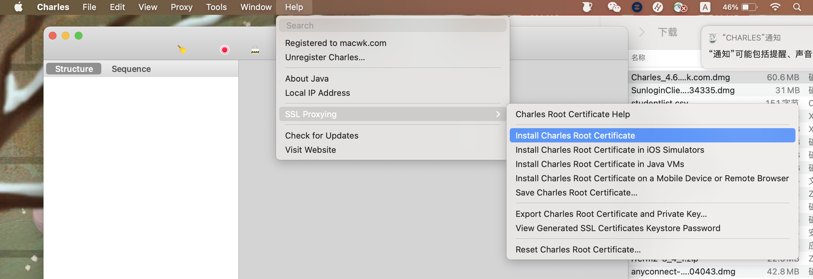
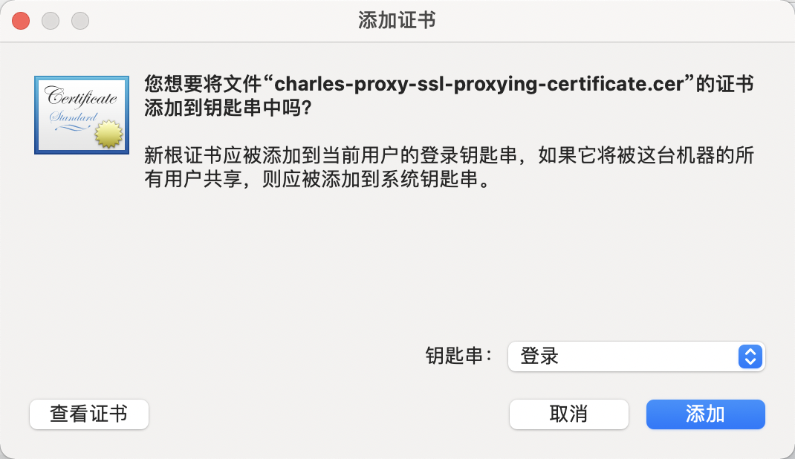
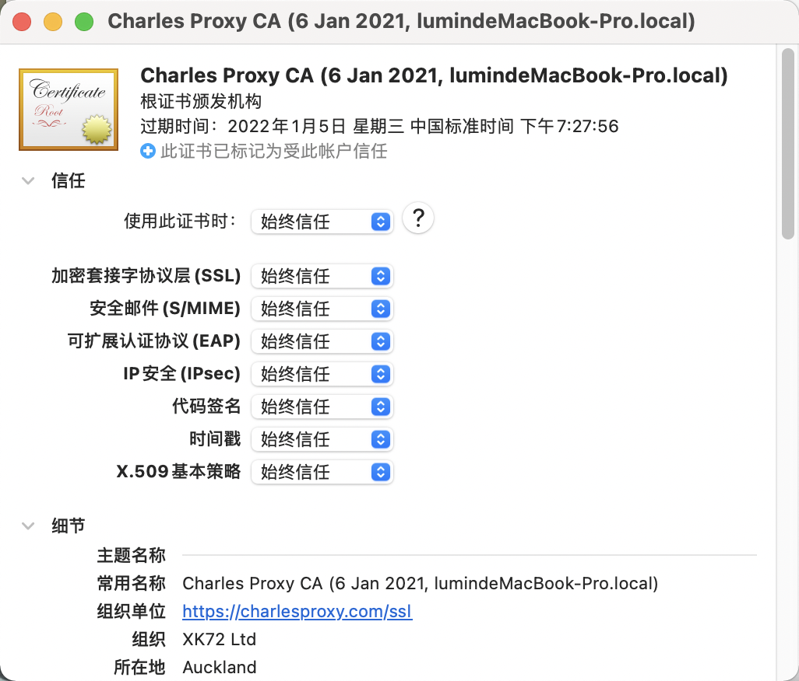

###### 开启SSL代理设置


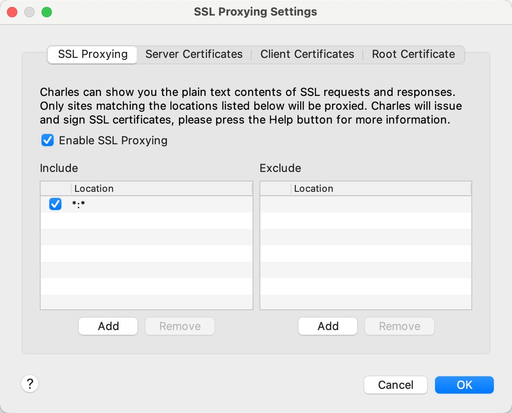

###### 开启Http代理模式

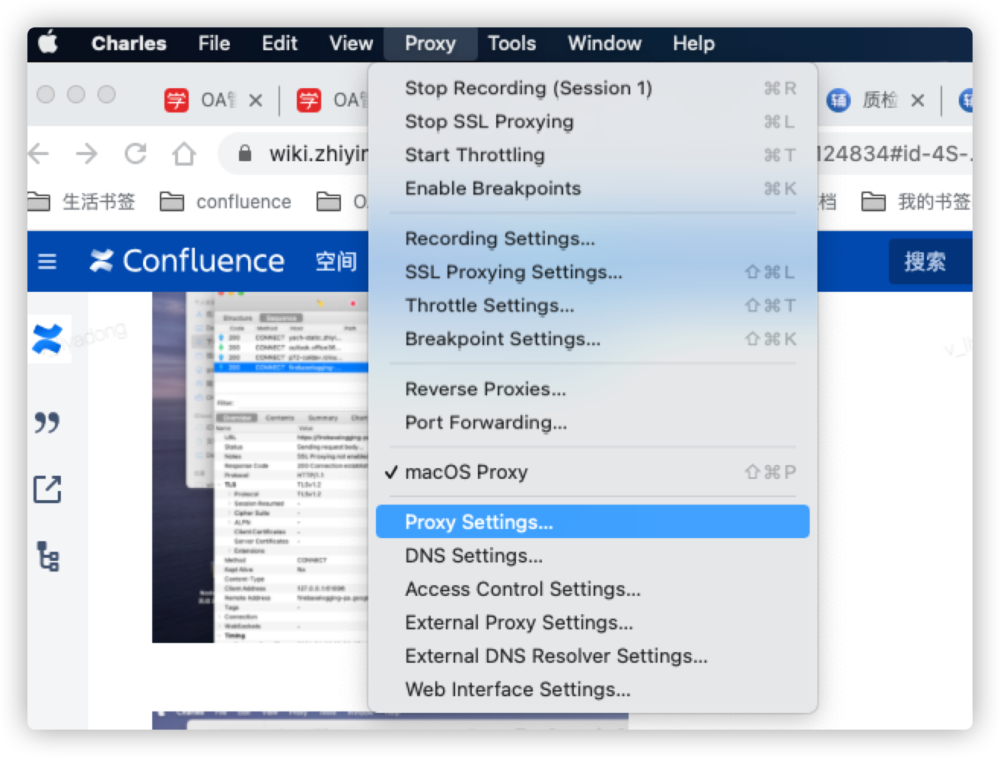
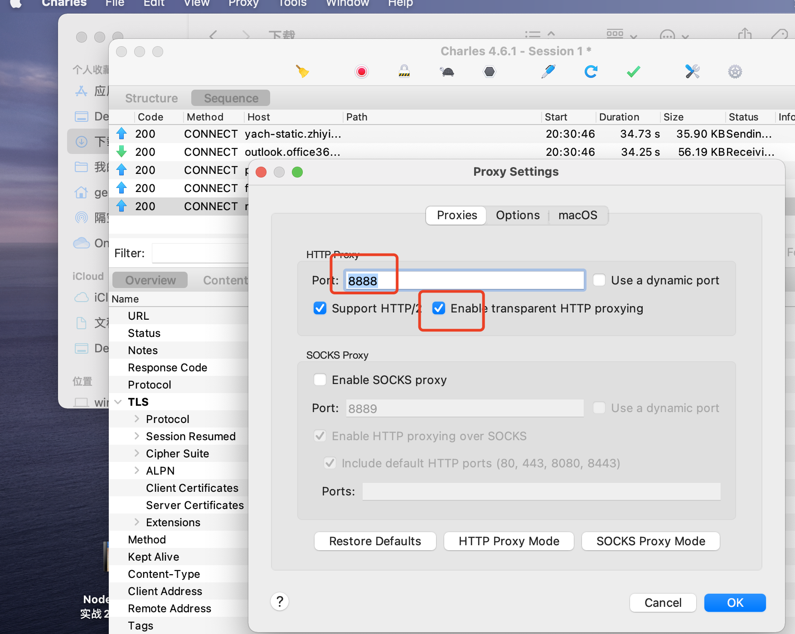

###### 开启远程映射 & 打开：macOS proxy

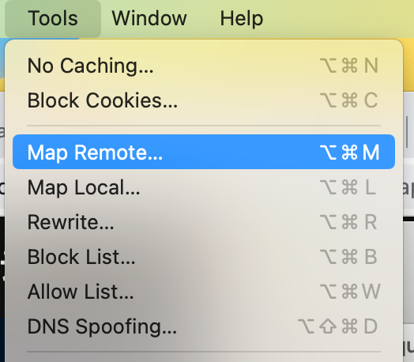

**情况一**
本地入口页的 `publicPath`使用的绝对地址，`例如 https://192.168.1.3:8080/`
这种情况，所有的静态资源(img, js, css)由入口页面(index.html)控制，会按照绝对地址加载，而忽略当前地址栏的域名
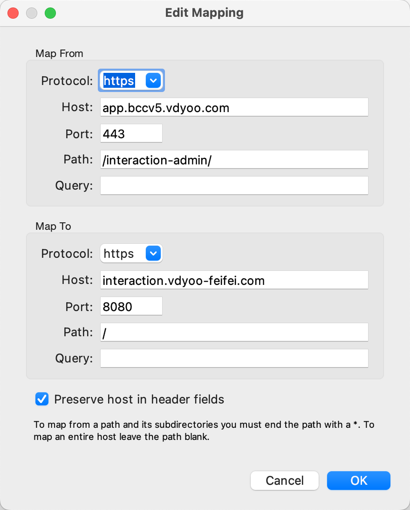

**情况二**
本地入口页的 `publicPath`使用的相对地址，例如：`./`
这种情况，所有的静态资源(img, js, css)由入口页面(index.html)控制，相对路径为相对于当前地址栏的域名的地址。
例如：地址栏域名为 `https://app.bccv5.vdyoo.com` ，文件的相对路径为：`./index.js`，访问的地址实际为："https://app.bccv5.vdyoo.com/index.js"
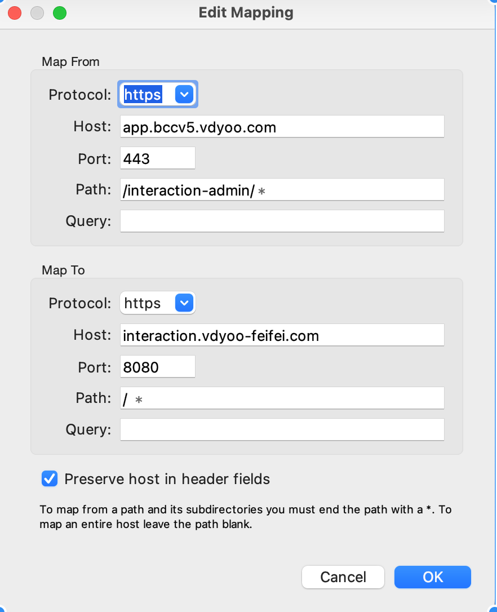

##### 步骤四：配置浏览器代理工具

> 为了可以快速便捷的切换代理工具，推荐安装浏览器插件“SwitchyOmega”。
> 可使用chrome扩展商店安装，或离线现在安装：[https://www.crx4chrome.com/crx/998/](https://www.crx4chrome.com/crx/998/)

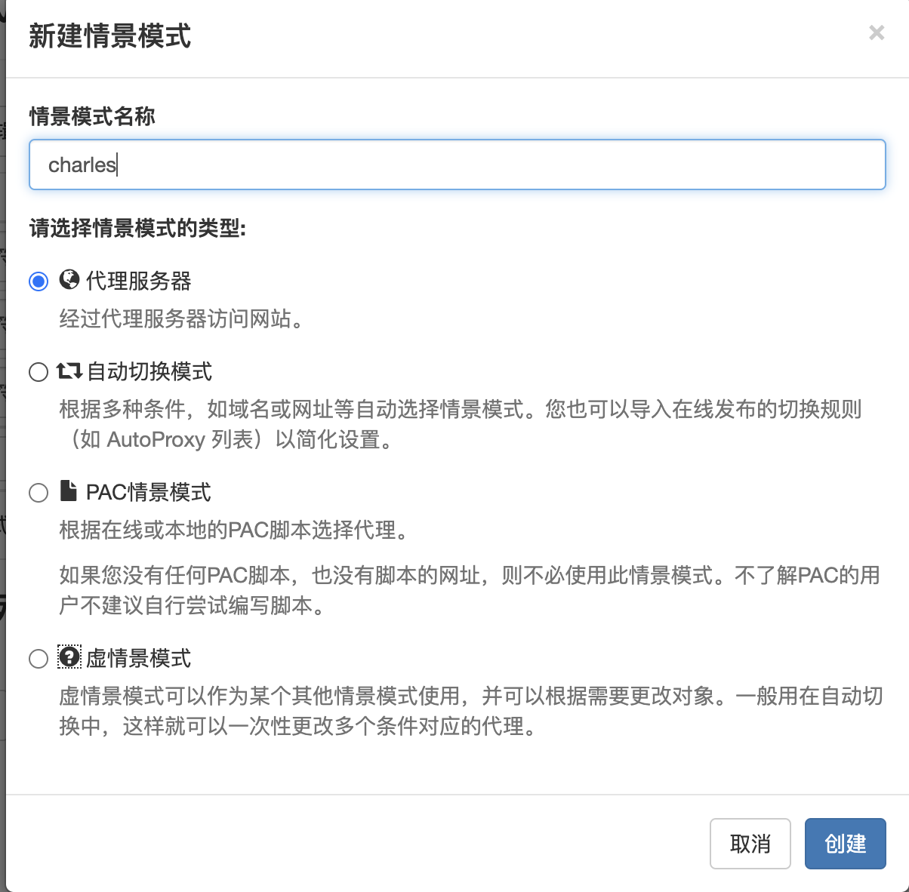
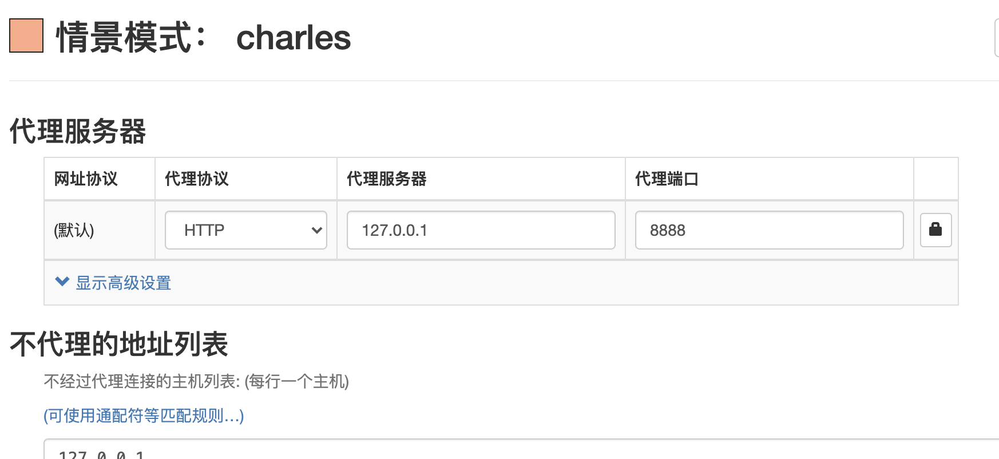

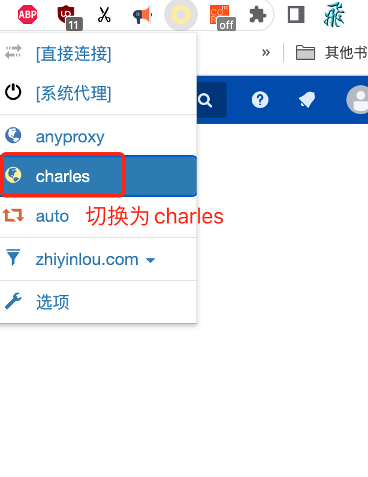

##### 步骤五：修改本地baseURL，开启本地测试，并通过浏览器访问线上地址

如本地开发环境中，使用的 `axios`,可通过修改 baseURL 选项，全局更改默认baseURL

> axios官网地址：[https://axios-http.com/docs/config_defaults](https://axios-http.com/docs/config_defaults)

例如：

```shell
axios.defaults.baseURL = 'https://api.example.com'; // 自己的接口地址
```

**开启本地开发环境**

```shell
npm run dev
```

**通过线上地址地址访问**
[https://app.bccv5.vdyoo.com/interaction-admin/](https://app.bccv5.vdyoo.com/interaction-admin/)

**验证：校验入口文件代理是否成功**
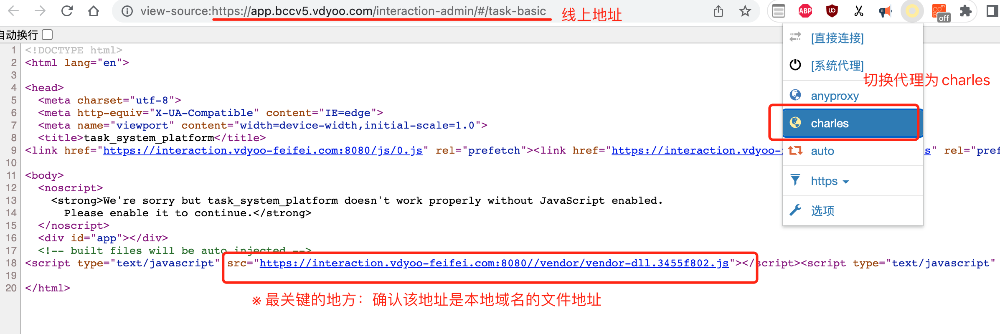

#### anyproxy操作步骤

##### 步骤一：同charles步骤一

##### 步骤二：同charles步骤二

##### 步骤三：下载anyproxy并增加配置文件

> ##### anyproxy官网中文文档：[https://anyproxy.io/cn/](https://anyproxy.io/cn/)

**本地安装**

```shell
npm i -D anyproxy
```

**备注**
anyproxy的http代理服务器默认地址为：`127.0.0.1:8001`
代理请求的web界面地址为：`127.0.0.1:8002`

**增加本地配置文件**

> 官网参考文档：[https://anyproxy.io/cn/#%E4%BF%AE%E6%94%B9%E8%AF%B7%E6%B1%82%E7%9A%84%E7%9B%AE%E6%A0%87%E5%9C%B0%E5%9D%80](https://anyproxy.io/cn/#%E4%BF%AE%E6%94%B9%E8%AF%B7%E6%B1%82%E7%9A%84%E7%9B%AE%E6%A0%87%E5%9C%B0%E5%9D%80)

anyporxy-config.js 配置文件，放置于项目根目录

```shell
module.exports = {
  *beforeSendRequest(requestDetail) {
    if (requestDetail.url.indexOf('https://app.bccv5.vdyoo.com/interaction-admin/') === 0) {
      const newRequestOptions = requestDetail.requestOptions;
      requestDetail.protocol = 'https';
      newRequestOptions.hostname = 'interaction.vdyoo-feifei.com'
      newRequestOptions.port = '8080';
      newRequestOptions.path = '/index.html';
      newRequestOptions.method = 'GET';
    return requestDetail;
    }
  }
};
```

##### 步骤四：配置代理工具

同charles操作步骤四，以下为anyproxy的配置
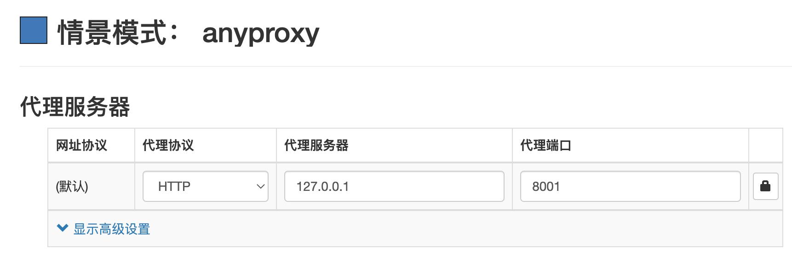

##### 步骤五：修改本地baseURL，开启本地测试，并通过浏览器访问线上地址

同charles步骤五，另需单独启动anyproxy

```shell
npx anyproxy --rule ./anyproxy-config.js
```

##### 常见问题

1. 使用自定义证书时，node的代理工具报错“[error self signed certificate in certificate chain](https://stackoverflow.com/questions/45088006/nodejs-error-self-signed-certificate-in-certificate-chain)”

> 参考：[https://stackoverflow.com/questions/45088006/nodejs-error-self-signed-certificate-in-certificate-chain](https://stackoverflow.com/questions/45088006/nodejs-error-self-signed-certificate-in-certificate-chain)

```shell
export NODE_TLS_REJECT_UNAUTHORIZED='0' && npx anyproxy --rule ./anyproxy-config.js
```

```shell
export NODE_TLS_REJECT_UNAUTHORIZED='0'
node app.js
```
