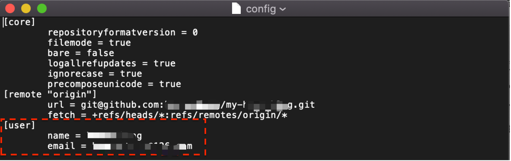

# git config配置多用户场景
## 一、常见场景
### 1.1、场景1
公司仓库和个人仓库的用户名和邮箱配置是有区别的，为了能够很好地区分工程上传到不同的远程仓库，我们需要分别处理，保证在不同的工程使用不同的账户。
### 1.2、场景2
```shell
# 提前：全局配置设置的公司仓库
git config --global user.name "yourName"
git config --global user.email "yourEmail"

# 问题：如果向个人的github仓库提交代码，contributions 不生效，不显示记录

```

## 二、基础信息
git通过配置文件来设置控制 Git 外观和行为，共有三个配置文件，权重为`仓库级>全局级>系统级`：

- 系统级`--system`：`/etc/gitconfig` 文件，包含系统上每一个用户及他们仓库的通用配置；
- 全局级`--global`：`~/.gitconfig` 或 `~/.config/git/config` 文件，只针对当前用户；
- 仓库级`--local`：`.git/config`，当前仓库的Git 目录中的 config 文件。

## 三、解决方案
### 3.1、按工程配置多用户
即基础信息中的“仓库级”配置，有两种常用方法<br />**方法一：** 通过在项目目录下执行命令<br />我们想要的是提交个人github仓库使用个人用户名和邮箱，以下方法任选其一：
```shell
git config user.name "your-name"
git config user.email your-email@example.com
```
**方法二：** 打开仓库级配置文件修改：
```shell
open .git/config
```
修改红框内的信息<br />

### 3.2、按目录配置多用户
在2017年，git新发布的版本2.13.0包含了一个新的功能`includeIf`配置，可以把匹配的路径使用对应的配置用户名和邮箱。

例如：在`~/`目录下面存在三个配置文件，

- `.gitconfig` // 全局通用配置文件
- `.gitconfig-self` // 个人工程配置文件
- `.gitconfig-work` // 公司工程配置文件

全局通用配置文件`~/.gitconfig`里面的内容是：主要是通过`includeIf`配置匹配不用的目录映射到不同配置文件上：
```shell
[includeIf "gitdir:~/self-workspace/"]
    path = .gitconfig-self
[includeIf "gitdir:~/workspace/"]
    path = .gitconfig-work
```

个人工程配置文件`~/.gitconfig-self`：
```shell
[user]
	name = yourname-self
	email = yourname-self@gmail.com
```

公司工程配置文件`~/.gitconfig-work`：
```shell
[user]
	name = yourname-work
	email = yourname-work@yourCompanyName.com
```

**注意事项：**

1. 文件`~/.gitconfig`里面的`includeIf`后面的`path`最后需要`/`结尾
2. 个人工程目录和公司工程目录需要要求是非包含关系，就是这两个工程目录配置路径不可以是父子关系。
3. 如以上操作不生效，则需要删除`~/.gitconfig`里面原有的`user`部分。
## 四、验证方法
```shell
# 在项目目录下分别使用以下两个命令

# 命令1：查看项目配置
git config --get user.name

# 命令2：查看全局配置
git config --global  --get user.name

# 对比查看以上输出结果是否符合预期

```

