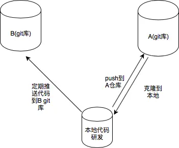

# git同一个项目使用多个远程仓库

> 参考信息：
> - [https://www.jianshu.com/p/4cd46619b3a5](https://www.jianshu.com/p/4cd46619b3a5)


<br />

## 背景
同一项目需要上传到两个不同搞定远程仓库
## 解决方案
### 第一种:从刚开始建项目,需求就是代码要上传到两个或多个仓库
这种情况比较好处理<br />**步骤如下**

1.  本地创建项目
2.  打开终端 `cd/项目` `git int`
3. 去对应的两个代码仓库创建本地代码要存储的目录, 并生成一个git地址
4. 回到终端 分别执行下面语句(仓库 A,B 的名字可以自己起,用来区分哪个远程仓库)

`git remote add 仓库 A https:///项目A仓库的地址`<br />`git remote add 仓库 B https:///项目B仓库的地址`

**查看远程仓库的情况**<br />`git remote -v`<br />可以看到已经有两个远程仓库了<br />`git push 仓库A master:master`<br />`git push 仓库B master:master`

`pull` 的时候也是两次<br />`git pull 仓库A master`<br />`git pull 仓库B master`

如果是多个代码仓库,每次都要`push` 和 `pull` 多次, 比较繁琐, 可以使用下面的方法<br />使用 `git remote set-url` 命令

1. 删除方法一的仓库A 远程仓库。<br />`git remote rm 仓库A`
2. 使用如下命令添加远程仓库。<br />`git remote set-url --add 仓库B(名称) http://仓库A地址`
3. 查看远程仓库情况。可以看到 `github` 远程仓库有两个 `push` 地址。这种方法的好处是每次只需要 `push` 一次就行了。<br />`git remote -v`<br />`git push 仓库B master:master`
### 第二种:项目中途增加仓库
比如一直在自己的公司git服务器上做开发, 突然有个需求, 让你中途把目前的代码再同步一份放到<br />另一个git服务器, 而且要不定期向这个服务器更新代码

**前置条件**<br />现在已经有本地的代码和一个代码仓库了

1. 去要求存放代码的git服务器上创建一个git仓库
2. 执行: `git remote add XXXX https://项目A仓库的地址`
3. 从新建的代码库更新一下,合并节点(代码库要求是新库)
```shell
git pull bx_bank master

# 报如下错误
# branch master -> FETCH_HEAD fatal: refusing to merge unrelated histories
```
**原因：**<br />不可以合并不同没有相同结点的分支，如果需要合并两个不同结点的分支

**解决方法：**<br />那么需要在`git pull`添加一句代码`--allow-unrelated-histories`。<br />修改之后的代码，假如源是`origin2`，分支是`master`，执行以下代码<br />`git pull origin2 master --allow-unrelated-histories`

然后将现在的本地代码`push` 到远程仓库<br />`git push origin2 master`

定期执行`git push origin2 master`这个语句就好了

追加: 如果只是定期往B仓库同步推代码, B仓库又是一个新建仓库<br />可以直接加入 `add remote` ,然后`push`<br />`git remote add origin 仓库地址`<br />`git push -u origin --all `<br />`git push -u origin --tags`

