# 使用pnpm的workspace、changeset实现monorepo

## 为什么选择 pnpm

以下是选择 pnpm 的一些原因：

1. **磁盘空间和安装速度的优化**：通过使用硬链接和符号链接，pnpm 能够显著减少项目的磁盘空间占用和安装时间。
2. **更严格的依赖关系管理**：pnpm 更严格地遵循包的依赖关系，确保您的应用程序只访问在其package.json中声明的依赖项。
3. **原生 Monorepo 支持**：通过 [pnpm workspaces](https://pnpm.io/zh/workspaces) 功能，pnpm 支持原生 Monorepo，使跨项目的包管理变得更加简单。

## Monorepo 的优点

1. 代码共享和复用：在单一代码库中，_不同项目和模块可以轻松地共享和复用代码，降低了重复开发的成本_。
2. 依赖管理：Monorepo 可以使开发人员更容易地管理项目间的依赖关系，减少了版本冲突和升级问题。
3. 原子提交：Monorepo 允许开发人员在一个提交中更新多个项目或模块，这有助于保持代码的一致性。
4. 更简洁的工作流程：使用 Monorepo 可以简化构建、测试和部署等工作流程，提高开发效率。

## Monorepo 的缺点

1. 代码库规模：随着项目和代码的增长，Monorepo 的规模可能变得庞大，从而影响性能和存储需求。
2. 权限管理：在一个大型代码库中管理访问权限可能变得复杂，特别是在多团队协作的情况下。
3. 潜在的耦合：由于代码位于同一仓库中，可能导致不同项目之间的耦合过于紧密，影响项目的独立性和灵活性。

一些知名的开源项目，如 [Next.js](https://github.com/vercel/next.js)、[Vite](https://github.com/vitejs/vite) 和[Element Plus](https://github.com/element-plus/element-plus)，都采用了 `Monorepo` 策略。在选择 `Monorepo` 之前，需要权衡其优缺点，并考虑它是否适用于特定的开发环境和需求。

## 基本介绍

> 本文使用的仓库demo地址：
> [https://github.com/huanmie913/sway-monorepo-pnpm-demo](https://github.com/huanmie913/sway-monorepo-pnpm-demo)

### 安装 `pnpm`

```shell
// 可以通过运行以下命令来全局安装 pnpm (推荐)
npm install -g pnpm

// 或者，使用以下命令安装到单个项目：
npm install pnpm
```

### 初始化项目

```typescript
pnpm init
```

### 脚本设置

当您在项目中使用 `pnpm` 时，您不希望被其他人意外运行 ` npm install` 或 `yarn`。 为了防止开发人员使用其他的包管理器，您可以将下面的这个 `preinstall` 脚本添加到项目根目录的 `package.json`：

```json

{
  "scripts": {
    "preinstall": "npx -y only-allow pnpm"
  }
}
```

[preinstall](https://docs.npmjs.com/cli/v6/using-npm/scripts#pre--post-scripts) 脚本会在 `install` 之前执行，现在，只要有人运行 `npm install` 或 `yarn install`，就会调用 [only-allow](https://github.com/pnpm/only-allow) 去限制只允许使用 `pnpm` 安装依赖。
如果您使用 ` npm v7`，请改用 `npx -y`

### 配置 `pnpm workspaces`

要在 `Monorepo` 中使用 `pnpm`，请在**项目根目录下**创建一个名为 `pnpm-workspace.yaml`的文件，并在其中定义您的工作区：

> - 官网 **_工作空间_** 文档：[https://pnpm.io/zh/workspaces](https://pnpm.io/zh/workspaces)
> - 官网配置链接：[https://pnpm.io/zh/pnpm-workspace_yaml](https://pnpm.io/zh/pnpm-workspace_yaml)

```yaml
# 以下是官网配置示例：https://pnpm.io/zh/pnpm-workspace_yaml
packages:
# all packages in direct subdirs of packages/
- 'packages/*'
# all packages in subdirs of components/
- 'components/**'
# exclude packages that are inside test directories
- '!**/test/**'
```

## workspace常见问题整理

#### 根目录 `package.json` 的 `private: true`字段

- 禁止根目录作为 `npm`包 `publish`
- `package.json`的 `private`的[官网文档](https://docs.npmjs.com/cli/v9/configuring-npm/package-json#private)

#### `pnpm`  [-w, --workspace-root](https://pnpm.io/zh/pnpm-cli#-w---workspace-root)

- 在[工作空间](https://pnpm.io/workspaces)的根目录中启动 pnpm ，而不是当前的工作目录
- 可以将依赖包安装到工程的根目录下，作为所有 `package` 的公共依赖（`pnpm-workspace.yaml`定义的子包）。
- 该参数 `-w`可以在工程内任意目录执行。如 `pnpm install -w` 或 `pnpm add -w` ，所安装的包都会添加到工程根目录的 `package.json`中
- `workspace`中所有的包共用的包推荐安装到根目录。例如：`eslint`、`vite`、`vue`、`react`

#### `pnpm` [--filter](https://link.zhihu.com/?target=https%3A//pnpm.io/zh/filtering)

- 过滤允许您将命令限制于包的特定子集
- 给某个 `package`（`workspace`定义的子包）单独安装指定依赖，例如：
- 注意：`--filter` 参数跟着的是 `package`下的 package.json 的 `name` 字段，并不是目录名
- 例如：使用 `--filter`执行 `@sway/monorepo-pkg-a` 下 `scripts` 脚本：`pnpm build --filter @sway/monorepo-pkg-a`
- `filter` 后面除了可以指定具体的包名，还可以跟着匹配规则来指定对匹配上规则的包进行操作，比如：
`pnpm build --filter "./packages/**"`

#### 模块（子包/package）之间的相互依赖

我们在开发时经常遇到的场景，比如 `monorepo-pkg-b` 中将 `monorepo-pkg-a` 作为依赖进行安装。基于 `pnpm` 提供的 `workspace:协议`，可以方便的在 `packages` 内部进行互相引用。
例如：在 `monorepo-pkg-b` 中引用 `monorepo-pkg-a`。

```powershell
# 可在任意目录执行，建议在根目录
pnpm install @sway/monorepo-pkg-a --filter @sway/monorepo-pkg-b
# 也可使用 pnpm add
pnpm add @sway/monorepo-pkg-a --filter @sway/monorepo-pkg-b
# 在@sway/monorepo-pkg-b目录执行可不加 --filter 参数，同样可根据workspace协议添加引用
pnpm add @sway/monorepo-pkg-a 
```

`monorepo-pkg-b`添加 `monorepo-pkg-a`后，`monorepo-pkg-b`的 `package.json`结果如下：

```json
"dependencies": {
  "@sway/monorepo-pkg-a": "workspace:^"
},
```

在设置依赖版本的时候推荐用 `workspace:*`，这样就可以保持依赖的版本是工作空间里最新版本，不需要每次手动更新依赖版本。
当 `pnpm publish` 的时候，会自动将 `package.json` 中的 `workspace` 修正为对应的版本号。

#### `pnpm -r, --recursive`

官网文档链接（pnpm -r）：[https://pnpm.io/zh/cli/recursive](https://pnpm.io/zh/cli/recursive) 
官网文档链接（pnpm run -r）：[https://pnpm.io/zh/cli/run#--recursive--r](https://pnpm.io/zh/cli/run#--recursive--r) 
在工作区的每个项目中运行命令，但不包括根目录，如需包含根目录，需将 [`include-workspace-root`]设置为 `true`。
注意：这将从每个包 `package.json`中的“`scripts`”中运行一个对应的命令。如果包没有该命令，则跳过该命令。如果所有包都没有该命令，则该命令将失败。

#### `pnpm run --parallel`

官网文档链接：[https://pnpm.io/zh/cli/run#--parallel](https://pnpm.io/zh/cli/run#--parallel) 
完全忽略并发和拓扑排序，在所有匹配的包中立即运行给定的脚本 并输出前缀流。 这是个推荐的标志，用于在许多 packages上长时间运行的进程，例如冗长的构建进程。

## 使用 `pnpm` 管理依赖

其中，`packages` 目录放置三个子包，分别是 ` pkg-a`、`pkg-b`、`pkg-c`，其中 `pkg-a `是 `pkg-b` 的子依赖 。

```
{
  "name": "pkg-b",
  "dependencies": {
    "pkg-a": "^0.0.0"
  }
}
```

### 使用 `pnpm` 管理依赖

我们将会使用 `pnpm` 来完成依赖的安装、依赖间的 `link` 和 `build`

### 创建workspace

在项目根目录创建 `pnpm-workspace.yaml`，内容如下：

```yaml
packages:
  - 'packages/**'
```

在 `pnpm-workspace.yaml` 里面我们声明了 `packages` 目录下的子目录都会被加入到 `workspace` 中，那么 `pnpm` 将根据会在 `workspace` 中子包的依赖关系，自动链接这些子包。比如上述的例子会将 ` pkg-a` 链接到 `pkg-b`。
现在让我们在项目根目录执行 ` pnpm install` 看一下效果：
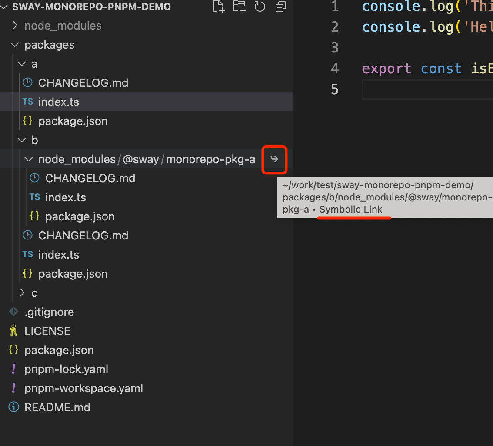

这里在 ` b/node_modules` 目录下可以看到，`pkg-a `已经自动 link 到 `pkg-b` 下了。

### 构建 `package` 产物

依赖安装好了以后，我们需要对子包进行构建。在项目根目录下执行 `pnpm run build` 来对每个子包进行构建：
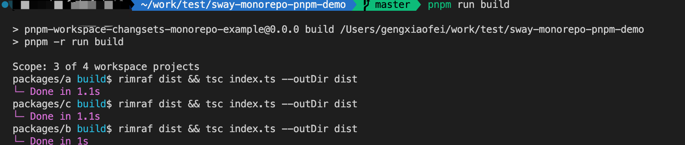 
可以看到，`pkg-a` 和 `pkg-c`先执行 `build` 命令，等他们执行完成后，`pkg-b `再执行 `build`。
为什么执行 `pnpm run build` 就变成这样呢？其实在项目根目录的 `package.json` 中预先写好了 `build` 脚本：

```json
{
  "scripts": {
    "build": "pnpm -r run build"
  }
}
```

加入 `-r` 是指定为 `worksapce` 中的子包执行 `build` 命令。默认情况下，`pnpm` 会根据子包的依赖拓扑排序，按顺序对子包执行命令，以避免在构建某个包的时候，出现子依赖的构建产物未生成的问题，进而引发比如类型错误等问题。另外如果两个子包没有依赖关系，`pnpm` 会并发进行构建。

### 监听 `package` 变更

在项目根目录下执行 ` pnpm run watch`，以对每个子包执行 `watch` 命令监听文件的变更以生成最新的构建产物。

pnpm run watch 对应在项目根目录的 package.json 中 watch 脚本：

```json
"scripts": {
  "watch": "pnpm --parallel -r run watch",
}
```

`watch` 命令是会长时间运行监听文件变更，进程不会自动退出（除了报错或者手动退出），因此需要加上 `--parallel` 告诉 `pnpm` 运行该脚本时完全忽略并发和拓扑排序。

## 使用 changesets 管理包发版和发布

### 背景

`workspace` 中的包版本管理是一个复杂的任务，`Changesets`是 `pnpm` 官网推荐的工具

> - pnpm官网推荐的 `Changesets` `github`地址为**：**[https://github.com/changesets/changesets](https://github.com/changesets/changesets)
> - pnpm官网changesets文档：[https://pnpm.io/zh/using-changesets](https://pnpm.io/zh/using-changesets)

### 安装和初始化 changesets

首先，我们需要安装 `changesets`。我们在项目根目录执行下面的命令：

```shell
pnpm i -Dw @changesets/cli
```

安装完成以后，你可以在项目根目录执行以下命令以快速初始化 `changesets`：

```shell
pnpm changeset init
```

这时候，你会发现，项目根目录下多了一个 `.changeset` 目录，其中 `config.json` 是 `changesets` 的配置文件。请注意，我们需要把这个目录一起提交到 `git` 上。

> 注意：`config.js`相关说明
>
> - `config.json`官网说明文件链接： [https://github.com/changesets/changesets/blob/main/docs/config-file-options.md](https://github.com/changesets/changesets/blob/main/docs/config-file-options.md)
> - `baseBranch`字段（`changeset`的 `2.26.1`版本使用的默认值为 `main`），该字段表示的分支必须存在于仓库中，否则在使用"`pnpm changeset`"命令时，会触发错误：“`Failed to find where HEAD diverged from main. Does main exist?`”。
建议该字段为仓库默认字段，例如：“`master`”
> - `ignore` (array of packages)：此选项允许您指定一些不会发布的包。
（这个特性是为了临时使用而设计的，可以在不发布变更的情况下合并它们——如果你想阻止一个包被发布，在 `package.json` 中设置 `private: true`，`package.json`的 `private`的[官网文档](https://docs.npmjs.com/cli/v9/configuring-npm/package-json#private)）
详情参考[changeset-doc](https://github.com/changesets/changesets/blob/main/docs/config-file-options.md#ignore-array-of-packages)

### 发布第一个版本

在模板中，`pkg-a`、`pkg-b`、`pkg-c` 三个包的版本号都是 ` 0.0.0`，我们可以在项目根目录下直接运行 `pnpm changeset publish` 为三个包发布第一个版本。发布完成后，我们完成了 `monorepo` 项目的初始化，我们可以把这个改动合并到你的主分支上并提交到远程仓库中。

> 注意：
>
> - `npm changeset publish` 官网文档：[https://github.com/changesets/changesets/blob/main/docs/intro-to-using-changesets.md](https://github.com/changesets/changesets/blob/main/docs/intro-to-using-changesets.md)
> - `npm changeset publish` 该命令会执行 `workspace`下每个包中的 `npm publish`
> - 如需单独对某个子包发布，需进入到子包文件夹中执行 `npm publish`

### 生成 `changeset` 文件

假设现在要进行一个迭代，我们从主分支上切一个 `release/0.1.0` 分支出来。我们在 `packages/a/index.ts` 文件中随便添加一行代码，并提交到远程仓库。`pkg-a` 代码发生变更了，我们需要发一个版本给用户使用。这时候我们在项目根目录下执行以下命令来选择要发布的包以及包的版本类型（`patch`、`minor`、`major`，严格遵循 [semver](https://semver.org/) 规范）：

```shell
pnpm changeset
```

`changeset` 通过 ` git diff` 和构建依赖图来获得要发布的包。我们选择发布 `pkg-a`：
（注意：使用 **_方向键_** 选择分支，使用空格_**选中/取消选中**_）
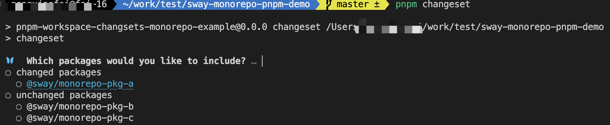 
可以选择 `major`、`minor`、`patch`三种方式来管理版本类型。
**操作方法**

- 使用**方向键**选择分支
- 使用**空格选中/取消选中**（支持多选）
- 使用**回车**选择_版本类型_

我们选择 `patch` ，更新最小版本号；填写 `changelog`；
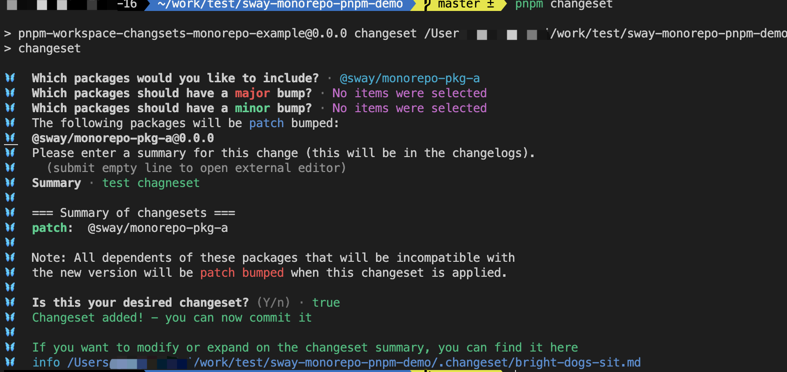

填写完毕后，会发现 `.changset`文件，多出来一个文件名随机的 `changeset` 文件：
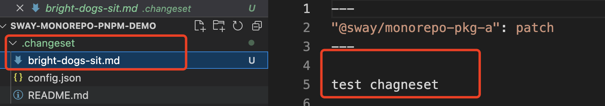

这个文件的本质是对包的版本和 `Changelog` 做一个预存储，我们也可以在这些文件中修改信息。随着不同开发者进行开发迭代积累，`changeset` 可能会有多个的，比如 `pnpm` 仓库：
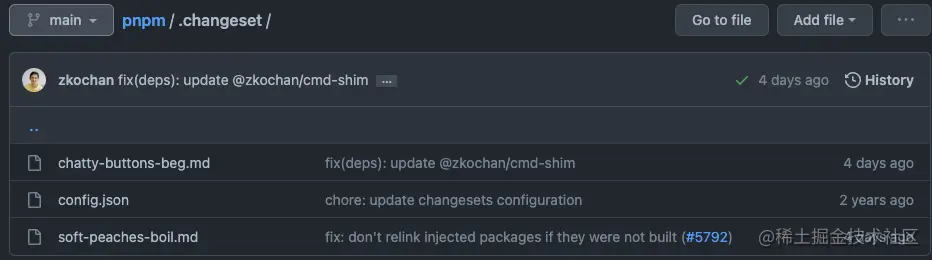
这些 `changeset` 文件是需要一并提交到远程仓库中的。在后面的包发布后，这些 changeset 文件是会被自动消耗掉的。

### 发布测试版本

假设现在我们要发布一个测试的版本来看下功能是否正常，我们可以使用 `changeset` 的 [Prereleases](https://github.com/changesets/changesets/blob/main/docs/prereleases.md) 功能。
通过执行 `pnpm changeset pre enter <tag> `命令进入先进入 `pre` 模式。

```shell
# ① 发布 alpha 版本
# 是内部测试版，一般不向外部发布，会有很多Bug，一般只有测试人员使用
pnpm changeset pre enter alpha   

# ② 发布 beta 版本
# 也是测试版，这个阶段的版本会一直加入新的功能。在Alpha版之后推出
pnpm changeset pre enter beta  

# ③ 发布 rc 版本
# Release Candidate) 系统平台上就是发行候选版本。RC版不会再加入新的功能了，主要着重于除错
pnpm changeset pre enter rc  
```

这里我运行第二条命令，选择发布 beta 版本。
然后执行 ` pnpm changeset version` 修改包的版本：

图：执行命令 


图：查看文件对比 
可以看到 `pkg-a` 的版本改成了 `0.1.0-beta.0`，`pkg-b` 依赖的 `pkg-a` 版本也对应修改了。
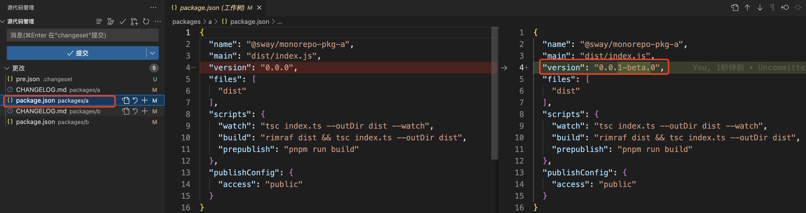 
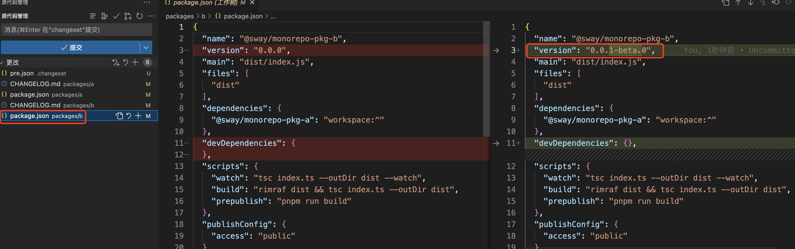 
这时执行 `pnpm run build && pnpm changeset publish` 发布 beta 版本：
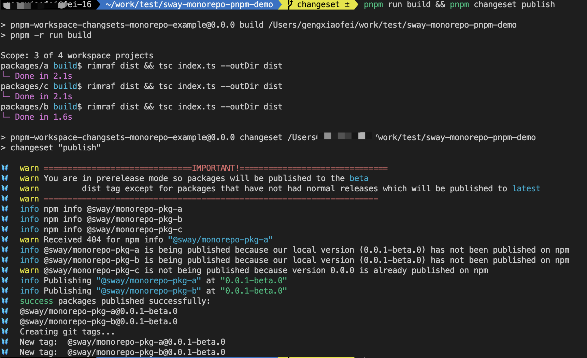 
完成版本发布之后，退出 `Prereleases` 模式：

```shell
pnpm changeset pre exit
```

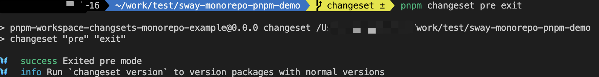

这时，我们需要把变更的内容提交到远程仓库中。
一方面，便于后面查看每次测试版本发布的变更记录；
另一方面，`changesets` 默认不会到 `npm` 中查找当前包最新的测试包版本号并自动加1，它是根据当前仓库的测试包版本号再往上递增生成新的版本号。

### 发布正式版本

测试版本验证完成以后，执行以下命令把包版本修改成正式版本：

```shell
pnpm changeset version
```

> 注意：
>
> - 发布正式版本时，`.changeset` 中的临时文件会被删除


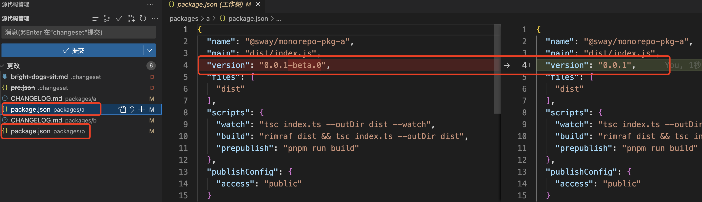 
然后我们执行以下命令发布正式版本：

```shell
pnpm changeset publish
```

`changeset` 会检查当前工作区中所有包的版本是否已经被发布过，如果没有则自动发布。
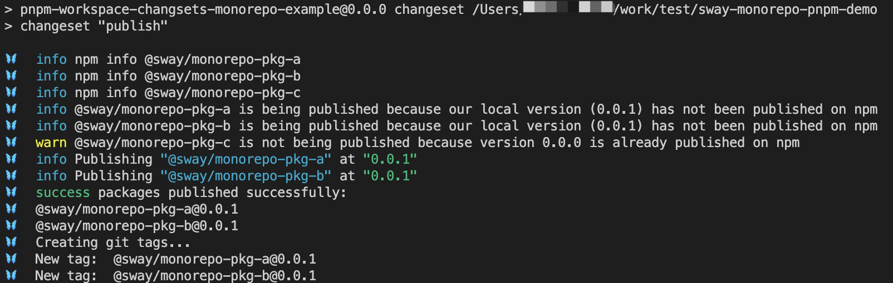

> 参考文章：
>
> - 基于 pnpm + changesets 的 monorepo 最佳实践：[https://juejin.cn/post/7181409989670961207](https://juejin.cn/post/7181409989670961207)
