# Polyfills(垫片)、Transpilers(转译器)、Vite的浏览器兼容

你知道么？你在 Vite 项目中写的高版本 ECMAScript 语法，可能是项目的隐患
## 一、背景
项目基于 Vite 开发，在开发过程中，使用了` Object.fromeEntries`
在低版本浏览器打开，发生了以下报错
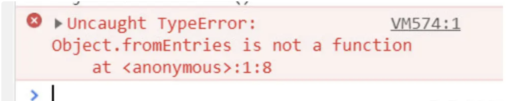
检查 vite.config.js，发现并没有用什么奇怪的插件，首先排除配置文件的问题
秉承追求极致的工程师文化，开始对问题刨根问底
## 二、定位问题
在分析原因之前，先来看看这个新语法 [Object.fromEntries](https://developer.mozilla.org/zh-CN/docs/Web/JavaScript/Reference/Global_Objects/Object/fromEntries)
它是 ES2019 新推出的语法，并且已是稳定版本
浏览器兼容性 
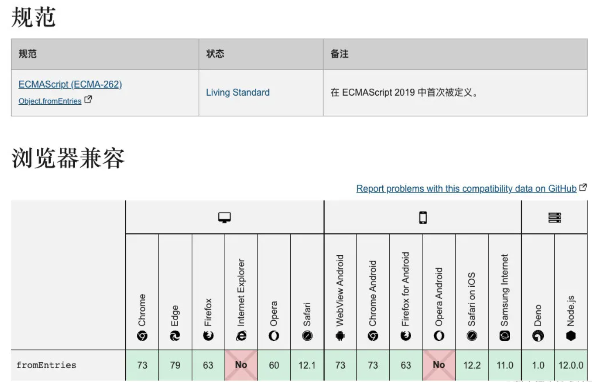
chrome 直到 chrome73 才开始支持
通常情况，为了兼容低版本浏览器，构建工具都会将新语法转为低版本浏览器能识别的语法
浏览器运行时，代码中确实存在 `Object.fromEntries`，因此初步断定 `Vite` 构建时未对 `Object.fromEntries` 作处理
既然是构建的问题，随即翻阅了 Vite 的官网，在[构建章节](https://cn.vitejs.dev/guide/build#browser-compatibility)发现了眉目 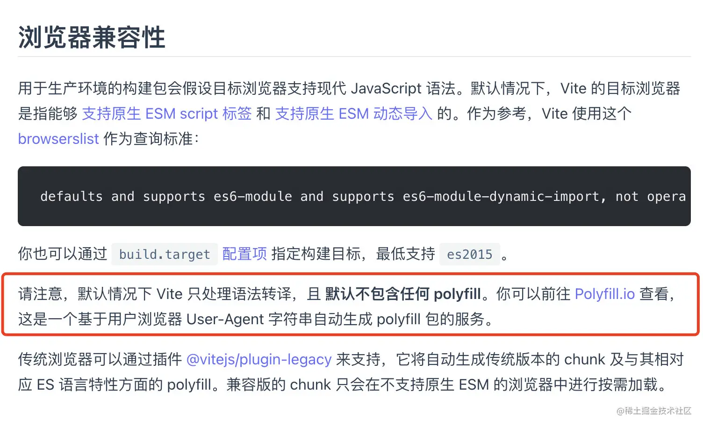
红框中写着，Vite 只会做`语法转译`，不会包含 `polyfills`，那么究竟什么是 `polyfills` 和`语法转译`？
## 三、polyfills
`polyfills` 是通过在低版本浏览器中模拟等效的代码，来实现高版本语法的行为
以本文 `Object.fromEntries` 为例，它的 `polyfill` 代码如下
```javascript
Object.fromEntries = Object.fromEntries || function fromEntries (iterable) {
  return [...iterable].reduce((obj, [key, val]) => {
    obj[key] = val
    return obj
  }, {})
}
```
在执行项目代码前，先加载相关的 `polyfills` 代码，之后遇到 `Object.fromEntries` 就可以完美运行了
### core-js
主流的 `polyfills` 库为 [core-js](https://github.com/zloirock/core-js)，它对目前 `ECMAScript` 最新的语法以版本或类型的维度做了分类，使得开发者更好的按需引入
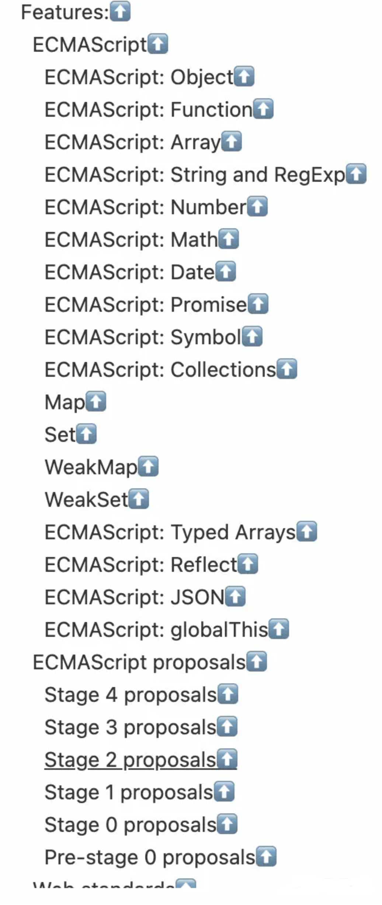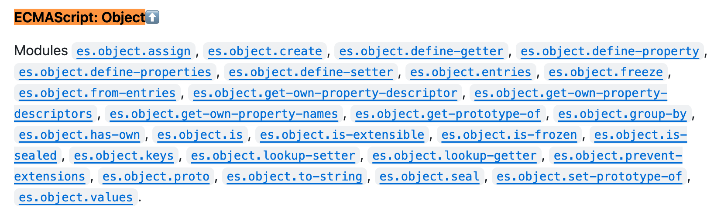
### @babel/preset-env
另外还有基于` core-js` 封装的上层插件 [@babel/preset-env](https://babeljs.io/docs/babel-preset-env)
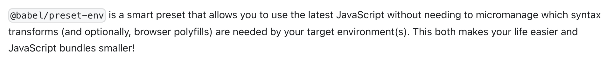
通过在文件中 (`.browserslist`) 声明浏览器版本，设置最低兼容的语法版本来控制 `polyfills` 的代码体积，避免引入过多且不必要的 `polyfills`
### polyfill.io
无论是 `core-js` 还是 `@babel/preset-env`，都是在构建时生成 `polyfills` 代码，换句话说，它们是以 `js` 文件的形式存放在本地产物里的
它们都有一个缺点，虽然可以通过配置在构建时优化 `polyfills` 体积，但一旦生成后无法进一步做优化
**举个例子**
当我使用低于 `chrome73` 的浏览器访问时，它加载了构建时生成的 `polyfills` 代码
而使用最新版本的 `chrome` 访问时，它也加载了相同代码。但对于此时的 `chrome`，由于内核已支持新语法，不需要这个 `polyfill`。此时加载无疑是一种资源浪费，还可能会影响首屏时间（FP）
有什么办法可以在浏览器运行时（`runtime`），动态加载 `polyfills` 呢？答案是 Vite 官网提到的 [polyfill.io](https://polyfill.io/)
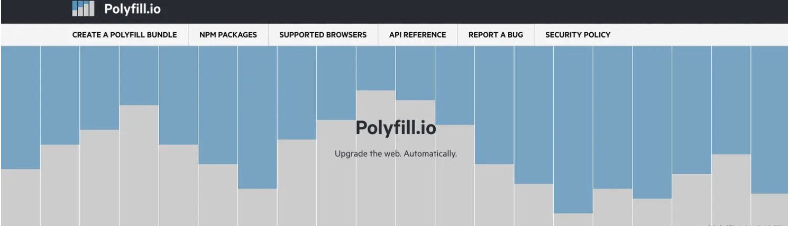
使用` polyfill.io `需要先设置最高的语法版本，得到一段 `URL`
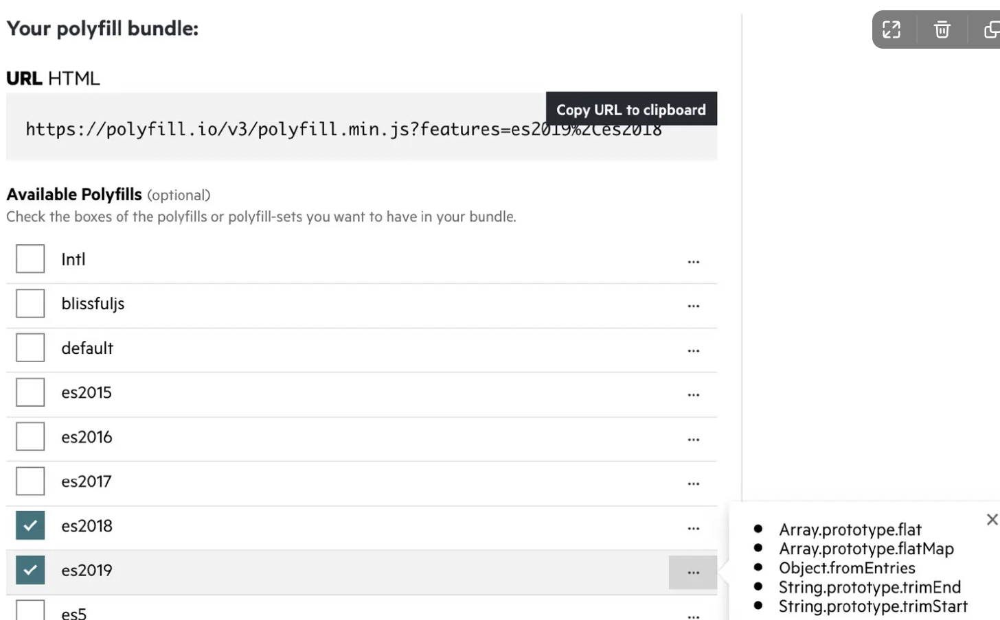
当浏览器访问 `URL` 时，动态返回适合当前浏览器的 `polyfills`

- 低版本浏览器

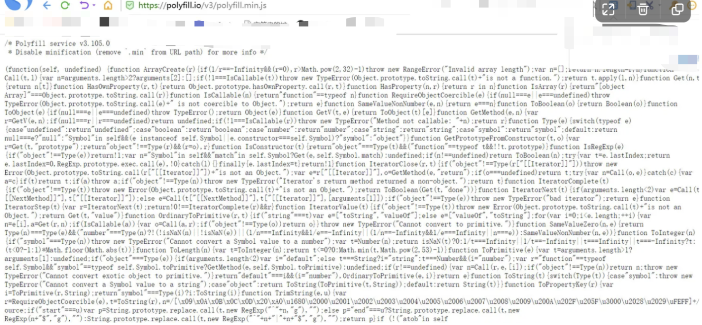

- 高版本浏览器

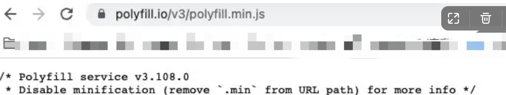
可以发现对于同一个 URL，低版本浏览器和高版本浏览器返回结果是不同的，背后通过服务端识别请求头` User-agent`，并按需返回 `polyfills`
但 `polyfill.io` 也不是完美的

- 需要请求第三方的 URL，由于 `polyfills` 需要在所有业务代码之前执行的特点，如果出现外网波动，可能会造成后续代码阻塞，导致更长的白屏（可以通过私有化部署解决）
- 国内浏览器 `User-agent` 可能识别不准确（国内的一些双核浏览器，还有一些偏门的浏览器可能会有隐患）

具体使用哪种 `polyfills` 手段还是需要看项目，并没有所谓的银弹

- 如果对产物体积不敏感，可以考虑使用预先构建好的 `polyfills`
- 如果目标浏览器能收敛并且有私有化部署的能力，可以考虑使用 `runtime` 版本的 `polyfills`

说了这么多 `polyfills`，接着来看下语法转译
## 四、语法转译
对于部分新语法，单靠 polyfill 是无法实现的，例如

- [optional-chaining ( a?.b )](https://babeljs.io/docs/babel-plugin-transform-optional-chaining)
- [nullish-coalescing-operator ( a ?? 10 )](https://babeljs.io/docs/babel-plugin-transform-nullish-coalescing-operator)
- [logical-assignment-operators ( a ||= 10 )](https://babeljs.io/docs/babel-plugin-transform-logical-assignment-operators)

类似的新语法，由于依赖浏览器内核的词法解析，低版本浏览器是无法通过补丁形式解决的，所以这种语法只能通过语法转译，在构建时就返回低版本浏览器能够运行的代码
```javascript
// 源码
const a = 0
console.log(a ?? 10)

// 产物
var a = 0;
console.log(a !== null && a !== void 0 ? a : 10);
```
现在主流的转译工具就是 [babel](https://babeljs.io/) （是的它除了 polyfills 也支持语法转译），通过与构建工具的集成，可以实现开发环境对新语法的开箱即用，实现原理简要如下

1. 构建时，通过词法分析，将其解析为[抽象语法树](https://zh.wikipedia.org/wiki/%E6%8A%BD%E8%B1%A1%E8%AA%9E%E6%B3%95%E6%A8%B9)

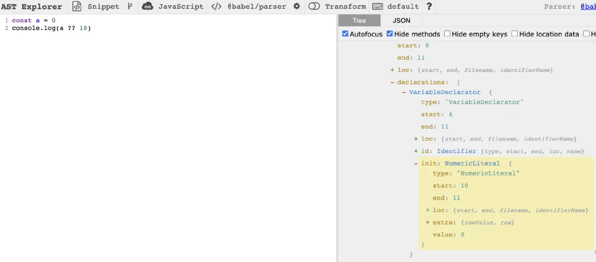

1. 之后将抽象语法树转换为兼容低版本浏览器的抽象语法树
2. 用新的抽象语法树生成低版本的 js 代码即可

最终产物也不会包含新语法，因此所有浏览器都能完美运行
## 五、polyfill和语法转译的区别
那么哪些语法用 `polyfill`，哪些语法用`语法转译`呢？

- 在任何版本的浏览器上都可以模拟实现的 `api`，使用 `polyfill`
- 涉及到词法层面的，例如新的关键字（`async`/`const`/`箭头函数`/`??`），使用语法转译
- 能用 `polyfill` 实现的都用 `polyfill`，实现不了的，用语法转译

**再举几个其他例子**
**polyfills**

- String.prototype.matchAll
- Number.isNaN
- Map/Set

**语法转译**

- 箭头函数
- `const`/`let`
- `async`/`await`
- 装饰器
## 六、Vite 对 polyfills 的支持
用了大篇幅讲了 `polyfills` 和`语法转译`的关系，回到问题本身，官方文档中明确提到 Vite 并不会添加 `polyfills`
而使用 [vue-cli](https://cli.vuejs.org/zh/guide/browser-compatibility.html#browserslist) 则会自动添加 polyfills
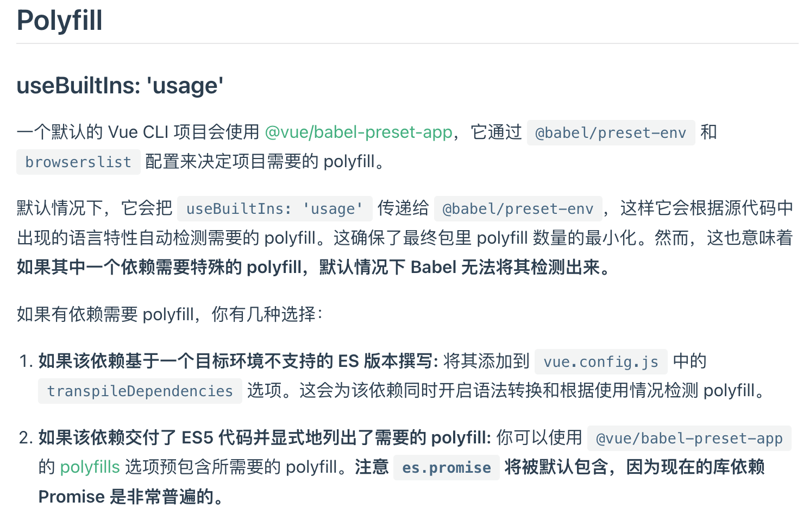
为此疑惑的我询问了 Vite 开发者
、
他表示 Vite 是面向现代浏览器的（这个其实不太对，后面他也补充了，现代浏览器也需要 `polyfills`）
**推测是因为 Vite 内置的 esbuild 对 polyfills 的支持有限，因此 Vite 本身也不包含 polyfills**
同时他推荐了[@vitejs/plugin-legacy](https://github.com/vitejs/vite/tree/main/packages/plugin-legacy#polyfill-specifiers)插件，可以为 Vite 添加 polyfills 的支持
或者使用上文提到的 `runtime polyfills` 的方式。具体采取哪种，还是得分析产物的体积，以及首屏的 `benchmark` 再做决定
不管怎么样，问题最终还是找到了，也有了相应解决方法
## 七、vite浏览器兼容文档
**Vite的浏览器兼容**
[https://cn.vitejs.dev/guide/build#browser-compatibility](https://cn.vitejs.dev/guide/build#browser-compatibility)

**使用vite的plugin方式**
官网文档：[https://cn.vitejs.dev/guide/using-plugins.html](https://cn.vitejs.dev/guide/using-plugins.html)
示例文档：[https://blog.csdn.net/qq_44603011/article/details/133299614](https://blog.csdn.net/qq_44603011/article/details/133299614)

**仅在build时处理兼容问题**
官网文档：[https://cn.vitejs.dev/config/build-options.html#build-target](https://cn.vitejs.dev/config/build-options.html#build-target)

**在vite中使用babel处理语法转译的方法**
vite plugin bable：[https://www.npmjs.com/package/vite-plugin-babel](https://www.npmjs.com/package/vite-plugin-babel)
## 八、总结

- 由于 `esbuild` 对 `polyfills` 支持有限，因此 `Vite` 本身也不包含 `polyfills`
- 在为项目单独添加 `polyfills` 前，避免写需要被 `polyfill` 的新语法，否则会导致低版本浏览器报错
- 低版本浏览器并非 IE 浏览器，也包含低版本的 chrome 浏览器
- 为了所有用户都能正常运行项目中的新语法，推荐单独添加 `polyfills`
- 可以使用 [@vitejs/plugin-legacy](https://github.com/vitejs/vite/tree/main/packages/plugin-legacy#polyfill-specifiers) 或者 [polyfill.io](https://polyfill.io/) 为 Vite 项目添加 polyfills
## 九、参考资料

- Polyfill和转译器：[https://zh.javascript.info/polyfills](https://zh.javascript.info/polyfills)
- [What is the difference between Polyfilling and Transpiling?](https://javascript.plainenglish.io/do-you-know-the-differences-between-polyfilling-and-transpiling-17b82e2053f6)
- [https://juejin.cn/post/7028025903326167053](https://juejin.cn/post/7028025903326167053)
