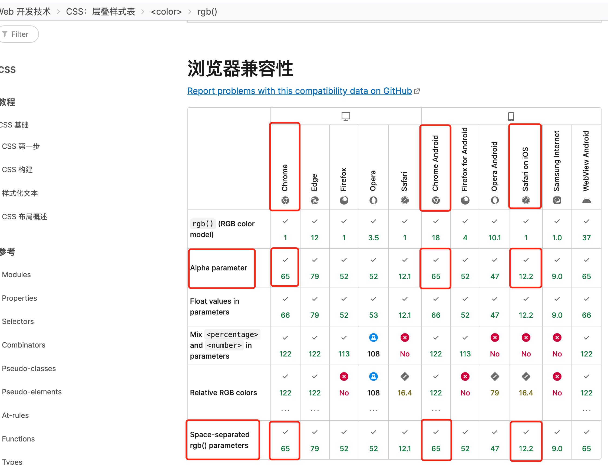
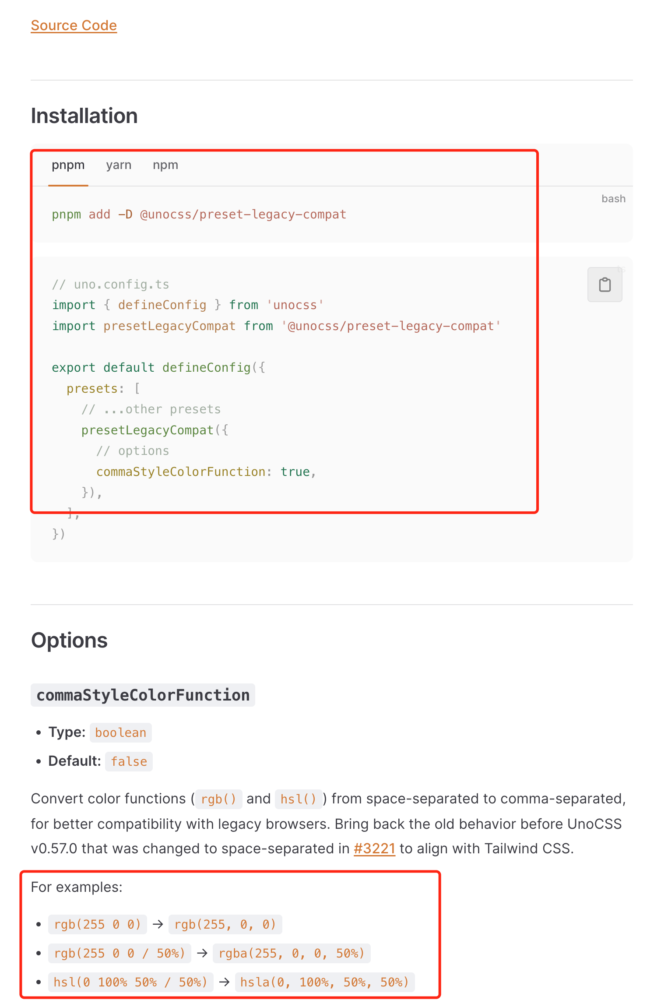

# CSS兼容问题之rgb 

**背景**

**低版本chrome浏览器（65以下）不支持`rgb`的空格分隔表示的透明度方法，请参考**[MDN的rgb()：链接](https://developer.mozilla.org/zh-CN/docs/Web/CSS/color_value/rgb)

**解决方案**

**- 使用`rgba`替换`rgb`**

**- 如使用unocss，请参考如下配置：**[链接](https://unocss.dev/presets/legacy-compat#commastylecolorfunction)

