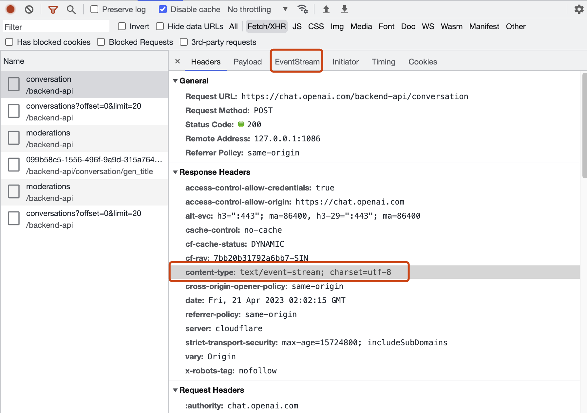
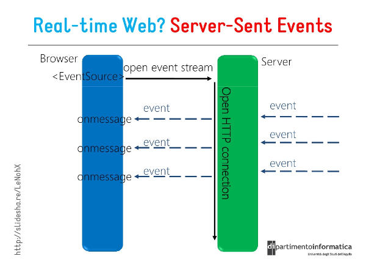

# EventSource之关于ChatGPT的文本流显示实现方式

> 来源：@任群的TTC文章

## 一、背景
在使用`ChatGPT`时，我们都体验过相应结果返回文字可以一个字一个字的蹦出来，类似打字的效果。结合`GPT`的实现方式是类似逐字生成的方式，应该是采用了流式的数据的响应方式。<br />	一开始在没有查看开发者工具时，猜测可能使用的方式，比如`websocket`双向通信协议、http长连接、轮训等。


但是当我打开控制台查看时候，发现并没有使用`websocket`等协议的通信方式，但是发现了一个`content-type=text/event-stream` 的请求，并且在面板选项中多了一个 `EventStream`的选项卡可供查看。当请求发起进行时，该请求的请求时间一直在增长，直至消息结束。<br />`Headers`面板：<br />


`EventStream`面板：<br />

经查询资料发现此种请求方式为：服务器推送事件`(Server-Sent-events`)，我们来看`MDN`上的描述信息：
> - 开发一个使用服务器发送的事件的 Web 应用程序是很容易的。你需要在服务器上的一些代码将事件流传输到 Web 应用程序，但 Web 应用程序端的事情几乎完全相同，处理任何其他类型的事件。
> - 在 Web 应用程序中使用服务器发送事件很简单。在服务器端，只需要按照一定的格式返回事件流，在客户端中，只需要为一些事件类型绑定监听函数，和处理其他普通的事件没多大区别。

## 二、名词解释

- `EventSource`: `EventSource`是浏览器提供的一个API，用于实现服务器发送事件（`Server-Sent Events, SSE`）。这是一种实时通信技术，允许服务器通过HTTP连接向客户端（如浏览器）实时推送消息。与`WebSocket`相比，`EventSource`仅支持单向通信（从服务器到客户端），但实现相对简单。`EventSource`主要用于实时更新数据、显示通知等场景。
- `SSE`: （`Server-Sent Events, SSE`）
- `application/event-stream`: 是服务器发送事件（SSE）的`MIME`类型。当使用`EventSource`建立连接时，服务器会返回这种`MIME`类型的响应，表明该连接将用于传输SSE消息。`application/event-stream`用于定义SSE消息的格式，每个消息由一系列字段（如data, id, event等）组成，字段之间以换行符分隔。
- `stream`: 流式数据
- 单工通道：只能一方面的数据导向，例如，在我们前端，我们通过浏览器向服务器请求数据，但是服务器不会主动推送数据给我们，这就是单通道
- 双工通道：类似webSocket这样的技术，客户端可以推数据给服务器，服务器也可以推数据给客户端
## 三、`SSE`的特点
`SSE` 与 `WebSocket` 作用相似，都是建立浏览器与服务器之间的通信渠道，然后服务器向浏览器推送信息。<br />总体来说，`WebSocket` 更强大和灵活。因为它是全双工通道，可以双向通信；SSE 是单向通道，只能服务器向浏览器发送，因为流信息本质上就是下载。如果浏览器向服务器发送信息，就变成了另一次 HTTP 请求。<br /><br />但是，SSE 也有自己的优点。

- SSE 使用 `HTTP` 协议，现有的服务器软件都支持。`WebSocket` 是一个独立协议。
- SSE 属于轻量级，使用简单；`WebSocket` 协议相对复杂。
- SSE 默认支持断线重连，`WebSocket` 需要自己实现。
- SSE 一般只用来传送文本，二进制数据需要编码后传送，`WebSocket` 默认支持传送二进制数据。
- SSE 支持自定义发送的消息类型。
## 四、详细解释
### 4.1、前端
#### 4.1.1、Eventsource对象
服务器发送事件 API 也就是 [EventSource](https://developer.mozilla.org/zh-CN/docs/Web/API/EventSource) 接口，在你创建一个新的 [EventSource](https://developer.mozilla.org/zh-CN/docs/Web/API/EventSource) 对象的同时，你可以指定一个接受事件的 URI。例如：
> const evtSource = new EventSource("ssedemo.php"); 
> **备注：** 从 Firefox 11 开始，EventSource开始支持[CORS](https://developer.mozilla.org/zh-CN/HTTP_access_control).虽然该特性目前并不是标准，但很快会成为标准


SSE 的客户端 API 部署在EventSource对象上。下面的代码可以检测浏览器是否支持 SSE。
```javascript
if ('EventSource' in window) {
  // ...
}
```
如果发送事件的脚本不同源，应该创建一个新的包含 `URL` 和 `options` 参数的`EventSource`对象。<br />使用的URL可以与当前网址同域，也可以跨域。跨域时，可以指定第二个参数，打开`withCredentials`属性，表示是否一起发送 `Cookie`。<br />例如，假设客户端脚本在 `example.com `上：
```javascript
const evtSource = new EventSource("//api.example.com/ssedemo", { withCredentials: true } );
```
`EventSource`实例的`readyState`属性，表明连接的当前状态。该属性只读，可以取以下值。<br />**0：**相当于常量`EventSource.CONNECTING`，表示连接还未建立，或者断线正在重连。<br />**1：**相当于常量`EventSource.OPEN`，表示连接已经建立，可以接受数据。<br />**2：**相当于常量`EventSource.CLOSED`，表示连接已断，且不会重连。
#### 4.1.2、基本用法
连接一旦建立，就会触发open事件，可以在onopen属性定义回调函数。
```javascript

evtSource.onopen = function (event) {
  // ...
};

// 另一种写法
evtSource.addEventListener('open', function (event) {
  // ...
}, false);
```

客户端收到服务器发来的数据，就会触发 [message](https://developer.mozilla.org/zh-CN/docs/Web/API/EventSource/message_event) 事件，可以在onmessage属性的回调函数。
```javascript
evtSource.onmessage = function(event) {
  const newElement = document.createElement("li");
  const eventList = document.getElementById("list");

  newElement.innerHTML = "message: " + event.data;
  eventList.appendChild(newElement);
}

// 另一种写法
evtSource.addEventListener('message', function (event) {
  var data = event.data;
  // handle message
}, false);
```

上面代码中，事件对象的data属性就是服务器端传回的数据（文本格式）。<br />如果发生通信错误（比如连接中断），就会触发error事件，可以在onerror属性定义回调函数。
```javascript
evtSource.onerror = function (event) {
  // handle error event
};

// 另一种写法
evtSource.addEventListener('error', function (event) {
  // handle error event
}, false);
```

close方法用于关闭 SSE 连接。
```javascript
evtSource.close();
```

#### 4.1.3、自定义事件
默认情况下，服务器发来的数据，总是触发浏览器`EventSource`实例的`message`事件。开发者还可以自定义 `SSE` 事件，这种情况下，发送回来的数据不会触发`message`事件。
```javascript
source.addEventListener('foo', function (event) {
  var data = event.data;
  // handle message
}, false);
```

### 4.2、服务端(`Nodejs`)
#### 4.2.1、基本信息
服务器向浏览器发送的 SSE 数据，必须是  [UTF-8](https://developer.mozilla.org/zh-CN/docs/Glossary/UTF-8) 编码的文本，具有如下的 HTTP 头信息。
```http
Content-Type: text/event-stream
Cache-Control: no-cache
Connection: keep-alive
```
上面三行之中，第一行的`Content-Type`必须指定 `MIME` 类型为`event-steam`。<br />每一次发送的信息，由若干个`message`组成，每个`message`之间用`\n\n`分隔。每个`message`内部由若干行组成，每一行都是如下格式。
```http
[field]: value\n
```
上面的`field`可以取四个值。
```http
data
event
id
retry
```
此外，还可以有冒号开头的行，表示注释。通常，服务器每隔一段时间就会向浏览器发送一个注释，保持连接不中断。
```http
: This is a comment
```
下面是一个例子
```http
: this is a test stream\n\n

data: some text\n\n

data: another message\n
data: with two lines \n\n
```
#### 4.2.2、字段
规范中规定了下面这些字段：<br />如果数据很长，可以分成多行，最后一行用\n\n结尾，前面行都用\n结尾。

`event`<br />事件类型。<br />如果指定了该字段，则在客户端接收到该条消息时，会在当前的`EventSource`对象上触发一个事件，事件类型就是该字段的字段值，你可以使用`addEventListener() `方法在当前 `EventSource`对象上监听任意类型的命名事件，如果该条消息没有`event`字段，则会触发`onmessage` 属性上的事件处理函数.
```http
event: foo\n
data: a foo event\n\n

data: an unnamed event\n\n

event: bar\n
data: a bar event\n\n
```
上面的代码创造了三条信息。第一条的名字是`foo`，触发浏览器的`foo`事件；第二条未取名，表示默认类型，触发浏览器的`message`事件；第三条是`bar`，触发浏览器的`bar`事件。

`data`<br />消息的数据字段。<br />如果该条消息包含多个data字段，则客户端会用换行符把它们连接成一个字符串来作为字段值。
```http
data:  message\n\n
```
如果数据很长，可以分成多行，最后一行用`\n\n`结尾，前面行都用`\n`结尾。
```http
data: begin message\n
data: continue message\n\n
```
下面是一个发送 JSON 数据的例子。
```
data: {\n
data: "foo": "bar",\n
data: "baz", 555\n
data: }\n\n
```

`id`<br />事件ID。<br />会成为当前EventSource对象的内部属性"最后一个事件 ID"的属性值，相当于每一条数据的编号。
```http
id: msg1\n
data: message\n\n
```
浏览器用`lastEventId`属性读取这个值。一旦连接断线，浏览器会发送一个 `HTTP` 头，里面包含一个特殊的`Last-Event-ID`头信息，将这个值发送回来，用来帮助服务器端重建连接。因此，这个头信息可以被视为一种同步机制。

`retry`<br />一个整数值。<br />指定了重新连接的时间 (单位为毫秒),如果该字段值不是整数，则会被忽略。
```http
retry: 10000\n
```
两种情况会导致浏览器重新发起连接：一种是时间间隔到期，二是由于网络错误等原因，导致连接出错。

除了上面规定的字段名，其他所有的字段名都会被忽略。
> 如果一行文本中不包含冒号，则整行文本会被解析成为字段名，其字段值为空。


#### 4.2.3、 `nodejs` 实例
`SSE` 要求服务器与浏览器保持连接。对于不同的服务器软件来说，所消耗的资源是不一样的。Apache 服务器，每个连接就是一个线程，如果要维持大量连接，势必要消耗大量资源。Node 则是所有连接都使用同一个线程，因此消耗的资源会小得多，但是这要求每个连接不能包含很耗时的操作，比如磁盘的 IO 读写。

```javascript

module.exports = async function (req, res) {
  const id = uuid()
  // 发送事件
  const sendEvent = (data) => {
    const retry = 2000
    const event = 'chatdata'
    const msg = `event:${event}\nid:${id}\nretry:${retry}\ndata: ${JSON.stringify(data)}\n\n`
    res.write(msg);
    res.write(`data: ${JSON.stringify(data)}\n\n`);
  };
  // 设置响应头
  res.setHeader('Content-Type', 'text/event-stream');
  res.setHeader('Cache-Control', 'no-cache');
  res.setHeader('Connection', 'keep-alive');
  // 发送次数
  let count = 0
  // 定时器发送
  let timer = setInterval(() => {
    if (count > 10) {
      clearInterval(timer)
      sendEvent({ message: `data: [DONE]` });
      return
    }
    count++
    sendEvent({ message: `data: {"count": "${count}"}` });
  }, 500)
}
```
## 五、实现一个chatGPT的中间层过滤
当我们想要对GPT做二次开发时，肯定是需要对gpt的接口做一层封装代理，中间增加一些我们自己的逻辑。那么这个时候我们就需要对openai的接口做一层封装了。
> 用户层 --> 接口服务层 --> openai API层

#### 5.1、接口服务层
以下示例展示了在nodejs层对openai进行代理并处理数据的返回给前端的方式：
```javascript
const axios = require('axios');
const { Readable } = require('stream')

module.exports = async function (req, res) {
  // 发送事件
  const sendEvent = (data) => {
    res.write(`data: ${JSON.stringify(data)}\n\n`);
  };
  // 设置响应头
  res.setHeader('Content-Type', 'text/event-stream');
  res.setHeader('Cache-Control', 'no-cache');
  res.setHeader('Connection', 'keep-alive');

  // 配置请求参数
  const requestOptions = {
    method: 'post',
    url: 'https://api.openai.com/v1/chat/completions',
    headers: {
      'Content-Type': 'application/json',
      'Authorization': `Bearer ${process.env.OPENAI_API_KEY}`,
    },
    data: {
      model: "gpt-3.5-turbo",
      messages: [
        { role: 'user', content: '你好' },
      ],
      max_tokens: 2048,
      stream: true, // 使用流式请求
    },
    responseType: 'stream', // 响应类型为流
  };

  axios(requestOptions)
    .then((response) => {
      const dataStream = Readable.from(response.data)
      // 监听数据流
      dataStream.on('data', (chunk) => {
        // 可在此添加一些自己的中间层处理逻辑
        sendEvent({ message: chunk.toString() });
      })
      dataStream.on('end', () => {
        // 数据流结束 do something...
        dataStream.destroy()
      })
    })
    .catch((error) => {
      // 错误 do something...
    })
}
```

#### 5.2、用户层
用户层通过发送 event-stream 请求来拉取消息：
```javascript
export default function ChatMain(props: any) {
  const [contentStream, setContentStream] = useState('')
  /**
   * 提交事件
   * @param event 提交事件
   * @param text 发送的消息体
   * @returns 
   */
  async function onSubmit(event: any, text?: string) {
    // 实例化 EventSource 参数是服务端监听的路由
    const user = 'user'
    const msg = text
    let params: any = {
      user,
      content: msg,
    }
    // 参数拼接
    params = Object.keys(params).map(key => `${key}=${params[key]}`).join('&')
    // 发起 event-source 请求
    const source = new EventSource(`/api/chatStream?${params}`, {
      withCredentials: true
    })
    // 用于拼接返回的文本
    let textStream = ''
    // 监听与服务器连接成功的事件
    source.onopen = function (event) { // 与服务器连接成功回调
      console.log('成功与服务器连接')
    }
    // 监听从服务器发送来的所有没有指定事件类型的消息(没有event字段的消息)
    source.onmessage = function (event) {
      const sourceData = JSON.parse(event.data);
      // 如果消息是 [DONE] 表示消息发送完毕，关闭连接
      if (sourceData.message === '[DONE]') {
        source.close()
        return
      }
      // 对返回的消息进行分割
      let list = sourceData.message.split('\n\n') || []
      try {
        list.forEach((item: string) => {
          if (item === 'data: [DONE]') {
            source.close()
            return
          }else if (!!item) {
            // 将返回的消息转换为对象
            let resultData = JSON.parse(item.substr(6))
            // 统一处理消息的错误
            if (resultData.errorMsg) {
              message.error(resultData.errorMsg)
              source.close()
              return
            }
            // 截取返回的消息体文本
            const chunkData = resultData?.choices?.[0]?.delta?.content
            if (chunkData) {
              textStream += chunkData
              // 把消息体文本赋值给 contentStream
              setContentStream(textStream)
            }
          }
        })
      } catch (error) {
        message.error(JSON.stringify(error))
      }
    }
    source.onerror = function (error) { // 监听错误
      message.error(JSON.stringify(error))
    }
  }
```

实现结果：<br />可以从控制台看到，接口的eventStream里能不断的返回数据结果。<br />

简单做下视觉实现：<br />

## 六、使用场景
这种事件流的形式很适合在线聊天对话、金融交易、股票行情、天气预报等实时业务的需要，并且有比较单一方向的推送，不涉及双向推送的。
## 七、注意事项
#### 7.1、nginx支持
在开发过程中，比如本地会使用localhost服务，直接通过类似 `localhost:3000/api/chat`的形式进行请求是没有问题的，但是当我们发布到测试或线上时候，一般会有域名服务比如:`chat.xx.com/api/chat`,这时就有可能会出现无法实现实时推送消息到前端的情况，但是接口是通的。这个时候就要排查一个原因就是服务代理层是否支持这种流文本服务，比如nginx服务的配置支持情况，我们的代理服务可能是这样的：
```
location /api/ {
  proxy_pass http://xxxx.com;
}
```

修改后：
```
location /api/ {
  proxy_pass http://xxxx.com;
  # 新增以下配置
  proxy_set_header Connection "";
  proxy_http_version 1.1;
  proxy_buffering off;
  proxy_cache off; 
}
```
#### 7.2、兼容性
作为一个html5的特性，在 caniuse 上查询到的浏览器兼容性，主流刘拉你基本很早就支持了：<br />

## 八、参考文档

1. MDN：[https://developer.mozilla.org/zh-CN/docs/Web/API/Server-sent_events/Using_server-sent_events](https://developer.mozilla.org/zh-CN/docs/Web/API/Server-sent_events/Using_server-sent_events)
2. openai: [https://platform.openai.com/docs/api-reference/chat](https://platform.openai.com/docs/api-reference/chat)
3. [https://www.ruanyifeng.com/blog/2017/05/server-sent_events.html](https://www.ruanyifeng.com/blog/2017/05/server-sent_events.html)

