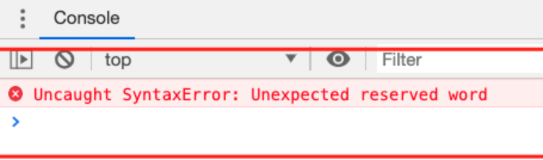
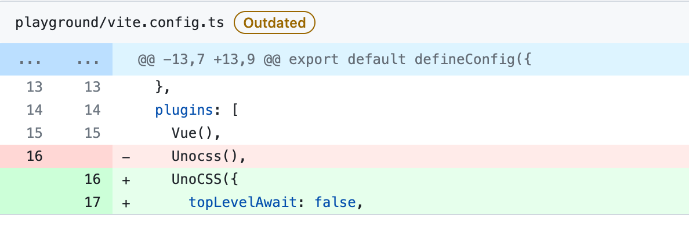

# unocss的浏览器兼容: Unexpected reserved word
## 一、背景 （遇到的问题）
`chrome87`（含）版本以下会遇到这个问题

`unocss Uncaught SyntaxError: Unexpected reserved word`
## 二、原因
`chrome87`版本以前不支持`TopLevelAwait`
## 三、解决方案
unoc的配置中增加如下配置
```javascript
UnoCSS({
  hmrTopLevelAwait: false,
}),
```
## 四、参考资料
[https://github.com/unocss/unocss/pull/2066](https://github.com/unocss/unocss/pull/2066)


