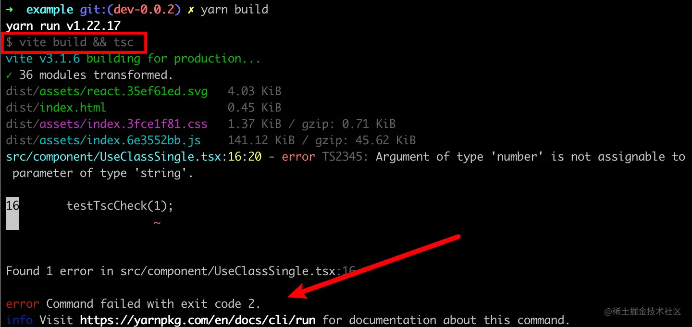

# d.ts 描述文件

> 参考信息
>
> - TS官网关于ds文件的说明：[https://www.typescriptlang.org/docs/handbook/declaration-files/introduction.html](https://www.typescriptlang.org/docs/handbook/declaration-files/introduction.html)

## 什么是声明文件

`TypeScript`声明文件是一种特殊的文件，通常使用.d.ts文件扩展名。它用于描述现有的 `JavaScript`代码库或模块的类型信息，以便在TypeScript项目中使用它们时能够获得类型检查和代码提示。`<br />`在 `TypeScript`项目中，可以使用声明文件为 `JavaScript`库和模块提供类型信息。`TypeScript`声明文件包含了库或模块的类型定义，包括函数、类、接口等。在编译时，`TypeScript`编译器会使用声明文件中的信息进行类型检查，从而提高代码的可靠性和可维护性。同时，IDE也可以利用声明文件提供更好的代码提示和自动完成功能。`<br />`需要注意的是，声明文件本身并不包含实际的代码，只是用于描述代码的类型信息。因此，在使用第三方 `JavaScript`库时，需要手动获取或安装相应的声明文件，以便在 `TypeScript`项目中使用该库时获得类型检查和代码提示。

## 如何自动生成声明文件

### 使用 `tsc`工具，修改 `tsconfig.json` 的配置

需要配置 `tsconfig.json` 文件，在 `typescript` 官方文档中，编译选项，在这里找到与生成相应的 ` .d.ts` 文件和 声明文件 相关的选项，其中包括：

```json
"emitDeclarationOnly": true, // 只输出声明文件(ts 产物)
"declaration": true, // 自动生成声明文件
"declarationDir": "dist", // 声明文件生成的目录
```

#### 调整构建命令的顺序，先 `build` 再执行 `tsc` 的检测

```json
// 原有的构建命令
{
  "scripts": "tsc && vite build"
}

// 修改后的构建命令
{
  "scripts": "vite build && tsc"
}
```

原因：`<br />`vite build 命令生成的构建会重新覆盖原有的目录，如果在 tsc 命令后执行，则生成的 .d.ts 文件会被覆盖`<br />`tsc 在构建过程的作用是类型检测，[vite 可以直接将 Typescript 转译到 Javascript](https://cn.vitejs.dev/guide/features.html#typescript)`<br />``<br />`Q: tsc 命令置后执行，会不会在构建完成后遗漏了类型检测？`<br />`A: 不会，即使 build 完成后，执行 tsc 遇到错误的编码，也会在终端报错从而退出命令的执行。

### 使用tsup

**TSUP**是一个用于构建TypeScript库的工具，它可以自动生成**.d.ts**文件，并支持自定义输出文件名和位置。在使用**TSUP**生成**.d.ts**文件时，需要在**tsup.config.json**配置文件中指定**dts**选项，例如：

```json
{
  "dts": true,
  "entryPoints": ["index.ts"],
  "outdir": "dist",
  "format": ["cjs", "esm"]
}

```

tsup: [https://github.com/egoist/tsup](https://github.com/egoist/tsup) `<br />`unbuild: [https://github.com/unjs/unbuild](https://github.com/unjs/unbuild)
