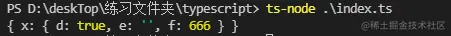

# TypeScript入门总结（二）

## 七、字面量类型

在 `TypeScript` 中，字面量不仅可以表示值，还可以表示类型，即所谓的字面量类型。

目前，TypeScript 支持 3 种字面量类型：_**字符串字面量类型、数字字面量类型、布尔字面量类型**_，对应的字符串字面量、数字字面量、布尔字面量分别拥有与其值一样的字面量类型，具体示例如下：

```typescript
{
  let specifiedStr: 'this is string' = 'this is string';
  let specifiedNum: 1 = 1;
  let specifiedBoolean: true = true;
}
```

比如 `'this is string'`（这里表示一个字符串字面量类型）类型是 `string` 类型（确切地说是 `string` 类型的子类型），而 `string` 类型不一定是 ` 'this is string'`（这里表示一个字符串字面量类型）类型，如下具体示例：

```typescript
{
  let specifiedStr: 'this is string' = 'this is string';
  let str: string = 'any string';
  specifiedStr = str; // ts(2322) 类型 '"string"' 不能赋值给类型 'this is string'
  str = specifiedStr; // ok 
}
```

比如说我们用“马”比喻 `string` 类型，即“黑马”代指 `'this is string'`类型，“黑马”肯定是“马”，但“马”不一定是“黑马”，它可能还是“白马”“灰马”。

因此，'this is string' 字面量类型可以给 string 类型赋值，但是 string 类型不能给 'this is string' 字面量类型赋值，这个比喻同样适合于形容数字、布尔等其他字面量和它们父类的关系。

### 7.1、字符串.字面量类型

一般来说，我们可以使用一个字符串字面量类型作为变量的类型，如下代码所示：

```typescript
let hello: 'hello' = 'hello';
hello = 'hi'; // ts(2322) Type '"hi"' is not assignable to type '"hello"'
```

实际上，定义单个的字面量类型并没有太大的用处，它真正的应用场景是可以把多个字面量类型组合成一个联合类型（后面会讲解），用来描述拥有明确成员的实用的集合。

如下代码所示，我们使用字面量联合类型描述了一个明确、可 `'up'` 可 `'down'` 的集合，这样就能清楚地知道需要的数据结构了。

```typescript
type Direction = 'up' | 'down';

function move(dir: Direction) {
  // ...
}
move('up'); // ok
move('right'); // ts(2345) Argument of type '"right"' is not assignable to parameter of type 'Direction'

```

通过使用字面量类型组合的联合类型，我们可以限制函数的参数为指定的字面量类型集合，然后编译器会检查参数是否是指定的字面量类型集合里的成员。

因此，相较于使用 string 类型，使用字面量类型（组合的联合类型）可以将函数的参数限定为更具体的类型。这不仅提升了程序的可读性，还保证了函数的参数类型，可谓一举两得。

### 7.3、数字.字面量类型 & 布尔.字面量类型

数字字面量类型和布尔字面量类型的使用与字符串字面量类型的使用类似，我们可以使用字面量组合的联合类型将函数的参数限定为更具体的类型，比如声明如下所示的一个类型 Config：

```typescript
interface Config {
  size: 'small' | 'big';
  isEnable:  true | false;
  margin: 0 | 2 | 4;
}
```

在上述代码中，我们限定了 `<br />size` 属性为字符串字面量类型 ` 'small' | 'big'`，`<br />isEnable` 属性为布尔字面量类型 `true | false<br />`（布尔字面量只包含 `true` 和 `false`，`true | false` 的组合跟直接使用 `boolean` 没有区别），`margin` 属性为数字字面量类型 0 | 2 | 4。

### 7.4、let和const分析

我们先来看一个 `const` 示例，如下代码所示：

```typescript
{
  const str = 'this is string'; // str: 'this is string'
  const num = 1; // num: 1
  const bool = true; // bool: true
}
```

在上述代码中，我们将 `const` 定义为一个不可变更的常量，在缺省类型注解的情况下，

`TypeScript` 推断出它的类型直接由赋值字面量的类型决定，这也是一种比较合理的设计。

接下来我们看看如下所示的 let 示例:

```typescript
{
  let str = 'this is string'; // str: string
  let num = 1; // num: number
  let bool = true; // bool: boolean
}
```

在上述代码中，缺省显式类型注解的可变更的变量的类型转换为了赋值字面量类型的父类型，比如 `str` 的类型是 `'this is string'`类型（这里表示一个字符串字面量类型）的父类型 `string`，`num` 的类型是 `1` 类型的父类型 `number`。

这种设计符合编程预期，意味着我们可以分别赋予 `str` 和 `num` 任意值（只要类型是 `string` 和 `number` 的子集的变量）：

```typescript
str = 'any string';
num = 2;
bool = false;
```

我们将 `TypeScript` 的字面量子类型转换为父类型的这种设计称之为 "`literal widening`"，也就是_字面量类型的拓宽_**，比如上面示例中提到的字符串字面量类型转换成 string 类型，下面我们着重介绍一下。

## 八、Type Wideninig（类型拓宽）

所有通过 `let` 或 `var` 定义的**变量、函数的形参、对象的非只读属性**，如果满足**指定了初始值且未显式添加类型注解**的条件，那么它们推断出来的类型就是**指定的初始值字面量类型拓宽后的类型**，这就是**字面量类型拓宽**。

下面我们通过字符串字面量的示例来理解一下字面量类型拓宽：

```typescript
let str = 'this is string'; // 类型是 string
let strFun = (str = 'this is string') => str; // 类型是 (str?: string) => string;
const specifiedStr = 'this is string'; // 类型是 'this is string'
let str2 = specifiedStr; // 类型是 'string'
let strFun2 = (str = specifiedStr) => str; // 类型是 (str?: string) => string;
```

- 因为第 1~2 行满足了 `let`、形参且未显式声明类型注解的条件，所以变量、形参的类型拓宽为 `string`（_形参类型确切地讲是 string | undefined_）。
- 因为第 3 行的常量不可变更，类型没有拓宽，所以 `specifiedStr` 的类型是 `'this is string'` 字面量类型。
- 第 4~5 行，因为赋予的值 `specifiedStr` 的类型是字面量类型，且没有显式类型注解，所以变量、形参的类型也被拓宽了。其实，这样的设计符合实际编程诉求。我们设想一下，如果 `str2` 的类型被推断为 `'this is string'`，它将不可变更，因为赋予任何其他的字符串类型的值都会提示类型错误。

基于字面量类型拓宽的条件，我们可以通过如下所示代码添加显示类型注解控制类型拓宽行为。

```typescript
{
  const specifiedStr: 'this is string' = 'this is string'; // 类型是 '"this is string"'
  let str2 = specifiedStr; // 即便使用 let 定义，类型是 'this is string'
}
```

实际上，除了字面量类型拓宽之外，`TypeScript` 对某些特定类型值也有类似 `"Type Widening"` （类型拓宽）的设计，下面我们具体来了解一下。

比如对 `_null_`_ 和 _`_undefined_`_ 的类型进行拓宽_，通过 `let`、`var` 定义的变量如果满足未显式声明类型注解且被赋予了 `null` 或 `undefined` 值，则推断出这些变量的类型是 `any`：

```typescript
{
  let x = null; // 类型拓宽成 any
  let y = undefined; // 类型拓宽成 any

  /** -----分界线------- */
  const z = null; // 类型是 null

  /** -----分界线------- */
  let anyFun = (param = null) => param; // 形参类型是 null
  let z2 = z; // 类型是 null
  let x2 = x; // 类型是 null
  let y2 = y; // 类型是 undefined
}
```

『注意：在严格模式下，一些比较老的版本中（2.0）`null` 和 `undefined` 并不会被拓宽成“`any`”。』

为了更方便的理解类型拓宽,下面我们举个例子,更加深入的分析一下

假设你正在编写一个向量库，你首先定义了一个 `Vector3` 接口，然后定义了 `getComponent` 函数用于获取指定坐标轴的值：

```typescript
interface Vector3 {
  x: number;
  y: number;
  z: number;
}

function getComponent(vector: Vector3, axis: "x" | "y" | "z") {
  return vector[axis];
}
```

但是，当你尝试使用 `getComponent` 函数时，`TypeScript` 会提示以下错误信息：

```typescript
let x = "x";
let vec = { x: 10, y: 20, z: 30 };
// 类型“string”的参数不能赋给类型“"x" | "y" | "z"”的参数。
getComponent(vec, x); // Error
```

为什么会出现上述错误呢？通过 `TypeScript` 的错误提示消息，我们知道是因为变量 x 的类型被推断为 `string` 类型，而 `getComponent` 函数期望它的第二个参数有一个更具体的类型。这在实际场合中被拓宽了，所以导致了一个错误。

这个过程是复杂的，因为对于任何给定的值都有许多可能的类型。例如

```typescript
const arr = ['x', 1];
```

上述 `arr` 变量的类型应该是什么？这里有一些可能性：

```typescript
('x' | 1)[]
['x', 1]
[string, number]
readonly [string, number]
(string | number)[]
readonly (string|number)[]
[any, any]
any[]
```

没有更多的上下文，`TypeScript` 无法知道哪种类型是 “正确的”，它必须猜测你的意图。

尽管 `TypeScript` 很聪明，但它无法读懂你的心思。它不能保证 100% 正确，正如我们刚才看到的那样的疏忽性错误。

在下面的例子中，变量 `x` 的类型被推断为字符串，因为 `TypeScript` 允许这样的代码：

```typescript
let x = 'semlinker';
x = 'kakuqo';
x = 'lolo';
```

对于 `JavaScript` 来说，以下代码也是合法的：

```typescript
let x = 'x';
x = /x|y|z/;
x = ['x', 'y', 'z'];
```

在推断 `x` 的类型为字符串时，`TypeScript` 试图在特殊性和灵活性之间取得平衡。一般规则是，变量的类型在声明之后不应该改变，因此 `string` 比 `string|RegExp` 或 `string|string[]` 或任何字符串更有意义。`<br />TypeScript` 提供了一些控制拓宽过程的方法。

其中一种方法是使用 `const`。如果用 `const` 而不是 `let` 声明一个变量，那么它的类型会更窄。

事实上，使用 `const` 可以帮助我们修复前面例子中的错误：

```typescript
const x = "x"; // type is "x" 
let vec = { x: 10, y: 20, z: 30 };
getComponent(vec, x); // OK
```

因为 `x` 不能重新赋值，所以 `TypeScript` 可以推断更窄的类型，就不会在后续赋值中出现错误。因为字符串字面量型 “`x`” 可以赋值给 ` "x"|"y"|"z"`，所以代码会通过类型检查器的检查。

然而，`const` 并不是万灵药。对于对象和数组，仍然会存在问题。

以下这段代码在 `JavaScript` 中是没有问题的：

```typescript
const obj = { 
  x: 1,
}; 

obj.x = 6; 
obj.x = '6';

obj.y = 8;
obj.name = 'semlinker';
```


而在 `TypeScript` 中，对于 `obj` 的类型来说，它可以是 ` {readonly x：1}` 类型，或者是更通用的 `{x：number}` 类型。当然也可能是 ` {[key: string]: number}` 或 `object` 类型。对于对象，`TypeScript` 的拓宽算法会**_将其内部属性视为将其赋值给 let 关键字声明的变量，进而来推断其属性的类型_。

因此 `obj` 的类型为 ` {x：number}` 。这使得你可以将 `obj.x` 赋值给其他 `number` 类型的变量，而不是 `string` 类型的变量，并且它还会阻止你添加其他属性。

因此最后三行的语句会出现错误：

```typescript
const obj = { 
  x: 1,
};

obj.x = 6; // OK 

// Type '"6"' is not assignable to type 'number'.
obj.x = '6'; // Error

// Property 'y' does not exist on type '{ x: number; }'.
obj.y = 8; // Error

// Property 'name' does not exist on type '{ x: number; }'.
obj.name = 'semlinker'; // Error
```

`TypeScript` 试图在具体性和灵活性之间取得平衡。它需要推断一个足够具体的类型来捕获错误，但又不能推断出错误的类型。它通过属性的初始化值来推断属性的类型，当然有几种方法可以覆盖 `TypeScript` 的默认行为。一种是提供显式类型注释：

```typescript
// Type is { x: 1 | 3 | 5; }
const obj: { x: 1 | 3 | 5 } = {
  x: 1 
};
```

另一种方法是使用_ _`_const_`_ 断言_。不要将其与 `let` 和 `const` 混淆，后者在值空间中引入符号。这是一个纯粹的类型级构造。让我们来看看以下变量的不同推断类型：

```typescript
// Type is { x: number; y: number; }
const obj1 = { 
  x: 1, 
  y: 2 
}; 

// Type is { x: 1; y: number; }
const obj2 = {
  x: 1 as const,
  y: 2,
}; 

// Type is { readonly x: 1; readonly y: 2; }
const obj3 = {
  x: 1, 
  y: 2 
} as const;

```

当你在一个值之后使用 `const` 断言时，`TypeScript` 将为它推断出最窄的类型，没有拓宽。对于真正的常量，这通常是你想要的。当然你也可以对数组使用 `const` 断言：

```typescript
// Type is number[]
const arr1 = [1, 2, 3]; 

// Type is readonly [1, 2, 3]
const arr2 = [1, 2, 3] as const;
```

既然有类型拓宽，自然也会有类型缩小，下面我们简单介绍一下 ` Type Narrowing`。

## 九、Type Narrowing（类型缩小）

在 `TypeScript` 中，我们可以通过某些操作将变量的类型由一个较为宽泛的集合缩小到相对较小、较明确的集合，这就是 "`Type Narrowing`"。

比如，我们可以使用类型守卫（后面会讲到）将函数参数的类型从 `any` 缩小到明确的类型，具体示例如下：

```typescript
{
  let func = (anything: any) => {
    if (typeof anything === 'string') {
      return anything; // 类型是 string 
    } else if (typeof anything === 'number') {
      return anything; // 类型是 number
    }
    return null;
  };
}
```

在 `VS Code` 中 `hover` 到第 `4` 行的 `anything` 变量提示类型是 `string`，到第 6 行则提示类型是 `number`。

同样，我们可以使用类型守卫将联合类型缩小到明确的子类型，具体示例如下：

```typescript
{
  let func = (anything: string | number) => {
    if (typeof anything === 'string') {
      return anything; // 类型是 string 
    } else {
      return anything; // 类型是 number
    }
  };
}
```

```typescript
{
  let func = (anything: string | number) => {
    if (typeof anything === 'string') {
      return anything; // 类型是 string 
    } else {
      return anything; // 类型是 number
    }
  };
}
```

当然，我们也可以通过字面量类型等值判断（`===`）或其他控制流语句（包括但不限于 if、三目运算符、switch 分支）将联合类型收敛为更具体的类型，如下代码所示：

```typescript
{
  type Goods = 'pen' | 'pencil' |'ruler';
  const getPenCost = (item: 'pen') => 2;
  const getPencilCost = (item: 'pencil') => 4;
  const getRulerCost = (item: 'ruler') => 6;
  const getCost = (item: Goods) =>  {
    if (item === 'pen') {
      return getPenCost(item); // item => 'pen'
    } else if (item === 'pencil') {
      return getPencilCost(item); // item => 'pencil'
    } else {
      return getRulerCost(item); // item => 'ruler'
    }
  }
}
```

在上述 `getCost` 函数中，接受的参数类型是字面量类型的联合类型，函数内包含了 if 语句的 3 个流程分支，其中每个流程分支调用的函数的参数都是具体独立的字面量类型。

那为什么类型由多个字面量组成的变量 `item` 可以传值给仅接收单一特定字面量类型的函数 `getPenCost`、`getPencilCost`、`getRulerCost` 呢？这是因为在每个流程分支中，编译器知道流程分支中的 `item` 类型是什么。比如 ` item === 'pencil'` 的分支，item 的类型就被收缩为“`pencil`”。

事实上，如果我们将上面的示例去掉中间的流程分支，编译器也可以推断出收敛后的类型，如下代码所示：

```typescript
  const getCost = (item: Goods) =>  {
    if (item === 'pen') {
      item; // item => 'pen'
    } else {
      item; // => 'pencil' | 'ruler'
    }
  }
```

一般来说 `TypeScript` 非常擅长通过条件来判别类型，但在处理一些特殊值时要特别注意 —— 它可能包含你不想要的东西！例如，以下从联合类型中排除 `null` 的方法是错误的：

```typescript
const el = document.getElementById("foo"); // Type is HTMLElement | null
if (typeof el === "object") {
  el; // Type is HTMLElement | null
}
```

因为在 `JavaScript` 中 ` typeof null` 的结果是 "`object`" ，所以你实际上并没有通过这种检查排除 `null` 值。除此之外，`falsy` 的原始值也会产生类似的问题：

```typescript
function foo(x?: number | string | null) {
  if (!x) {
    x; // Type is string | number | null | undefined\
  }
}
```

因为空字符串和 `0` 都属于 `falsy` 值，所以在分支中 `x` 的类型可能是 `string` 或 `number` 类型。帮助类型检查器缩小类型的另一种常见方法是在它们上放置一个明确的 “标签”：

```typescript
interface UploadEvent {
  type: "upload";
  filename: string;
  contents: string;
}

interface DownloadEvent {
  type: "download";
  filename: string;
}

type AppEvent = UploadEvent | DownloadEvent;

function handleEvent(e: AppEvent) {
  switch (e.type) {
    case "download":
      e; // Type is DownloadEvent 
      break;
    case "upload":
      e; // Type is UploadEvent 
      break;
  }
}
```

## 十、联合类型

联合类型表示取值可以为多种类型中的一种，使用 `|` 分隔每个类型。

```typescript
let myFavoriteNumber: string | number;
myFavoriteNumber = 'seven'; // OK
myFavoriteNumber = 7; // OK
```

联合类型通常与 `null` 或 `undefined` 一起使用：

```typescript
const sayHello = (name: string | undefined) => {
  /* ... */
};
```

例如，这里 `name` 的类型是 `string | undefined` 意味着可以将 `string` 或 `undefined` 的值传递给 `sayHello` 函数。

```typescript
sayHello("semlinker"); 
sayHello(undefined);
```

通过这个示例，你可以凭直觉知道类型 A 和类型 B 联合后的类型是同时接受 A 和 B 值的类型。此外，对于联合类型来说，你可能会遇到以下的用法：

```typescript
let num: 1 | 2 = 1;
type EventNames = 'click' | 'scroll' | 'mousemove';
```

以上示例中的 `1、2 或 'click'`被称为 `字面量类型`，用来约束取值只能是某几个值中的一个。

## 十一、类型别名

类型别名用来给一个类型起个新名字。类型别名常用于联合类型。

```typescript
type Message = string | string[];
let greet = (message: Message) => {
  // ...
};
```

『注意：类型别名，诚如其名，即我们仅仅是给类型取了一个新的名字，并不是创建了一个新的类型。』

## 十二、交叉类型

交叉类型就是跟联合类型相反，用 `&`操作符表示，交叉类型就是两个类型必须存在。

交叉类型是将多个类型合并为一个类型。 这让我们可以把现有的多种类型叠加到一起成为一种类型，它包含了所需的所有类型的特性。

交叉类型真正的用武之地就是将多个接口类型合并成一个类型，从而实现等同接口继承的效果，也就是所谓的合并接口类型，如下代码所示：

```typescript
interface IpersonA{
  name: string,
  age: number
}

interface IpersonB {
  name: string,
  gender: string
}

let person: IpersonA & IpersonB = { 
  name: "师爷",
  age: 18,
  gender: "男"
};
```

`person` 即是 `IpersonA` 类型，又是 `IpersonB` 类型

『注意：交叉类型取的多个类型的并集，但是如果key相同但是类型不同，则该key为never类型』

```typescript
interface IpersonA {
    name: string
}

interface IpersonB {
    name: number
}

function testAndFn(params: IpersonA & IpersonB) {
    console.log(params)
}

testAndFn({name: "黄老爷"}) // error TS2322: Type 'string' is not assignable to type 'never'.
```

如果同名属性的类型兼容，比如一个是 `number`，另一个是 `number` 的子类型、数字字面量类型，合并后 name 属性的类型就是两者中的子类型。

如下所示示例中 `name` 属性的类型就是数字字面量类型 2，因此，我们不能把任何非 2 之外的值赋予 `name` 属性。

```typescript
type IntersectionTypeConfict = { id: number; name: 2; } 
  & { age: number; name: number; };

let mixedConflict: IntersectionTypeConfict = {
  id: 1,
  name: 2, // ok
  age: 2
};
mixedConflict = {
  id: 1,
  name: 22, // '22' 类型不能赋给 '2' 类型
  age: 2
};
```

那么如果同名属性是非基本数据类型的话，又会是什么情形。我们来看个具体的例子：

```typescript
interface A {
  x:{d:true},
}
interface B {
  x:{e:string},
}
interface C {
  x:{f:number},
}
type ABC = A & B & C
let abc:ABC = {
  x:{
    d:true,
    e:'',
    f:666
  }
}
```

以上代码成功运行后，会输出以下结果：



由上图可知，在混入多个类型时，若存在相同的成员，且成员类型为非基本数据类型，那么是可以成功合并。

## 十三、类型守卫

**『类型保护是可执行运行时检查的一种表达式，用于确保该类型在一定的范围内**。』

换句话说，类型保护可以保证一个字符串是一个字符串，尽管它的值也可以是一个数值。

类型保护与特性检测并不是完全不同，其主要思想是**尝试检测属性、方法或原型**，以确定如何处理值。

换句话说：**类型守卫是运行时检查，确保一个值在所要类型的范围内**

目前主要有四种的方式来实现类型保护：

### 13.1、 `in`关键词

```typescript
interface InObj1 {
    a: number,
    x: string
}
interface InObj2 {
    a: number,
    y: string
}
function isIn(arg: InObj1 | InObj2) {
    // x 在 arg 打印 x
    if ('x' in arg) console.log('x')
    // y 在 arg 打印 y
    if ('y' in arg) console.log('y')
}
isIn({a:1, x:'xxx'});
isIn({a:1, y:'yyy'});
```

### 13.2、 `typeof` 关键词

```typescript
function isTypeof( val: string | number) {
  if (typeof val === "number") return 'number'
  if (typeof val === "string") return 'string'
  return '啥也不是'
}
```

> typeof 只支持：typeof 'x' === 'typeName' 和 typeof 'x' !== 'typeName'，x 必须是 'number', 'string', 'boolean', 'symbol'。

### 13.3、`instanceof`

```typescript
function creatDate(date: Date | string){
    console.log(date)
    if(date instanceof Date){
        date.getDate()
    }else {
        return new Date(date)
    }
}
```

### 13.4、自定义类型保护的类型谓词

```typescript
function isNumber(num: any): num is number {
    return typeof num === 'number';
}
function isString(str: any): str is string{
    return typeof str=== 'string';
}
```

## 十四、Interfaces(接口)

在 TypeScript 中，我们使用接口（Interfaces）来定义对象的类型。

### 14.1、什么是接口

在面向对象语言中，接口（`Interfaces`）是一个很重要的概念，它是对行为的抽象，而具体如何行动需要由类（`classes`）去实现（`implement`）。`<br />TypeScript` 中的接口是一个非常灵活的概念，除了可用于[对类的一部分行为进行抽象]以外，也常用于对「对象的形状（`Shape`）」进行描述。

### 14.2、简单的例子

```typescript
interface Person {
    name: string;
    age: number;
}
let tom: Person = {
    name: 'Tom',
    age: 25
};
```

上面的例子中，我们定义了一个接口 `Person`，接着定义了一个变量 `tom`，它的类型是 `Person`。这样，我们就约束了 `tom` 的形状必须和接口 `Person` 一致。

接口一般首字母大写。

定义的变量比接口少了一些属性是不允许的：

```typescript
interface Person {
  name: string;
  age: number;
}
let tom: Person = {
  name: 'Tom'
};

// index.ts(6,5): error TS2322: Type '{ name: string; }' is not assignable to type 'Person'.
//   Property 'age' is missing in type '{ name: string; }'.
```

多一些属性也是不允许的：

```typescript
interface Person {
  name: string;
  age: number;
}

let tom: Person = {
  name: 'Tom',
  age: 25,
  gender: 'male'
};

// index.ts(9,5): error TS2322: Type '{ name: string; age: number; gender: string; }' is not assignable to type 'Person'.
//   Object literal may only specify known properties, and 'gender' does not exist in type 'Person'.
```

『可见，赋值的时候，变量的形状必须和接口的形状保持一致。』

### 14.3、可选 | 只读属性

```typescript
interface Person {
  readonly name: string;
  age?: number;
}
```

只读属性用于限制只能在对象刚刚创建的时候修改其值。此外 `TypeScript` 还提供了 `ReadonlyArray<T>` 类型，它与 ` Array<T>` 相似，只是把所有可变方法去掉了，因此可以确保数组创建后再也不能被修改。

```typescript
let a: number[] = [1, 2, 3, 4];
let ro: ReadonlyArray<number> = a;
ro[0] = 12; // error!
ro.push(5); // error!
ro.length = 100; // error!
a = ro; // error!
```

### 14.4、任意属性

有时候我们希望一个接口中除了包含必选和可选属性之外，还允许有其他的任意属性，这时我们可以使用 索引签名 的形式来满足上述要求。

```typescript
interface Person {
  name: string;
  age?: number;
  [propName: string]: any;
}

let tom: Person = {
  name: 'Tom',
  gender: 'male'
};
```

_『需要注意的是，__一旦定义了任意属性，那么确定属性和可选属性的类型都必须是它的类型的子集』_

```typescript
interface Person {
    name: string;
    age?: number;
    [propName: string]: string;
}

let tom: Person = {
    name: 'Tom',
    age: 25,
    gender: 'male'
};

// index.ts(3,5): error TS2411: Property 'age' of type 'number' is not assignable to string index type 'string'.
// index.ts(7,5): error TS2322: Type '{ [x: string]: string | number; name: string; age: number; gender: string; }' is not assignable to type 'Person'.
//   Index signatures are incompatible.
//     Type 'string | number' is not assignable to type 'string'.
//       Type 'number' is not assignable to type 'string'.
```

上例中，任意属性的值允许是 `string`，但是可选属性 `age` 的值却是 `number`，`number` 不是 string 的子属性，所以报错了。

另外，在报错信息中可以看出，此时 ` { name: 'Tom', age: 25, gender: 'male' }` 的类型被推断成了 ` { [x: string]: string | number; name: string; age: number; gender: string; }`，这是联合类型和接口的结合。

_一个接口中只能定义一个任意属性。如果接口中有多个类型的属性，则可以在任意属性中使用联合类型：_

```typescript
interface Person {
  name: string;
  age?: number; // 这里真实的类型应该为：number | undefined
  [propName: string]: string | number | undefined;
}

let tom: Person = {
  name: 'Tom',
  age: 25,
  gender: 'male'
};
```

### 14.5、鸭式辨型法

所谓的鸭式辨型法就是像鸭子一样走路并且嘎嘎叫的就叫鸭子，即具有鸭子特征的认为它就是鸭子，也就是通过制定规则来判定对象是否实现这个接口。

**例子：**

```typescript
interface LabeledValue {
  label: string;
}

function printLabel(labeledObj: LabeledValue) {
  console.log(labeledObj.label);
}

let myObj = { size: 10, label: "Size 10 Object" };
printLabel(myObj); // OK
```

上面代码，在参数里写对象就相当于是直接给 `labeledObj`赋值，这个对象有严格的类型定义，所以不能多参或少参。而当你在外面将该对象用另一个变量 `myObj`接收，`myObj`不会经过额外属性检查，但会根据类型推论为 `let myObj: { size: number; label: string } = { size: 10, label: "Size 10 Object" };`，然后将这个 `myObj`再赋值给 `labeledObj`，此时根据类型的兼容性，两种类型对象，参照**鸭式辨型法**，因为都具有 `label`属性，所以被认定为两个相同，_故而可以用此法来绕开多余的类型检查_。

### 14.6、绕开额外属性检查的方式

#### 14.6.1、鸭式辨型法

如上例子所示

#### 14.6.2、类型断言

类型断言的意义就等同于你在告诉程序，你很清楚自己在做什么，此时程序自然就不会再进行额外的属性检查了。

```typescript
interface Props { 
  name: string; 
  age: number; 
  money?: number;
}

let p: Props = {
  name: "兔神",
  age: 25,
  money: -100000,
  girl: false
} as Props; // OK
```

#### 14.6.3、索引签名

```typescript
interface Props { 
  name: string; 
  age: number; 
  money?: number;
  [key: string]: any;
}

let p: Props = {
  name: "兔神",
  age: 25,
  money: -100000,
  girl: false
}; // OK
```

## 十五、接口与类型别名的区别

实际上，在大多数的情况下使用接口类型和类型别名的效果等价，但是在某些特定的场景下这两者还是存在很大区别。

『`TypeScript`的核心原则之一是对值所具有的结构进行_类型检查_。 而接口的作用就是为这些类型命名和为你的代码或第三方代码定义数据模型。』

『`type`(类型别名)会给一个类型起个新名字。 `type` 有时和 `interface` 很像，但是可以作用于原始值（基本类型），联合类型，元组以及其它任何你需要手写的类型。起别名不会新建一个类型 - 它创建了一个新 名字来引用那个类型。给基本类型起别名通常没什么用，尽管可以做为文档的一种形式使用。』

### 15.1、`Objects / Functions`

两者都可以用来描述对象或函数的类型，但是语法不同。

『Interface』

```typescript
interface Point {
  x: number;
  y: number;
}

interface SetPoint {
  (x: number, y: number): void;
}

```

『Type alias』

```typescript
type Point = {
  x: number;
  y: number;
};

type SetPoint = (x: number, y: number) => void;

```

### 15.2、不同点

- 类型别名还可以用于其他类型，如_基本类型（原始值）、联合类型、元组_，接口不可以

```typescript
// primitive
type Name = string;

// object
type PartialPointX = { x: number; };
type PartialPointY = { y: number; };

// union
type PartialPoint = PartialPointX | PartialPointY;

// tuple
type Data = [number, string];

// dom
let div = document.createElement('div');
type B = typeof div;
```

- 接口可以定义多次、会被自动合并为单个接口，类型别名不可以

```typescript
interface Point { x: number; }
interface Point { y: number; }
const point: Point = { x: 1, y: 2 };
```

### 15.3、扩展

两者的扩展方式不同，但并不互斥。接口可以扩展类型别名，同理，类型别名也可以扩展接口。

接口的扩展就是**继承**，通过 `extends` 来实现。

类型别名的扩展就是交叉类型，通过 `&` 来实现。

#### 15.3.1、接口扩展接口

```typescript
interface PointX {
    x: number
}

interface Point extends PointX {
    y: number
}
```

#### 15.3.2、类型别名扩展类型别名

```typescript
type PointX = {
    x: number
}

type Point = PointX & {
    y: number
}
```

#### 15.3.3、接口扩展类型别名

```typescript
type PointX = {
    x: number
}
interface Point extends PointX {
    y: number
}
```

#### 15.3.4、类型别名扩展接口

```typescript
interface PointX {
    x: number
}
type Point = PointX & {
    y: number
}
```
