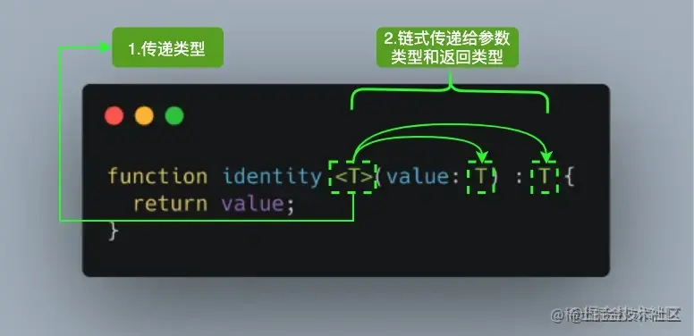

# TypeScript入门总结（三）

## 十六、泛型
### 16.1、泛型介绍
假如让你实现一个函数 `identity`，函数的参数可以是任何值，返回值就是将参数原样返回，并且其只能接受一个参数，你会怎么做？<br />你会觉得这很简单，顺手就写出这样的代码：
```typescript
const identity = (arg) => arg;
```
由于其可以接受任意值，也就是说你的函数的入参和返回值都应该可以是任意类型。 现在让我们给代码增加类型声明：
```typescript
type idBoolean = (arg: boolean) => boolean;
type idNumber = (arg: number) => number;
type idString = (arg: string) => string;
...
```
一个笨的方法就像上面那样，也就是说 JS 提供多少种类型，就需要复制多少份代码，然后改下类型签名。这对程序员来说是致命的。这种复制粘贴增加了出错的概率，使得代码难以维护，牵一发而动全身。并且将来 JS 新增新的类型，你仍然需要修改代码，也就是说你的代码『**对修改开放』**，这样不好。还有一种方式是使用 `any` 这种“万能语法”。缺点是什么呢？我举个例子：
```typescript
identity("string").length; // ok
identity("string").toFixed(2); // ok
identity(null).toString(); // ok
...
```
如果你使用 `any` 的话，怎么写都是 ok 的， 这就丧失了类型检查的效果。实际上我知道我传给你的是 `string`，返回来的也一定是 `string`，而 `string` 上没有 `toFixed` 方法，因此需要报错才是我想要的。也就是说我真正想要的效果是：当我用到id的时候，你根据我传给你的类型进行推导。比如我传入的是 `string`，但是使用了 `number` 上的方法，你就应该报错。<br />_为了解决上面的这些问题，我们『_**_使用泛型对上面的代码进行重构』_**_。和我们的定义不同，这里用了一个 类型 T，这个 『_**_T 是一个抽象类型，只有在调用的时候才确定它的值』_**_，这就不用我们复制粘贴无数份代码了。_
```typescript
function identity<T>(arg: T): T {
  return arg;
}
```
其中 T 代表 `**Type**`，在定义泛型时通常用作第一个类型变量名称。但实际上 T 可以用任何有效名称代替。除了 T 之外，以下是常见泛型变量代表的意思：

- `K（Key）`：表示对象中的键类型；
- `V（Value）`：表示对象中的值类型；
- `E（Element）`：表示元素类型。

来张图片帮助你理解 <br />其实并不是只能定义一个类型变量，我们可以引入希望定义的任何数量的类型变量。比如我们引入一个新的类型变量 U，用于扩展我们定义的 `identity` 函数：
```typescript
function identity <T, U>(value: T, message: U) : T {
  console.log(message);
  return value;
}
console.log(identity<Number, string>(68, "Semlinker"));
```


除了为类型变量显式设定值之外，一种更常见的做法是使编译器自动选择这些类型，从而使代码更简洁。我们可以完全省略尖括号，比如：
```typescript
function identity <T, U>(value: T, message: U) : T {
  console.log(message);
  return value;
}
console.log(identity(68, "Semlinker"));
```
对于上述代码，编译器足够聪明，能够知道我们的参数类型，并将它们赋值给 T 和 U，而不需要开发人员显式指定它们。
### 16.3、泛型约束
假如我想打印出参数的 `size` 属性呢？如果完全不进行约束 TS 是会报错的：
```typescript
function trace<T>(arg: T): T {
  console.log(arg.size); // Error: Property 'size doesn't exist on type 'T'
  return arg;
}
```
报错的原因在于 T 理论上是可以是任何类型的，不同于 `any`，你不管使用它的什么属性或者方法都会报错（除非这个属性和方法是所有集合共有的）。<br />那么直观的想法是限定传给 `trace` 函数的**参数类型**应该有 `size` 类型，这样就不会报错了。如何去表达这个**类型约束**的点呢？实现这个需求的关键在于使用**类型约束**。 使用 `extends` 关键字可以做到这一点。简单来说就是你定义一个类型，然后让 T 实现这个接口即可。
```typescript
interface Sizeable {
  size: number;
}

function trace<T extends Sizeable>(arg: T): T {
  console.log(arg.size);
  return arg;
}
```
有的人可能说我直接将 Trace 的参数限定为 Sizeable 类型可以么？如果你这么做，会有类型丢失的风险，详情可以参考这篇文章[A use case for TypeScript Generics](https://juliangaramendy.dev/blog/when-ts-generics)。
### 16.4、泛型工具类型
为了方便开发者 `TypeScript` 内置了一些常用的工具类型，比如 `Partial`、`Required`、`Readonly`、`Record` 和 `ReturnType` 等。不过在具体介绍之前，我们得先介绍一些相关的基础知识，方便读者可以更好的学习其它的工具类型。
#### 14.4.1、`typeof`
```typescript
interface Person {
  name: string;
  age: number;
}

const sem: Person = { name: "semlinker", age: 30 };
type Sem = typeof sem; // type Sem = Person
```
你也可以对嵌套对象执行相同的操作：
```typescript
const Message = {
    name: "jimmy",
    age: 18,
    address: {
      province: '四川',
      city: '成都'   
    }
}
type message = typeof Message;
/*
 type message = {
    name: string;
    age: number;
    address: {
        province: string;
        city: string;
    };
}
*/
```
此外，typeof 操作符除了可以获取对象的结构类型之外，它也可以用来获取函数对象的类型，比如：
```typescript
function toArray(x: number): Array<number> {
  return [x];
}
type Func = typeof toArray; // -> (x: number) => number[]
```
#### 14.4.2、`keyof`
`keyof` 操作符是在 TypeScript 2.1 版本引入的，该操作符可以用于获取某种类型的所有键，其返回类型是联合类型。
```typescript
interface Person {
  name: string;
  age: number;
}

type K1 = keyof Person; // "name" | "age"
type K2 = keyof Person[]; // "length" | "toString" | "pop" | "push" | "concat" | "join" 
type K3 = keyof { [x: string]: Person };  // string | number
```
在 TypeScript 中支持两种索引签名，数字索引和字符串索引：
```typescript
interface StringArray {
  // 字符串索引 -> keyof StringArray => string | number
  [index: string]: string; 
}

interface StringArray1 {
  // 数字索引 -> keyof StringArray1 => number
  [index: number]: string;
}
```
为了同时支持两种索引类型，就得要求数字索引的返回值必须是字符串索引返回值的子类。其中的原因就是当使用数值索引时，`JavaScript` 在执行索引操作时，会先把数值索引先转换为字符串索引。所以` keyof { [x: string]: Person } `的结果会返回 `string | number`。<br />`keyof`也支持基本数据类型：
```typescript
let K1: keyof boolean; // let K1: "valueOf"
let K2: keyof number; // let K2: "toString" | "toFixed" | "toExponential" | ...
let K3: keyof symbol; // let K1: "valueOf"
```
`**keyof**`** 的作用**<br />JavaScript 是一种高度动态的语言。有时在静态类型系统中捕获某些操作的语义可能会很棘手。以一个简单的`prop` 函数为例：
```typescript
function prop(obj: object, key: string) {
  return obj[key];
}
```
元素隐式地拥有 `any` 类型，因为 `string` 类型不能被用于索引 `{}` 类型。要解决这个问题，你可以使用以下非常暴力的方案：
```typescript
function prop(obj: object, key: string) {
  return (obj as any)[key];
}
```
很明显该方案并不是一个好的方案，我们来回顾一下 `prop` 函数的作用，该函数用于获取某个对象中指定属性的属性值。因此我们期望用户输入的属性是对象上已存在的属性，那么如何限制属性名的范围呢？这时我们可以利用本文的主角 `keyof` 操作符：
```typescript
function prop<T extends object, K extends keyof T>(obj: T, key: K) {
  return obj[key];
}
```
在以上代码中，我们使用了 `TypeScript` 的泛型和泛型约束。<br />『首先定义了 `T` 类型并使用 `extends` 关键字约束该类型必须是 `object` 类型的子类型，然后使用 `keyof` 操作符获取 `T` 类型的所有键，其返回类型是联合类型，最后利用 `extends` 关键字约束 `K` 类型必须为 `keyof` `T` 联合类型的子类型。』 <br />是骡子是马拉出来遛遛就知道了，我们来实际测试一下：
```typescript
type Todo = {
  id: number;
  text: string;
  done: boolean;
}

const todo: Todo = {
  id: 1,
  text: "Learn TypeScript keyof",
  done: false
}

function prop<T extends object, K extends keyof T>(obj: T, key: K) {
  return obj[key];
}

const id = prop(todo, "id"); // const id: number
const text = prop(todo, "text"); // const text: string
const done = prop(todo, "done"); // const done: boolean
```
很明显使用泛型，重新定义后的` prop<T extends object, K extends keyof T>(obj: T, key: K) `函数，已经可以正确地推导出指定键对应的类型。那么当访问 `todo` 对象上不存在的属性时，会出现什么情况？比如：
```typescript
const date = prop(todo, "date");
```
对于上述代码，`TypeScript` 编译器会提示以下错误：
```typescript
Argument of type '"date"' is not assignable to parameter of type '"id" | "text" | "done"'.
```
这就阻止我们尝试读取不存在的属性。
#### 14.4.3、`in`
`in` 用来遍历枚举类型：
```typescript
type Keys = "a" | "b" | "c"

type Obj =  {
  [p in Keys]: any
} // -> { a: any, b: any, c: any }
```
#### 14.4.4、`infer`
在条件类型语句中，可以用 `infer` 声明一个类型变量并且对它进行使用。
```typescript
type ReturnType<T> = T extends (
  ...args: any[]
) => infer R ? R : any;
```
以上代码中` infer R` 就是声明一个变量来承载传入函数签名的返回值类型，简单说就是用它取到函数返回值的类型方便之后使用。
#### 14.4.5、`extend`
有时候我们定义的泛型不想过于灵活或者说想继承某些类等，可以通过 `extends` 关键字添加泛型约束。
```typescript
interface Lengthwise {
  length: number;
}

function loggingIdentity<T extends Lengthwise>(arg: T): T {
  console.log(arg.length);
  return arg;
}
```
现在这个泛型函数被定义了约束，因此它不再是适用于任意类型：
```typescript
loggingIdentity(3);  // Error, number doesn't have a .length property
```
这时我们需要传入符合约束类型的值，必须包含`length`属性：
```typescript
loggingIdentity({length: 10, value: 3});
```
#### 14.4.6、索引类型
在实际开发中，我们经常能遇到这样的场景，在对象中获取一些属性的值，然后建立对应的集合。
```typescript
let person = {
  name: 'musion',
  age: 35
}

function getValues(person: any, keys: string[]) {
  return keys.map(key => person[key])
}

console.log(getValues(person, ['name', 'age'])) // ['musion', 35]
console.log(getValues(person, ['gender'])) // [undefined]
```
在上述例子中，可以看到`getValues(persion, ['gender'])`打印出来的是`[undefined]`，但是`ts`编译器并没有给出报错信息，那么如何使用ts对这种模式进行类型约束呢？这里就要用到了索引类型,改造一下`getValues`函数，通过 **索引类型查询**和 **索引访问** 操作符：
```typescript
function getValues<T, K extends keyof T>(person: T, keys: K[]): T[K][] {
  return keys.map(key => person[key]);
}

interface Person {
    name: string;
    age: number;
}

const person: Person = {
    name: 'musion',
    age: 35
}

getValues(person, ['name']) // ['musion']
getValues(person, ['gender']) // 报错：
// Argument of Type '"gender"[]' is not assignable to parameter of type '("name" | "age")[]'.
// Type "gender" is not assignable to type "name" | "age".

```
编译器会检查传入的值是否是Person的一部分。通过下面的概念来理解上面的代码：
```typescript
T[K]表示对象T的属性K所表示的类型，在上述例子中，T[K][] 表示变量T取属性K的值的数组

  // 通过[]索引类型访问操作符, 我们就能得到某个索引的类型
class Person {
  name:string;
  age:number;
}
type MyType = Person['name'];  //Person中name的类型为string type MyType = string

```
介绍完概念之后，应该就可以理解上面的代码了。<br />首先看泛型，这里有T和K两种类型，根据类型推断，<br />第一个参数`person`就是`person`，类型会被推断为`Person`。<br />而第二个数组参数的类型推断（`K extends keyof T`），`keyof`关键字可以获取`T`，也就是`Person`的所有属性名，即`['name', 'age']`。而`extends`关键字让泛型`K`继承了`Person`的所有属性名，即`['name', 'age']`。<br />这三个特性组合保证了代码的动态性和准确性，也让代码提示变得更加丰富了
```typescript
getValues(person, ['gender']) // 报错：
// Argument of Type '"gender"[]' is not assignable to parameter of type '("name" | "age")[]'.
// Type "gender" is not assignable to type "name" | "age".
```
#### 14.4.7、映射类型
『根据旧的类型创建出新的类型, 我们称之为映射类型』<br />比如我们定义一个接口
```typescript
interface TestInterface{
    name:string,
    age:number
}
```
我们把上面定义的接口里面的属性全部变成可选
```typescript
// 我们可以通过+/-来指定添加还是删除

type OptionalTestInterface<T> = {
  [p in keyof T]+?:T[p]
}

type newTestInterface = OptionalTestInterface<TestInterface>
// type newTestInterface = {
//    name?:string,
//    age?:number
// }
```
比如我们再加上只读
```typescript

type OptionalTestInterface<T> = {
 +readonly [p in keyof T]+?:T[p]
}

type newTestInterface = OptionalTestInterface<TestInterface>
// type newTestInterface = {
//   readonly name?:string,
//   readonly age?:number
// }
```
由于生成只读属性和可选属性比较常用, 所以TS内部已经给我们提供了现成的实现 `Readonly` / `Partial`
#### 14.4.8、内置工具类型
##### (1) Partial
『`Partial<T>` 将类型的属性变成可选』<br />**定义**
```typescript
type Partial<T> = {
  [P in keyof T]?: T[P];
};
```
在以上代码中，首先通过 `keyof T` 拿到 `T` 的所有属性名，然后使用 `in` 进行遍历，将值赋给 `P`，最后通过 `T[P]` 取得相应的属性值的类。中间的 `?` 号，用于将所有属性变为可选。<br />**例子**
```typescript
interface UserInfo {
    id: string;
    name: string;
}
// error：Property 'id' is missing in type '{ name: string; }' but required in type 'UserInfo'
const xiaoming: UserInfo = {
    name: 'xiaoming'
}
```
**使用  **`**Partial<T>**`
```typescript
type NewUserInfo = Partial<UserInfo>;
const xiaoming: NewUserInfo = {
    name: 'xiaoming'
}
```
这个  `NewUserInfo` 就相当于
```typescript
interface NewUserInfo {
    id?: string;
    name?: string;
}
```
但是` Partial<T>` 有个局限性，就是只支持处理第一层的属性，如果我的接口定义是这样的
```typescript
interface UserInfo {
    id: string;
    name: string;
    fruits: {
        appleNumber: number;
        orangeNumber: number;
    }
}

type NewUserInfo = Partial<UserInfo>;

// Property 'appleNumber' is missing in type '{ orangeNumber: number; }' but required in type '{ appleNumber: number; orangeNumber: number; }'.
const xiaoming: NewUserInfo = {
    name: 'xiaoming',
    fruits: {
        orangeNumber: 1,
    }
}
```
可以看到，第二层以后就不会处理了，如果要处理多层，就可以自己实现<br />`**DeepPartial**`
```typescript
type DeepPartial<T> = {
     // 如果是 object，则递归类型
    [U in keyof T]?: T[U] extends object
      ? DeepPartial<T[U]>
      : T[U]
};

type PartialedWindow = DeepPartial<T>; // 现在T上所有属性都变成了可选啦
```
##### (2) `Required`
『`Required`将类型的属性变成必选』<br />**定义**
```typescript
type Required<T> = { 
    [P in keyof T]-?: T[P] 
};
```
其中 `-?` 是代表移除 `?` 这个 `modifier` 的标识。再拓展一下，除了可以应用于 `?` 这个 `modifiers` ，还有应用在 `readonly` ，比如 `Readonly<T>` 这个类型
```typescript
type Readonly<T> = {
    readonly [p in keyof T]: T[p];
}
```
##### (3) `Readonly`
『`Readonly<T>` 的作用是将某个类型所有属性变为只读属性，也就意味着这些属性不能被重新赋值。』<br />**定义**
```typescript
type Readonly<T> = {
	readonly [P in keyof T]: T[P];
};
```
**例子**
```typescript
interface Todo {
 title: string;
}

const todo: Readonly<Todo> = {
 title: "Delete inactive users"
};

todo.title = "Hello"; // Error: cannot reassign a readonly property
```
##### (4) `Pick`
『`Pick` 从某个类型中挑出一些属性出来』<br />**定义**
```typescript
type Pick<T, K extends keyof T> = {
    [P in K]: T[P];
};
```
**例子**
```typescript
interface Todo {
  title: string;
  description: string;
  completed: boolean;
}

type TodoPreview = Pick<Todo, "title" | "completed">;

const todo: TodoPreview = {
  title: "Clean room",
  completed: false,
};
```
##### (5) `Record`
『`Record<K extends keyof any, T>` 的作用是将 `K` 中所有的属性的值转化为 `T` 类型。』<br />**定义**
```typescript
type Record<K extends keyof any, T> = {
    [P in K]: T;
};
```
**例子**
```typescript
interface PageInfo {
  title: string;
}

type Page = "home" | "about" | "contact";

const x: Record<Page, PageInfo> = {
  about: { title: "about" },
  contact: { title: "contact" },
  home: { title: "home" },
};
```
##### (6) `ReturnType`
『用来得到一个函数的返回值类型』<br />**定义**
```typescript
type ReturnType<T extends (...args: any[]) => any> = T extends (
  ...args: any[]
) => infer R
  ? R
  : any;
```
`infer`在这里用于提取函数类型的返回值类型。`ReturnType<T>` 只是将 `infer R` 从参数位置移动到返回值位置，因此此时 `R` 即是表示待推断的返回值类型。<br />**例子**
```typescript
type Func = (value: number) => string;
const foo: ReturnType<Func> = "1";
```
`ReturnType`获取到 `Func` 的返回值类型为 `string`，所以，`foo` 也就只能被赋值为字符串了。
##### (7) `Exclude`
『`Exclude<T, U>` 的作用是将某个类型中属于另一个的类型移除掉。』<br />**定义**
```typescript
type Exclude<T, U> = T extends U ? never : T;
```
如果 `T` 能赋值给 `U` 类型的话，那么就会返回 `never` 类型，否则返回 `T` 类型。<br />最终实现的效果就是将 `T` 中某些属于 `U` 的类型移除掉。

**例子**
```typescript
type T0 = Exclude<"a" | "b" | "c", "a">; // "b" | "c"
type T1 = Exclude<"a" | "b" | "c", "a" | "b">; // "c"
type T2 = Exclude<string | number | (() => void), Function>; // string | number
```

##### (8) `Extract`
`Extract<T, U>` 的作用是从 `T` 中提取出 `U`。<br />**定义**
```typescript
type Extract<T, U> = T extends U ? T : never;
```
**例子**
```typescript
type T0 = Extract<"a" | "b" | "c", "a" | "f">; // "a"
type T1 = Extract<string | number | (() => void), Function>; // () =>void
```

##### (9) `Omit`
『`Omit<T, K extends keyof any>` 的作用是使用 `T` 类型中除了 `K` 类型的所有属性，来构造一个新的类型。』<br />**定义**
```typescript
type Omit<T, K extends keyof any> = Pick<T, Exclude<keyof T, K>>;
```
**例子**
```typescript
interface Todo {
  title: string;
  description: string;
  completed: boolean;
}

type TodoPreview = Omit<Todo, "description">;

const todo: TodoPreview = {
  title: "Clean room",
  completed: false,
};
```

##### (10) `NonNullable`
『`NonNullable<T>` 的作用是用来过滤类型中的 `null` 及 `undefined` 类型。』<br />**定义**
```typescript
type NonNullable<T> = T extends null | undefined ? never : T;
```
**例子**
```typescript
type T0 = NonNullable<string | number | undefined>; // string | number
type T1 = NonNullable<string[] | null | undefined>; // string[]
```

##### (11) `Parameters`
『`Parameters<T>` 的作用是用于获得函数的参数类型组成的元组类型。』<br />**定义**
```typescript
type Parameters<T extends (...args: any) => any> = T extends (...args: infer P) => any
? P : never;
```
**例子**
```typescript
type A = Parameters<() =>void>; // []
type B = Parameters<typeofArray.isArray>; // [any]
type C = Parameters<typeofparseInt>; // [string, (number | undefined)?]
type D = Parameters<typeofMath.max>; // number[]
```
##### (12) `InstanceType`
返回构造函数类型T的实例类型
```typescript
class C {
  x = 0;
  y = 0;
}

type D = InstanceType<typeof C>;  // C
```

## 十七、`tsconfig.json`
### 17.1、`tsconfig.json`介绍
`tsconfig.json` 是 `TypeScript` 项目的配置文件。如果一个目录下存在一个` tsconfig.json` 文件，那么往往意味着这个目录就是 `TypeScript` 项目的根目录。<br />`tsconfig.json` 包含 `TypeScript` 编译的相关配置，通过更改编译配置项，我们可以让 `TypeScript` 编译出 `ES6`、`ES5`、`node` 的代码。

### 17.2、`tsconfig.json` 重要字段

- `files` - 设置要编译的文件的名称；
- `include` - 设置需要进行编译的文件，支持路径模式匹配；
- `exclude` - 设置无需进行编译的文件，支持路径模式匹配；
- `compilerOptions` - 设置与编译流程相关的选项。
### 17.3、compilerOptions 选项
```javascript
{
  "compilerOptions": {
  
    /* 基本选项 */
    "target": "es5",                       // 指定 ECMAScript 目标版本: 'ES3' (default), 'ES5', 'ES6'/'ES2015', 'ES2016', 'ES2017', or 'ESNEXT'
    "module": "commonjs",                  // 指定使用模块: 'commonjs', 'amd', 'system', 'umd' or 'es2015'
    "lib": [],                             // 指定要包含在编译中的库文件
    "allowJs": true,                       // 允许编译 javascript 文件
    "checkJs": true,                       // 报告 javascript 文件中的错误
    "jsx": "preserve",                     // 指定 jsx 代码的生成: 'preserve', 'react-native', or 'react'
    "declaration": true,                   // 生成相应的 '.d.ts' 文件
    "sourceMap": true,                     // 生成相应的 '.map' 文件
    "outFile": "./",                       // 将输出文件合并为一个文件
    "outDir": "./",                        // 指定输出目录
    "rootDir": "./",                       // 用来控制输出目录结构 --outDir.
    "removeComments": true,                // 删除编译后的所有的注释
    "noEmit": true,                        // 不生成输出文件
    "importHelpers": true,                 // 从 tslib 导入辅助工具函数
    "isolatedModules": true,               // 将每个文件做为单独的模块 （与 'ts.transpileModule' 类似）.

    /* 严格的类型检查选项 */
    "strict": true,                        // 启用所有严格类型检查选项
    "noImplicitAny": true,                 // 在表达式和声明上有隐含的 any类型时报错
    "strictNullChecks": true,              // 启用严格的 null 检查
    "noImplicitThis": true,                // 当 this 表达式值为 any 类型的时候，生成一个错误
    "alwaysStrict": true,                  // 以严格模式检查每个模块，并在每个文件里加入 'use strict'

    /* 额外的检查 */
    "noUnusedLocals": true,                // 有未使用的变量时，抛出错误
    "noUnusedParameters": true,            // 有未使用的参数时，抛出错误
    "noImplicitReturns": true,             // 并不是所有函数里的代码都有返回值时，抛出错误
    "noFallthroughCasesInSwitch": true,    // 报告 switch 语句的 fallthrough 错误。（即，不允许 switch 的 case 语句贯穿）

    /* 模块解析选项 */
    "moduleResolution": "node",            // 选择模块解析策略： 'node' (Node.js) or 'classic' (TypeScript pre-1.6)
    "baseUrl": "./",                       // 用于解析非相对模块名称的基目录
    "paths": {},                           // 模块名到基于 baseUrl 的路径映射的列表
    "rootDirs": [],                        // 根文件夹列表，其组合内容表示项目运行时的结构内容
    "typeRoots": [],                       // 包含类型声明的文件列表
    "types": [],                           // 需要包含的类型声明文件名列表
    "allowSyntheticDefaultImports": true,  // 允许从没有设置默认导出的模块中默认导入。

    /* Source Map Options */
    "sourceRoot": "./",                    // 指定调试器应该找到 TypeScript 文件而不是源文件的位置
    "mapRoot": "./",                       // 指定调试器应该找到映射文件而不是生成文件的位置
    "inlineSourceMap": true,               // 生成单个 soucemaps 文件，而不是将 sourcemaps 生成不同的文件
    "inlineSources": true,                 // 将代码与 sourcemaps 生成到一个文件中，要求同时设置了 --inlineSourceMap 或 --sourceMap 属性

    /* 其他选项 */
    "experimentalDecorators": true,        // 启用装饰器
    "emitDecoratorMetadata": true          // 为装饰器提供元数据的支持
  }
}

```

## 十八、编写高效 TS 代码的一些建议
### 18.1、尽量减少重复代码
对于刚接触 TypeScript 的小伙伴来说，在定义接口时，可能一不小心会出现以下类似的重复代码。比如：
```typescript
interface Person {
  firstName: string;
  lastName: string;
}

interface PersonWithBirthDate {
  firstName: string;
  lastName: string;
  birth: Date;
}
```

很明显，相对于 `Person` 接口来说，`PersonWithBirthDate` 接口只是多了一个 `birth` 属性，其他的属性跟 `Person` 接口是一样的。那么如何避免出现例子中的重复代码呢？要解决这个问题，可以利用 `extends` 关键字：
```typescript
interface Person { 
  firstName: string; 
  lastName: string;
}

interface PersonWithBirthDate extends Person { 
  birth: Date;
}
```
当然除了使用 `extends` 关键字之外，也可以使用交叉运算符（`&`）：
```typescript
type PersonWithBirthDate = Person & { birth: Date };
```
另外，有时候你可能还会发现自己想要定义一个类型来匹配一个初始配置对象的「形状」，比如：
```typescript
const INIT_OPTIONS = {
  width: 640,
  height: 480,
  color: "#00FF00",
  label: "VGA",
};

interface Options {
  width: number;
  height: number;
  color: string;
  label: string;
}
```
其实，对于 `Options` 接口来说，你也可以使用 `typeof` 操作符来快速获取配置对象的「形状」：
```typescript
type Options = typeof INIT_OPTIONS;		
```
在实际的开发过程中，重复的类型并不总是那么容易被发现。有时它们会被语法所掩盖。比如有多个函数拥有相同的类型签名：
```typescript
function get(url: string, opts: Options): Promise<Response> { /* ... */ } 
function post(url: string, opts: Options): Promise<Response> { /* ... */ }
```
对于上面的 get 和 post 方法，为了避免重复的代码，你可以提取统一的类型签名：
```typescript
type HTTPFunction = (url: string, opts: Options) => Promise<Response>; 
const get: HTTPFunction = (url, opts) => { /* ... */ };
const post: HTTPFunction = (url, opts) => { /* ... */ };
```
### 18.2、使用更精确的类型替代字符串类型
假设你正在构建一个音乐集，并希望为专辑定义一个类型。这时你可以使用 `interface` 关键字来定义一个 `Album` 类型：
```typescript
interface Album {
  artist: string; // 艺术家
  title: string; // 专辑标题
  releaseDate: string; // 发行日期：YYYY-MM-DD
  recordingType: string; // 录制类型："live" 或 "studio"
}
```
对于 `Album` 类型，你希望 `releaseDate` 属性值的格式为` YYYY-MM-DD`，而 `recordingType` 属性值的范围为 `live` 或 `studio`。但因为接口中 `releaseDate` 和 `recordingType` 属性的类型都是字符串，所以在使用 `Album` 接口时，可能会出现以下问题：
```typescript
const dangerous: Album = {
  artist: "Michael Jackson",
  title: "Dangerous",
  releaseDate: "November 31, 1991", // 与预期格式不匹配
  recordingType: "Studio", // 与预期格式不匹配
};
```
虽然 `releaseDate` 和 `recordingType` 的值与预期的格式不匹配，但此时 `TypeScript` 编译器并不能发现该问题。为了解决这个问题，你应该为 `releaseDate` 和 `recordingType` 属性定义更精确的类型，比如这样：
```typescript
interface Album {\
  artist: string; // 艺术家
  title: string; // 专辑标题
  releaseDate: Date; // 发行日期：YYYY-MM-DD
  recordingType: "studio" | "live"; // 录制类型："live" 或 "studio"
}
```
重新定义 Album 接口之后，对于前面的赋值语句，`TypeScript` 编译器就会提示以下异常信息：
```typescript
const dangerous: Album = {
  artist: "Michael Jackson",
  title: "Dangerous",
  // 不能将类型“string”分配给类型“Date”。ts(2322)
  releaseDate: "November 31, 1991", // Error
  // 不能将类型“"Studio"”分配给类型“"studio" | "live"”。ts(2322)\
  recordingType: "Studio", // Error
};
```
为了解决上面的问题，你需要为 releaseDate 和 recordingType 属性设置正确的类型，比如这样：
```typescript
const dangerous: Album = {
  artist: "Michael Jackson",
  title: "Dangerous",
  releaseDate: new Date("1991-11-31"),
  recordingType: "studio",
};
```
### 18.3、定义的类型总是表示有效的状态
假设你正在构建一个允许用户指定页码，然后加载并显示该页面对应内容的 `Web` 应用程序。首先，你可能会先定义 `State` 对象：
```typescript
interface State {
  pageContent: string;
  isLoading: boolean;
  errorMsg?: string;
}
```
接着你会定义一个 `renderPage` 函数，用来渲染页面：
```typescript
function renderPage(state: State) {
  if (state.errorMsg) {
    return `呜呜呜，加载页面出现异常了...${state.errorMsg}`;
  } else if (state.isLoading) {
    return `页面加载中~~~`;
  }
  return `<div>${state.pageContent}</div>`;
}

// 输出结果：页面加载中~~~
console.log(renderPage({isLoading: true, pageContent: ""}));
// 输出结果：<div>大家好</div>
console.log(renderPage({isLoading: false, pageContent: "大家好呀"}));
```
创建好 `renderPage` 函数，你可以继续定义一个 `changePage` 函数，用于根据页码获取对应的页面数据：
```typescript
async function changePage(state: State, newPage: string) {
  state.isLoading = true;
  try {
    const response = await fetch(getUrlForPage(newPage));
    if (!response.ok) {
      throw new Error(`Unable to load ${newPage}: ${response.statusText}`);
    }
    const text = await response.text();
    state.isLoading = false;
    state.pageContent = text;
  } catch (e) {
    state.errorMsg = "" + e;
  }
}
```
对于以上的 `changePage` 函数，它存在以下问题：

- 在 `catch` 语句中，未把 `state.isLoading` 的状态设置为 `false`；
- 未及时清理 `state.errorMsg` 的值，因此如果之前的请求失败，那么你将继续看到错误消息，而不是加载消息。

出现上述问题的原因是，前面定义的 `State` 类型允许同时设置 `isLoading` 和 `errorMsg` 的值，尽管这是一种无效的状态。针对这个问题，你可以考虑引入可辨识联合类型来定义不同的页面请求状态：
```typescript
interface RequestPending {
  state: "pending";
}

interface RequestError {
  state: "error";
  errorMsg: string;
}

interface RequestSuccess {
  state: "ok";
  pageContent: string;
}

type RequestState = RequestPending | RequestError | RequestSuccess;

interface State {
  currentPage: string;
  requests: { [page: string]: RequestState };
}
```
在以上代码中，通过使用可辨识联合类型分别定义了` 3` 种不同的请求状态，这样就可以很容易的区分出不同的请求状态，从而让业务逻辑处理更加清晰。接下来，需要基于更新后的 `State` 类型，来分别更新一下前面创建的 `renderPage` 和 `changePage` 函数：

**『更新后的 **`**renderPage**`** 函数』**
```typescript
function renderPage(state: State) {
  const { currentPage } = state;
  const requestState = state.requests[currentPage];
  switch (requestState.state) {
    case "pending":
      return `页面加载中~~~`;
    case "error":
      return `呜呜呜，加载第${currentPage}页出现异常了...${requestState.errorMsg}`;
    case "ok":
      `<div>第${currentPage}页的内容：${requestState.pageContent}</div>`;
  }
}
```
**『更新后的 changePage 函数』**
```typescript
async function changePage(state: State, newPage: string) {
  state.requests[newPage] = { state: "pending" };
  state.currentPage = newPage;
  try {
    const response = await fetch(getUrlForPage(newPage));
    if (!response.ok) {
      throw new Error(`无法正常加载页面 ${newPage}: ${response.statusText}`);
    }
    const pageContent = await response.text();
    state.requests[newPage] = { state: "ok", pageContent };
  } catch (e) {
    state.requests[newPage] = { state: "error", errorMsg: "" + e };
  }
}
```
在 `changePage` 函数中，会根据不同的情形设置不同的请求状态，而不同的请求状态会包含不同的信息。这样 renderPage 函数就可以根据统一的 `state` 属性值来进行相应的处理。因此，通过使用可辨识联合类型，让请求的每种状态都是有效的状态，不会出现无效状态的问题。
## 十九、更多
光说不练假把式,点击下面的链接去练练手吧<br />[typescript练习题](https://github.com/semlinker/awesome-typescript/issues)<br />如果文章有什么错误,欢迎在评论区指出,如果觉得对你有帮助的话,欢迎点赞收藏哦,你的点赞就是我继续写作更新的动力.
## 二十、最后
如果你想学习es7- es12新出的特性，请参考 [快2022年了，这些ES7-ES12的知识点你都掌握了嘛？](https://juejin.cn/post/7046217976176967711)
