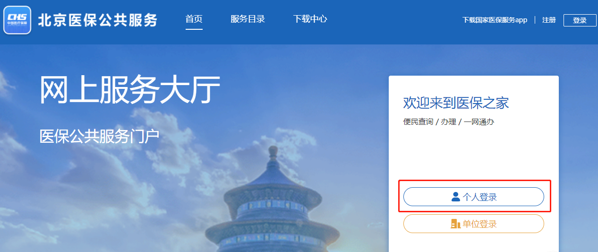
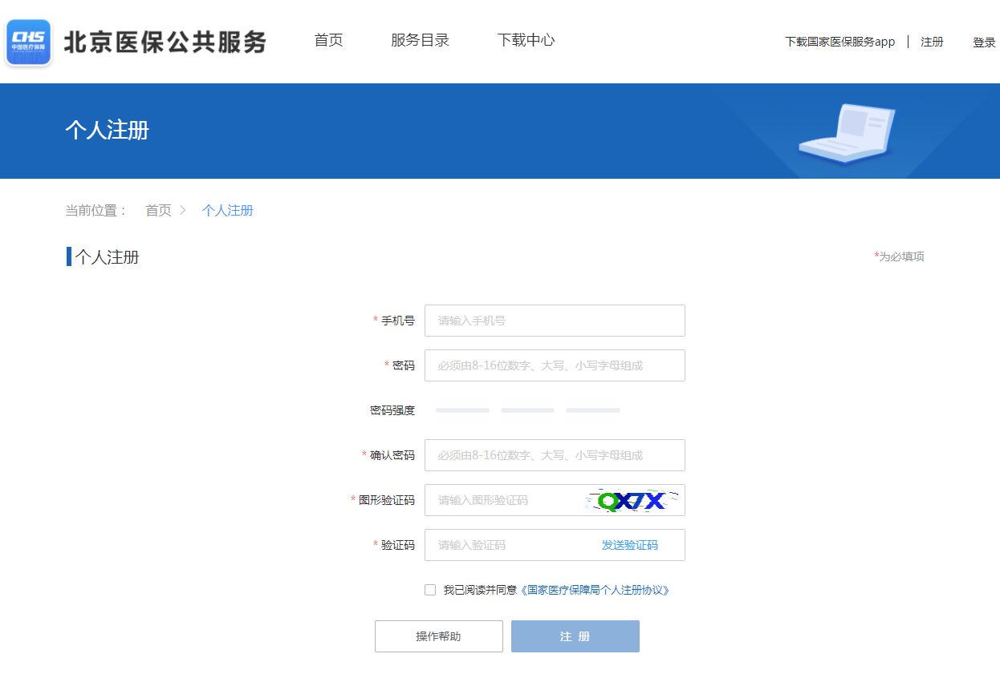
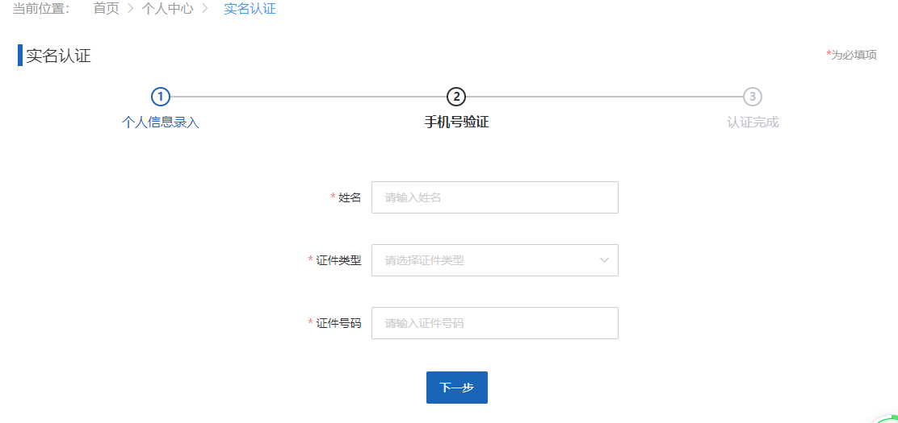
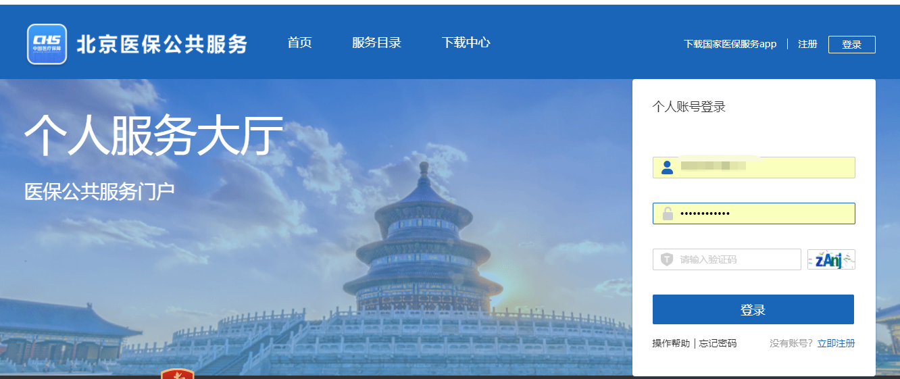
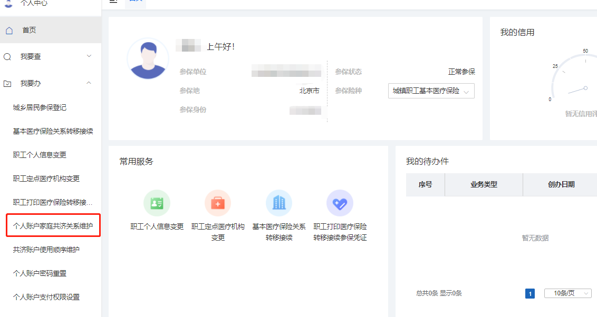
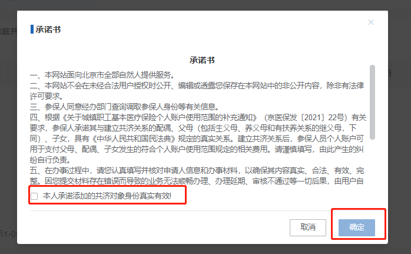
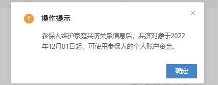
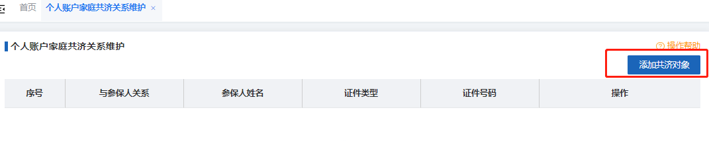
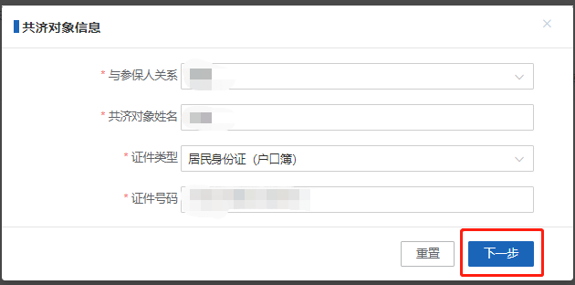
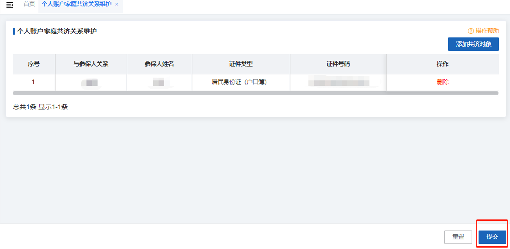

# 医保“亲情账户”和“家庭共济”账户

> 参考资料来源：
>
> - [https://www.jiangshan.gov.cn/art/2023/5/12/art_1229091905_3663235.html](https://www.jiangshan.gov.cn/art/2023/5/12/art_1229091905_3663235.html)

医保已全面进入 **“码时代”** ，随着医保亲情账户上线，帮助“一老一小”开通医保电子凭证，家里的老人、小孩也可以“码”上看病、“码”上拿药。

实际使用中，很多人会把**医保个人账户家庭共济**和**医保亲情账户**_搞混_，_认为绑定了亲情账户就能使用家人医保个人账户内的钱了。但事实并不是这样，今天的医保知识小课堂就来给您讲讲它们的区别_。

## “医保亲情账户”和“个人账户家庭共济”

### 医保亲情账户

**医保亲情账户**是家庭成员医保电子凭证的授权持有并使用。` `您可以在**国家医保服务平台APP**、**浙里办**、**支付宝等平台绑定家庭成员的医保亲情账户**，帮助家人尤其是家里的**老人和小孩**等未使用智能手机的群体实现扫码挂号、购药和结算等，还可以查询家庭成员的年度医疗费用。就好比家人的实体社保卡都交到您手中，由您在陪同家人就医时具体负责挂号、购药和结算等。` `需要提醒的是，在**使用医保亲情账户时**需要按规定做到**人“码”相符**，不得违规冒名就医购药。

### 个人账户家庭共济

**个人账户家庭共济**是指将本人的个人账户历年余额授权给近亲属使用的机制。` `您在完成个人账户家庭共济备案后，**近亲属**就可以使用您的医保个人账户余额，用于支付看病买药时符合规定的应由个人支付的费用。您可以在**浙里办**APP或小程序的“**浙里医保**”专区掌上办理，或就近到医保经办机构窗口办理个人账户家庭共济备案。

### 差异

综上，医保“亲情账户”和“家庭共济”是完全不同的。` `医保 **“亲情账户”** 是在陪同家人看病时拿出自己的手机展示家人的医保电子凭证，不涉及医保个人账户资金给他人使用；` `而 **“家庭共济”** 是_授权职工医保个人历年账户的资金给亲人使用_。

### 注意事项

需要提醒大家的还有以下三点：` `**一是**仅通过医保电子凭证绑定“亲情账户”并不能直接使用家庭共济资金，还需要完成个人账户家庭共济授权的操作；` `**二是**医保电子凭证可以被多人绑定“亲情账户”，家庭共济仅能被一人授权绑定，如小朋友的医保电子凭证既可以被爸爸绑定“亲情账户”，也可以被妈妈绑定“亲情账户”，**_家庭共济授权绑定时只能被父母其中一人授权绑定_**；` `**三是**医保“亲情账户”和家庭共济互不影响，没有一致性要求，例如小朋友被妈妈绑定“亲情账户”，被爸爸家庭共济授权绑定，就医时可以直接使用家庭共济资金。

## 北京医保开通个人账户家庭共济

### **手机(支付宝/微信)添加方法**

#### （支付宝/微信）”京通“小程序，搜索”家庭共济“

在搜索结果中选择”职工个人账户家庭共济关系维护“

#### 选择”添加共济对象“

按照提示信息添加即可

### **电脑（PC）添加方法**

**☆ 北京市人民政府网：**[**https://www.beijing.gov.cn/fuwu/bmfw/bmdh/sb/ylbx/jy/202212/t20221201_2869522.html**](https://www.beijing.gov.cn/fuwu/bmfw/bmdh/sb/ylbx/jy/202212/t20221201_2869522.html)

` `您可以通过北京医保公共服务平台办理医保个人账户家庭成员共济备案，具体操作步骤如下：

#### 第一步

访问北京医保公共服务平台（[https://fw.ybj.beijing.gov.cn/hallEnter/](https://fw.ybj.beijing.gov.cn/hallEnter/)），选择“个人登录”按钮，进入个人服务大厅。` `

#### 第二步

如果您未注册该平台账号，请点击“立即注册”按钮进行个人注册。` `` `

#### 第三步

注册后，输入姓名、证件号码并选择证件类型完成实名认证。` `

#### 第四步

在医保公共服务平台个人账号登录页面，输入已注册的账号和密码，点击“登录”按钮。` `

#### 第五步

进入“医保公共服务门户个人服务大厅”后，点击左侧菜单栏的“我要办”模块，选择“个人账户家庭共济关系维护”功能。` `

#### 第六步

查看承诺书，勾选“本人承诺添加的共济对象身份真实有效！”，点击“确定”按钮。` `

#### 第七步

查看“操作提示”后，点击“确定”按钮。` `

#### 第八步

点击页面右侧“添加共济对象”按钮添加新的共济对象。` `

#### 第九步

输入“共济对象信息”，选择“与参保人关系”及证件类型，输入共济对象姓名及身份证号码，并点击“下一步”按钮。` `

#### 第十步

添加新共济对象成功后，确认共济人详情信息后，点击下方“提交”按钮后，系统提示共济人信息保存成功。` `` `

### 注意事项

1. 家庭成员使用参保人员个人账户时，应具备两个条件：
   1. 一是为本市基本医疗保险参保人员；
   2. 二是须进行备案。
2. 2022年12月1日起，备案成功的家庭成员可共济使用参保人员的个人账户资金。
3. 完成个人账户家庭成员共济备案后，参保人员个人账户资金既可用于支付本人和家庭成员符合医保相关规定的医药费用，还可为家庭成员支付参加城乡居民基本医疗保险、长期护理保险或北京市补充医疗保险（现阶段特指北京普惠健康保）的费用。
