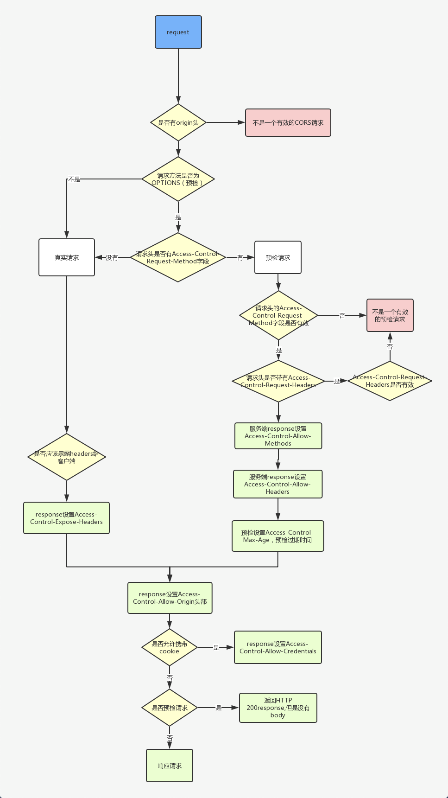

# 跨域详解&CORS

## 一、概述

> 来源
>
> - MDN同源策略：[https://developer.mozilla.org/zh-CN/docs/Web/Security/Same-origin_policy](https://developer.mozilla.org/zh-CN/docs/Web/Security/Same-origin_policy)
> - 浏览器同源政策及规避方法：[http://www.ruanyifeng.com/blog/2016/04/same-origin-policy.html](http://www.ruanyifeng.com/blog/2016/04/same-origin-policy.html)

**浏览器安全的基石**是"同源政策"（[same-origin policy](https://en.wikipedia.org/wiki/Same-origin_policy)）。很多开发者都知道这一点，但了解得不全面。
本文详细介绍"同源政策"的各个方面，以及如何规避它。

### 1.1、同源策略

**同源策略**是一个重要的安全策略，它用于限制一个[origin](https://developer.mozilla.org/zh-CN/docs/Glossary/Origin)的**文档或者它加载的脚本**如何能与**另一个源的资源**进行交互。它能帮助阻隔恶意文档，减少可能被攻击的媒介。

> 备注：
>
> - 同源策略是**浏览器**的限制性安全策略，仅在浏览器中的请求受此策略约束。
> - 同一请求入在终端使用 `curl`命令或服务端读写请求则不受该限制

如果两个 URL 的 [protocol](https://developer.mozilla.org/zh-CN/docs/Glossary/Protocol)、[port(en-US)](https://developer.mozilla.org/en-US/docs/Glossary/Port) (如果有指定的话) 和 [host](https://developer.mozilla.org/zh-CN/docs/Glossary/Host) 都相同的话，则这两个 URL 是_同源_。这个方案也被称为“协议/主机/端口元组”，或者直接是“元组”。（“元组”是指一组项目构成的整体，双重/三重/四重/五重/等的通用形式）。

下表给出了与 `URL` `http://store.company.com/dir/page.html` 的源进行对比的示例：
备注：store.company.com 设置了本地host配置

```shell
# 模拟域名解析，将store.company.com 解析到127.0.0.1
127.0.0.1 store.company.com
```

| **URL**                                   | **结果** | **原因**                    |
| ----------------------------------------------- | -------------- | --------------------------------- |
| http://store.company.com/dir2/other.html        | 同源           | 只有路径不同                      |
| http://store.company.com/dir/inner/another.html | 同源           | 只有路径不同                      |
| https://store.company.com/secure.html           | 失败           | 协议不同                          |
| http://store.company.com:81/dir/etc.html        | 失败           | 端口不同 ( http:// 默认端口是 80) |
| http://news.company.com/dir/other.html          | 失败           | 主机不同                          |
| http://127.0.0.1/dir/other.html                 | 失败           | 主机不同                          |

### 1.2、目的

同源政策的目的，是为了**保证**用户信息的**安全**，**防止恶意的网站窃取数据**。
设想这样一种情况：A网站是一家银行，用户登录以后，又去浏览其他网站。如果其他网站可以读取A网站的 `Cookie`，会发生什么？
很显然，如果 Cookie 包含隐私（比如存款总额），这些信息就会泄漏。更可怕的是，Cookie 往往用来保存用户的登录状态，如果用户没有退出登录，其他网站就可以冒充用户，为所欲为。因为浏览器同时还规定，提交表单不受同源政策的限制。
由此可见，**"同源政策"**是必需的，否则 `Cookie` 可以共享，互联网就毫无安全可言了。

### 1.3、限制范围

随着互联网的发展，"同源政策"越来越严格。目前，如果非同源，共有三种行为受到限制。
（1） Cookie、LocalStorage 和 IndexDB 无法读取。
（2） DOM 无法获得。
（3） AJAX 请求不能发送。

**如下场景不受跨域限制**
**(1)、跨域资源嵌入（Cross-origin embedding）一般是被允许的跨域的**

> 例如通过如下html标签引入的资源：script、link、img、video、object、

**(2)、使用** `<form>`**表单提交请求**

> 来源：
>
> - [https://developer.mozilla.org/zh-CN/docs/Web/HTTP/CORS](https://developer.mozilla.org/zh-CN/docs/Web/HTTP/CORS)
> - [https://developer.mozilla.org/zh-CN/docs/Web/HTML/Element/form](https://developer.mozilla.org/zh-CN/docs/Web/HTML/Element/form)

HTML 4.0 中的 [form](https://developer.mozilla.org/zh-CN/docs/Web/HTML/Element/form) 元素（早于跨站 [XMLHttpRequest](https://developer.mozilla.org/zh-CN/docs/Web/API/XMLHttpRequest) 和 [fetch](https://developer.mozilla.org/zh-CN/docs/Web/API/fetch)）可以向任何来源提交**简单请求**，所以任何编写服务器的人一定已经在保护[跨站请求伪造攻击](https://developer.mozilla.org/zh-CN/docs/Glossary/CSRF)（CSRF）

## 二、跨域的解决方案

> 来源
>
> - [http://www.ruanyifeng.com/blog/2016/04/cors.html](http://www.ruanyifeng.com/blog/2016/04/cors.html)
> - [https://developer.mozilla.org/zh-CN/docs/Web/HTTP/CORS](https://developer.mozilla.org/zh-CN/docs/Web/HTTP/CORS)

请求的跨域（`Ajax`、`Fetch`）解决方案，除了架设服务器代理（浏览器请求同源服务器，再由后者请求外部服务），还有 `CORS`、`JSONP`、`WebSocket`，下面我们将讲解这几种方案的实现方法和注意事项。

除此之外，我们还会讲解一下 `cookie`和 `iframe`的跨域解决方案

### 2.1、Ajax之CORS

#### 2.1.1、CORS简介

CORS需要浏览器和服务器同时支持。目前，所有浏览器都支持该功能，IE浏览器不能低于IE10。
整个CORS通信过程，都是浏览器自动完成，不需要用户参与。
对于开发者来说，CORS通信与同源的AJAX通信没有差别，代码完全一样。

> 备注/重要：
>
> - 实现CORS通信的关键是设置 `请求的响应头`(response headers)，一个请求链路上的 `所有可以设置响应头的节点`，都可以实现 `CORS`，也可能会导致bug
> - CORS的参数仅可在请求链路上上设置一次，如果设置多次，会叠加显示在“response headers”中，从而导致跨域请求异常（详见nginx跨域设置）

浏览器将CORS请求分成两类
简单请求（simple request）和非简单请求（not-so-simple request）。

#### 2.1.2、简单请求

> 来源：
>
> - [https://developer.mozilla.org/zh-CN/docs/Web/HTTP/CORS#%E8%8B%A5%E5%B9%B2%E8%AE%BF%E9%97%AE%E6%8E%A7%E5%88%B6%E5%9C%BA%E6%99%AF](https://developer.mozilla.org/zh-CN/docs/Web/HTTP/CORS#%E8%8B%A5%E5%B9%B2%E8%AE%BF%E9%97%AE%E6%8E%A7%E5%88%B6%E5%9C%BA%E6%99%AF)

只要同时满足以下两大条件，就属于简单请求

> （1) 请求方法是以下三种方法之一：
>
> - HEAD
> - GET
> - POST

（2）HTTP的头信息不超出以下几种字段：

> - Accept
> - Accept-Language
> - Content-Language
> - Last-Event-ID
> - Content-Type：只限于三个值application/x-www-form-urlencoded、multipart/form-data、text/plain

这是为了兼容表单（form），因为历史上表单一直可以发出跨域请求。AJAX 的跨域设计就是，只要表单可以发，AJAX 就可以直接发。

凡是不同时满足上面两个条件，就属于非简单请求。
浏览器对这两种请求的处理，是不一样的。

对于简单请求，浏览器直接发出CORS请求。
具体来说，就是在头信息之中，增加一个 `Origin`字段。
下面是一个例子，浏览器发现这次跨源AJAX请求是简单请求，就自动在头信息之中，添加一个 `Origin`字段。

```http
GET /cors HTTP/1.1
Origin: http://api.bob.com
Host: api.alice.com
Accept-Language: en-US
Connection: keep-alive
User-Agent: Mozilla/5.0...
```

上面的头信息中，`Origin`字段用来说明，本次请求来自哪个源 `（协议 + 域名 + 端口）`。服务器根据这个值，决定是否同意这次请求。

**☆ 如果 `Origin`指定的源，不在许可范围内**
服务器会返回一个正常的HTTP回应。浏览器发现，这个回应的头信息没有包含 `Access-Control-Allow-Origin`字段（详见下文），就知道出错了，从而抛出一个错误，被 `XMLHttpRequest`的 `onerror`回调函数捕获。注意，**这种错误无法通过状态码识别**，因为HTTP回应的状态码有可能是200。

**`fetch`的处理方法如下**
如果遇到网络故障或服务端的 CORS 配置错误时，[fetch()](https://developer.mozilla.org/zh-CN/docs/Web/API/fetch) promise 将会 reject，带上一个 [TypeError](https://developer.mozilla.org/zh-CN/docs/Web/JavaScript/Reference/Global_Objects/TypeError) 对象。

> 来源：
> MDN Fetch API：[https://developer.mozilla.org/zh-CN/docs/Web/API/Fetch_API/Using_Fetch#%E6%A3%80%E6%B5%8B%E8%AF%B7%E6%B1%82%E6%98%AF%E5%90%A6%E6%88%90%E5%8A%9F](https://developer.mozilla.org/zh-CN/docs/Web/API/Fetch_API/Using_Fetch#%E6%A3%80%E6%B5%8B%E8%AF%B7%E6%B1%82%E6%98%AF%E5%90%A6%E6%88%90%E5%8A%9F)

**☆ 如果 `Origin`指定的域名在许可范围内**
服务器返回的响应，会多出几个头信息字段。

```http
Access-Control-Allow-Origin: http://api.bob.com
Access-Control-Allow-Credentials: true
Access-Control-Expose-Headers: FooBar
Content-Type: text/html; charset=utf-8
```

上面的响应头(response headers)信息之中，有三个与CORS请求相关的字段，都以 `Access-Control-`开头。
**（1）`Access-Control-Allow-Origin`：必选字段**
它的值要么是请求时 `Origin`字段的值，要么是一个 `*`，表示接受任意域名的请求。

> **注意**：如使用fetch或携带cookie，该场景不适用。详见：cookie的跨域设置

**（2）`Access-Control-Allow-Credentials`：可选字段**
它的值是一个布尔值，表示是否允许发送 `Cookie`。默认情况下，`Cookie`不包括在 `CORS`请求之中。设为 `true`，即表示服务器明确许可，`Cookie`可以包含在请求中，一起发给服务器。这个值也只能设为 `true`，如果服务器不要浏览器发送Cookie，删除该字段即可。

> **注意**：仅开启此设置，不保证一定可以支持cookie的跨域读取设置，详见cookie的跨域设置

**（3）`Access-Control-Expose-Headers`：可选字段**
CORS请求时，`XMLHttpRequest`对象的 `getResponseHeader()`方法只能拿到6个基本字段：`Cache-Control`、`Content-Language`、`Content-Type`、`Expires`、`Last-Modified`、`Pragma`。如果想拿到其他字段，就必须在 `Access-Control-Expose-Headers`里面指定。上面的例子指定，`getResponseHeader('FooBar')`可以返回 `FooBar`字段的值。

#### 2.1.3、非简单请求

##### 2.1.3.1、预检(preflight)请求

非简单请求是那种对服务器有特殊要求的请求，比如请求方法是 `PUT`或 `DELETE`，或者 `Content-Type字`段的类型是 `application/json`。

非简单请求的 `CORS`请求，会在正式通信之前，增加一次 `HTTP`查询请求，称为"预检"请求（`preflight`）。

浏览器先询问服务器，当前网页所在的域名是否在服务器的许可名单之中，以及可以使用哪些 `HTTP`动词和头信息字段。只有得到肯定答复，浏览器才会发出正式的 `XMLHttpRequest`请求，否则就报错。
下面是一段浏览器的JavaScript脚本。

```http
var url = 'http://api.alice.com/cors';
var xhr = new XMLHttpRequest();
xhr.open('PUT', url, true);
xhr.setRequestHeader('X-Custom-Header', 'value');
xhr.send();
```

上面代码中，`HTTP`请求的方法是 `PUT`，并且发送一个自定义头信息 `X-Custom-Header`。

浏览器发现，这是一个非简单请求，就自动发出一个"预检"请求，要求服务器确认可以这样请求。下面是这个"预检"请求的HTTP头信息。

```http
OPTIONS /cors HTTP/1.1
Origin: http://api.bob.com
Access-Control-Request-Method: PUT
Access-Control-Request-Headers: X-Custom-Header
Host: api.alice.com
Accept-Language: en-US
Connection: keep-alive
User-Agent: Mozilla/5.0...
```

"预检"请求用的请求方法是 `OPTIONS`，表示这个请求是用来询问的。头信息里面，关键字段是 `Origin`，表示请求来自哪个源。

除了 `Origin`字段，**"预检"请求的头信息**包括两个特殊字段。
**（1）`Access-Control-Request-Method`：必选字段**
用来列出浏览器的CORS请求会用到哪些HTTP方法，上例是PUT。
**（2）`Access-Control-Request-Headers`**
该字段是一个逗号分隔的字符串，指定浏览器CORS请求会额外发送的头信息字段，上例是 `X-Custom-Header`。

##### 2.1.3.2、预检请求的回应

服务器收到"预检"请求以后，检查了 `Origin`、`Access-Control-Request-Method`和 `Access-Control-Request-Headers`字段以后，确认允许跨源请求，就可以做出回应。

```http
HTTP/1.1 200 OK
Date: Mon, 01 Dec 2008 01:15:39 GMT
Server: Apache/2.0.61 (Unix)
Access-Control-Allow-Origin: http://api.bob.com
Access-Control-Allow-Methods: GET, POST, PUT
Access-Control-Allow-Headers: X-Custom-Header
Content-Type: text/html; charset=utf-8
Content-Encoding: gzip
Content-Length: 0
Keep-Alive: timeout=2, max=100
Connection: Keep-Alive
Content-Type: text/plain
```

上面的HTTP回应中，关键的是 `Access-Control-Allow-Origin`字段，表示 `http://api.bob.com`可以请求数据。该字段也可以设为星号(`*`)，表示同意任意跨源请求。

> 注意：
>
> - 携带cookie的跨域请求，不能设置为型号(`*`)

```http
Access-Control-Allow-Origin: *
```

如果服务器否定了"预检"请求，会返回一个正常的HTTP回应，但是没有任何CORS相关的头信息字段。这时，浏览器就会认定，服务器不同意预检请求，因此触发一个错误，被 `XMLHttpRequest`对象的 `onerror`回调函数捕获。控制台会打印出如下的报错信息。

```http
XMLHttpRequest cannot load http://api.alice.com.
Origin http://api.bob.com is not allowed by Access-Control-Allow-Origin.
```

服务器回应的其他 `CORS`相关字段如下。

```http
Access-Control-Allow-Methods: GET, POST, PUT
Access-Control-Allow-Headers: X-Custom-Header
Access-Control-Allow-Credentials: true
Access-Control-Max-Age: 1728000
```

**（1）`**Access-Control-Allow-Methods`：必选字段**
它的值是逗号分隔的一个字符串，表明服务器支持的所有跨域请求的方法。注意，返回的是所有支持的方法，而不单是浏览器请求的那个方法。这是为了避免多次"预检"请求。
**（2）Access-Control-Allow-Headers**
如果浏览器请求包括 `Access-Control-Request-Headers`字段，则 `Access-Control-Allow-Headers`字段是必需的。它也是一个逗号分隔的字符串，表明服务器支持的所有头信息字段，不限于浏览器在"预检"中请求的字段。
**（3）`Access-Control-Allow-Credentials`**
该字段与简单请求时的含义相同。
**（4）`Access-Control-Max-Age`：可选字段**
用来指定本次预检请求的有效期，单位为秒。上面结果中，有效期是20天（1728000秒），即允许缓存该条回应1728000秒（即20天），在此期间，不用发出另一条预检请求。

##### 2.1.3.3、浏览器的正常请求和回应

一旦服务器通过了"预检"请求，以后每次浏览器正常的 `CORS`请求，就都跟简单请求一样，会有一个 `Origin`头信息（请求头 `request headers`）字段。服务器的回应(响应头 ` response headers`)，也都会有一个 `Access-Control-Allow-Origin`头信息字段。
下面是"预检"请求之后，浏览器的正常 `CORS`请求。

```http
PUT /cors HTTP/1.1
Origin: http://api.bob.com
Host: api.alice.com
X-Custom-Header: value
Accept-Language: en-US
Connection: keep-alive
User-Agent: Mozilla/5.0...
```

上面头信息的 `Origin`字段是浏览器自动添加的。
下面是服务器正常的回应。

```http
Access-Control-Allow-Origin: http://api.bob.com
Content-Type: text/html; charset=utf-8
```

上面头信息中，`Access-Control-Allow-Origin`字段是每次回应都必定包含的。

#### 2.1.4、完整请求流程



#### 2.1.5、`Nginx`的 `CORS`跨域设置

##### 2.1.5.1、常见服务器的跨域设置

> 如访问不通，需要梯子
> [https://enable-cors.org/server.html](https://enable-cors.org/server.html)

##### 2.1.5.2、HTTP Headers

参考文档：[https://developer.mozilla.org/zh-CN/docs/Web/HTTP/Headers](https://developer.mozilla.org/zh-CN/docs/Web/HTTP/Headers)

##### 2.1.5.3、Nginx官网配置手册

[http://nginx.org/en/docs/http/ngx_http_headers_module.html](http://nginx.org/en/docs/http/ngx_http_headers_module.html)

##### 2.1.5.4、Nginx的跨域设置/常用设置如下

```nginx
# 针对异常接口无法显示错误信息，单独设置options请求，强制返回204状态，便于系统调试
# 例如：接口异常时，如无设置响应头状态码，跨域报错可能为"response to preflight request doesn't pass access control check: it does not have http ok status"

if ($request_method = 'OPTIONS') {
  add_header 'Access-Control-Allow-Origin' '$http_origin' always;
  add_header 'Access-Control-Allow-Credentials' 'true' always;
  add_header 'Access-Control-Allow-Methods' 'GET, POST, OPTIONS, PUT, DELETE' always;
  add_header 'Access-Control-Allow-Headers' 'X-Grade, prelogid,Authorization,DNT,User-Agent,Keep-Alive,Content-Type,accept,origin' always;
  # Access-Control-Expose-Headers 非必须
  add_header 'Access-Control-Expose-Headers' 'X-Pagenation-Count' always;
  return 204;
}

add_header 'Access-Control-Allow-Origin' '$http_origin' always;
add_header 'Access-Control-Allow-Credentials' 'true' always;
add_header 'Access-Control-Allow-Methods' 'GET, POST, OPTIONS, PUT, DELETE' always;
add_header 'Access-Control-Allow-Headers' 'X-Grade, prelogid,Authorization,DNT,User-Agent,Keep-Alive,Content-Type,accept,origin' always;
# Access-Control-Expose-Headers 非必须
add_header 'Access-Control-Expose-Headers' 'X-Pagenation-Count' always;
```

##### 2.1.5.5、常见问题

1. **报错信息不显示明细**`<br />response to preflight request doesn't pass access control check: it does not have http ok status``<br />`解决方法：需将 `CORS`设置中 `OPTIONS` 方法的响应码设置为 `204`
2. **重复设置跨域响应头**`<br />`Access to XMLHttpRequest at 'https://test.com/gateway/admin/robot/getList' from origin 'http://localhost:9200' has been blocked by CORS policy: The 'Access-Control-Allow-Origin' header contains multiple values '*, http://localhost:9200', but only one is allowed. `<br />`**解决方法：**检查后端代码接口的响应头设置、网关设置、服务器设置等所有可以设置请求响应头的地方，CORS的响应头仅可设置一次。`<br />`**原因：**如在多个地方设置响应头字段，后添加的设置不会覆盖先添加的信息，从而导致一个请求的响应头中有多个相同字段，CORS的设置失败
3. **跨域设置仅对部分方法生效**，例如：Get生效，Post无效`<br />`**解决方案**：每条nginx配置后增加always属性。详情看如下案例

> - Nginx配置跨域不生效可能是这个原因:[https://blog.dianduidian.com/post/nginx%E9%85%8D%E7%BD%AE%E8%B7%A8%E5%9F%9F%E4%B8%8D%E7%94%9F%E6%95%88%E6%9C%89%E5%8F%AF%E8%83%BD%E6%98%AF%E8%BF%99%E4%B8%AA%E5%8E%9F%E5%9B%A0/](https://blog.dianduidian.com/post/nginx%E9%85%8D%E7%BD%AE%E8%B7%A8%E5%9F%9F%E4%B8%8D%E7%94%9F%E6%95%88%E6%9C%89%E5%8F%AF%E8%83%BD%E6%98%AF%E8%BF%99%E4%B8%AA%E5%8E%9F%E5%9B%A0/)
> - [https://stackoverflow.com/questions/35946006/nginx-cors-doesnt-work-for-post](https://stackoverflow.com/questions/35946006/nginx-cors-doesnt-work-for-post)
> - [http://nginx.org/en/docs/http/ngx_http_headers_module.html](http://nginx.org/en/docs/http/ngx_http_headers_module.html)

#### 2.1.6、`CORS`与 `JSONP`的比较

`CORS`与 `JSONP`的使用目的相同，但是 `CORS`比 `JSONP`更强大。
`JSONP`只支持 `GET`请求，`CORS`支持所有类型的 `HTTP`请求。
`JSONP`的优势在于支持老式浏览器，以及可以向不支持 `CORS`的网站请求数据。

### 2.2、Ajax之JSONP

JSONP是服务器与客户端跨源通信的常用方法。最大特点就是简单适用，老式浏览器全部支持，服务器改造非常小。
它的基本思想是，网页通过添加一个 `<script>`元素，向服务器请求JSON数据，这种做法不受同源政策限制；服务器收到请求后，将数据放在一个指定名字的回调函数里传回来。
首先，网页动态插入 `<script>`元素，由它向跨源网址发出请求。

```javascript
function addScriptTag(src) {
  var script = document.createElement('script');
  script.setAttribute("type","text/javascript");
  script.src = src;
  document.body.appendChild(script);
}

window.onload = function () {
  addScriptTag('http://example.com/ip?callback=foo');
}

function foo(data) {
  console.log('Your public IP address is: ' + data.ip);
};
```

上面代码通过动态添加 `<script>`元素，向服务器 `example.com`发出请求。注意，该请求的查询字符串有一个 `callback`参数，用来指定回调函数的名字，这对于JSONP是必需的。
服务器收到这个请求以后，会将数据放在回调函数的参数位置返回。

```javascript
foo({
  "ip": "8.8.8.8"
});
```

由于 `<script>`元素请求的脚本，直接作为代码运行。这时，只要浏览器定义了 `foo`函数，该函数就会立即调用。作为参数的 `JSON`数据被视为 `JavaScript`对象，而不是字符串，因此避免了使用 `JSON.parse`的步骤。

### 2.3、Ajax之WebSocket

`WebSocket`是一种通信协议，使用 `ws://`（非加密）和 `wss://`（加密）作为协议前缀。该协议不实行同源政策，只要服务器支持，就可以通过它进行跨源通信。
下面是一个例子，浏览器发出的 `WebSocket`请求的头信息（摘自[维基百科](https://en.wikipedia.org/wiki/WebSocket)）。

```javascript
GET /chat HTTP/1.1
Host: server.example.com
Upgrade: websocket
Connection: Upgrade
Sec-WebSocket-Key: x3JJHMbDL1EzLkh9GBhXDw==
Sec-WebSocket-Protocol: chat, superchat
Sec-WebSocket-Version: 13
Origin: http://example.com
```

上面代码中，有一个字段是 `Origin`，表示该请求的请求源（`origin`），即发自哪个域名。
正是因为有了 `Origin`这个字段，所以 `WebSocket`才没有实行同源政策。因为服务器可以根据这个字段，判断是否许可本次通信。如果该域名在白名单内，服务器就会做出如下回应。

```javascript
HTTP/1.1 101 Switching Protocols
Upgrade: websocket
Connection: Upgrade
Sec-WebSocket-Accept: HSmrc0sMlYUkAGmm5OPpG2HaGWk=
Sec-WebSocket-Protocol: chat
```

### 2.4、Cookie的跨域

#### 2.4.1、前端跨域cookie读写

`Cookie` 是服务器写入浏览器的一小段信息，只有同源的网页才能共享。但是，两个网页一级域名相同，只是二级域名不同，浏览器允许通过设置 `document.domain`共享 `Cookie`。

举例来说，A网页是 `http://w1.example.com/a.html`，B网页是 `http://w2.example.com/b.html`，那么只要设置相同的 `document.domain`，两个网页就可以共享 `Cookie`。

```javascript
document.domain = 'example.com';
```

现在，A网页通过脚本设置一个 `Cookie`。

```javascript
document.cookie = "test1=hello";
```

B网页就可以读到这个 `Cookie`。

```javascript
var allCookie = document.cookie;
```

> 注意：
>
> - 这种方法只适用于 `Cookie` 和 `iframe` 窗口
> - `LocalStorage` 和 `IndexDB` 无法通过这种方法，规避同源政策，而要使用下文介绍的 `PostMessage API`

另外，服务器也可以在设置 `Cookie`的时候，指定 `Cookie`的所属域名为一级域名，比如 `.example.com`。

```http
Set-Cookie: key=value; domain=.example.com; path=/
```

这样的话，二级域名和三级域名不用做任何设置，都可以读取这个Cookie。

#### 2.4.2、附带身份凭证的跨域请求（例如：cookie）

**场景描述**
CORS请求默认不发送 `Cookie`和 `HTTP`认证信息。如发送请求时，需**自动携带** `**cookie**`**并发送到服务器**，且使用CORS的跨域方案，需要满足如下三个方面。

1. **服务端**(PHP/JAVA/GO/NODEJS等)**或服务器**(Ngnix、Apache、Tomcat等)在请求的**响应头（response-header）**中设置**CORS**策略，必须增加此设置 `Access-Control-Allow-Credentials: true`
2. 服务端下发 `cookie`时，并确保策略受 `SameSite`属性控制，若使 `**Secure**`参数生效，请求必须使用 `https`协议。
   `Set-Cookie:  SameSite=None; **Secure**`
3. 前端提交请求时，需确保请求配置中含有“`withCredentials`”（XHR/Axios）或 "`credentials`"(FETCH)

> **注意：**
>
> - 该场景仅适用于请求自动携带 `cookie`，即，请求头（`request headers`）中自动添加cookie字段
> - 如前段代码读取 `cookie`信息，然后作为请求的 `params`参数携带信息，则不在此范围内

如下为三个方面的详解

##### 2.4.2.1、`CORS`设置注意事项

> 来源：
> 跨域资源共享-附带身份凭证的请求：[https://developer.mozilla.org/zh-CN/docs/Web/HTTP/CORS#%E8%8B%A5%E5%B9%B2%E8%AE%BF%E9%97%AE%E6%8E%A7%E5%88%B6%E5%9C%BA%E6%99%AF](https://developer.mozilla.org/zh-CN/docs/Web/HTTP/CORS#%E8%8B%A5%E5%B9%B2%E8%AE%BF%E9%97%AE%E6%8E%A7%E5%88%B6%E5%9C%BA%E6%99%AF)

在响应附带身份凭证的请求时

- 服务器不能将 `Access-Control-Allow-Origin `的值设为通配符 `“*”`，
  而应将其设置为特定的域，如：`Access-Control-Allow-Origin: https://example.com`。
- 服务器不能将 `Access-Control-Allow-Headers` 的值设为通配符“*”，
  而应将其设置为首部名称的列表，
  如：`Access-Control-Allow-Headers: X-PINGOTHER, Content-Type`
- 服务器不能将 `Access-Control-Allow-Methods`的值设为通配符 `“*”`，
  而应将其设置为特定请求方法名称的列表，如：`Access-Control-Allow-Methods: POST, GET`

另外，响应头中如果携带了 ` Set-Cookie` 字段，尝试对 `Cookie` 进行修改，如果操作失败，将会抛出异常。

##### 2.4.2.2、`cookies` 的 `SameSite`

> 来源：
> MDN/SameSite：[https://developer.mozilla.org/zh-CN/docs/Web/HTTP/Headers/Set-Cookie/SameSite](https://developer.mozilla.org/zh-CN/docs/Web/HTTP/Headers/Set-Cookie/SameSite)

**SameSite** 是 HTTP 响应头 [Set-Cookie](https://developer.mozilla.org/zh-CN/docs/Web/HTTP/Headers/Set-Cookie) 的属性之一。
它允许您声明该 Cookie 是否仅限于**第一方**或者**同一站点上下文**。

**SameSite的取值范围**

- `Lax`（默认值）：`Cookies` 允许与顶级导航一起发送，并将与第三方网站发起的 GET 请求一起发送
- `Strict`：Cookies 只会在第一方上下文中发送，不会与第三方网站发起的请求一起发送。
- `None`：Cookie 将在所有上下文中发送，即允许跨站发送。
  以前 None 是默认值，但最近的浏览器版本将 Lax 作为默认值，以便对某些类型的跨站请求伪造（[CSRF](https://developer.mozilla.org/zh-CN/docs/Glossary/CSRF)）攻击具有相当强的防御能力。
  使用 None 时，需在最新的浏览器版本中使用 [Secure](https://developer.mozilla.org/zh-CN/docs/Web/HTTP/Headers/Set-Cookie) 属性。
  `[Secure](https://developer.mozilla.org/zh-CN/docs/Web/HTTP/Headers/Set-Cookie) cookie `仅通过 **HTTPS** 协议加密发送到服务器。请注意，不安全站点（`http:`）无法使用 `Secure` 指令设置 `cookies`。

[cookie手动设置/强制清缓存](https://www.yuque.com/geng.ff/hiur8n/ge77qg?view=doc_embed)
[无痕模式无法使用cookie/This set-cookie was not stored due to user preference](https://www.yuque.com/geng.ff/hiur8n/xr72wa?view=doc_embed)

**“第一方” 和 “第三方”**

> **来源：**[https://web.dev/i18n/zh/samesite-cookies-explained/#cookie](https://web.dev/i18n/zh/samesite-cookies-explained/#cookie)

与当前网站的域名（即浏览器地址栏中显示的内容）相匹配的 cookie 被称为**第一方** cookie。
同样，来自当前网站以外域名的 cookie 被称为**第三方** cookie。
这不是一个绝对的标签，而是相对于用户上下文来决定的。
同一个 `cookie` 可以是第一方的，也可以是第三方的，具体取决于用户当时所在的网站。

> **示例**
> 有 `a.com`(第一方)和 `b.com`(第三方)两个域名，如从 `a.com`请求 `b.com`的接口，那么携带的 `cookie`为 `b.com`的

##### 2.4.2.3、前端配置代码

###### ☆ XHR(XMLHttpRequest)

> MDN/XMLHttpRequest：[https://developer.mozilla.org/zh-CN/docs/Web/API/XMLHttpRequest](https://developer.mozilla.org/zh-CN/docs/Web/API/XMLHttpRequest)

`XMLHttpRequest.withCredentials`
一个布尔值 (en-US)，用来指定跨域 Access-Control 请求是否应当带有授权信息，如 cookie 或授权 header 头。

```json
var xhr = new XMLHttpRequest();
xhr.open('GET', url);
xhr.withCredentials = true; // 允许跨域携带cookie信息
xhr.send();
```

###### ☆ Axios

> github/axios：[https://github.com/axios/axios](https://github.com/axios/axios)

```json
//默认配置 
withCredentials: false, // default

// 全局配置修改
axios.defaults.withCredentials = true;//允许跨域携带cookie信息


```

###### ☆ JQuery

```json
$.ajax({
    type: "GET",
    url: url,
    xhrFields: {
        withCredentials: true // 允许跨域携带cookie信息
    },
    processData: false,
    success: function(data) {}
});
```

###### ☆ FETCH

> - MDN（中文）：[https://developer.mozilla.org/zh-CN/docs/Web/API/fetch#%E5%8F%82%E6%95%B0](https://developer.mozilla.org/zh-CN/docs/Web/API/fetch#%E5%8F%82%E6%95%B0)
> - MDN（英文/推荐）：[https://developer.mozilla.org/en-US/docs/Web/API/Fetch_API/Using_Fetch](https://developer.mozilla.org/en-US/docs/Web/API/Fetch_API/Using_Fetch)

`credentials`: 请求的 `credentials`，如
`omit`：不携带cookie、
`same-origin`：携带同源cookie（默认值，2018年8后的版本支持）
`include`：支持同源和跨源的cookie携带

```http
fetch("https://example.com", {
  credentials: "include",
});

```

#### 2.4.3、本地开发环境使用线上环境(https)接口，并携带cookie

[线上环境代理到开发环境(本地开发环境使用https)](https://www.yuque.com/geng.ff/hiur8n/bi5l1k?view=doc_embed)

### 2.5、Iframe

如果两个网页不同源，就无法拿到对方的 `DOM`。典型的例子是 `iframe`窗口和 `window.open`方法打开的窗口，它们与父窗口无法通信。
比如，父窗口运行下面的命令，如果 `iframe`窗口不是同源，就会报错。

```javascript
document.getElementById("myIFrame").contentWindow.document
// Uncaught DOMException: Blocked a frame from accessing a cross-origin frame.
```

上面命令中，父窗口想获取子窗口的 `DOM`，因为跨源导致报错。
反之亦然，子窗口获取主窗口的 `DOM`也会报错。

```javascript
window.parent.document.body
// 报错
```

如果两个窗口一级域名相同，只是二级域名不同，那么设置上一节介绍的 `document.domain`属性，就可以规避同源政策，拿到 `DOM`。
对于完全不同源的网站，目前有三种方法，可以解决跨域窗口的通信问题。

- 片段识别符（`fragment identifier`）
- `window.name`
- 跨文档通信API（`Cross-document messaging`）

#### 2.5.1、片段识别符

片段标识符（`fragment identifier`）指的是，`URL`的 `#`号后面的部分，比如 `http://example.com/x.html#fragment`的 `#fragment`。如果只是改变片段标识符，页面不会重新刷新。
父窗口可以把信息，写入子窗口的片段标识符。

```javascript
var src = originURL + '#' + data;
document.getElementById('myIFrame').src = src;
```

子窗口通过监听hashchange事件得到通知。

```javascript
window.onhashchange = checkMessage;

function checkMessage() {
  var message = window.location.hash;
  // ...
}
```

同样的，子窗口也可以改变父窗口的片段标识符。

```javascript
parent.location.href= target + "#" + hash;
```

#### 2.5.2、`window.name`

浏览器窗口有 `window.name`属性。这个属性的最大特点是，无论是否同源，只要在同一个窗口里，前一个网页设置了这个属性，后一个网页可以读取它。
父窗口先打开一个子窗口，载入一个不同源的网页，该网页将信息写入 `window.name`属性。

```javascript
window.name = data;
```

接着，子窗口跳回一个与主窗口同域的网址。

```javascript
location = 'http://parent.url.com/xxx.html';
```

然后，主窗口就可以读取子窗口的window.name了。

```javascript
var data = document.getElementById('myFrame').contentWindow.name;
```

这种方法的优点是，`window.name`容量很大，可以放置非常长的字符串；缺点是必须监听子窗口 `window.name`属性的变化，影响网页性能。

#### 2.5.3、`window.postMessage`

上面两种方法都属于破解，`HTML5`为了解决这个问题，引入了一个全新的 `API`：跨文档通信 API（`Cross-document messaging`）。
这个 `API`为 `window`对象新增了一个 `window.postMessage`方法，允许跨窗口通信，不论这两个窗口是否同源。
举例来说，父窗口http://aaa.com向子窗口http://bbb.com发消息，调用 `postMessage`方法就可以了。

```javascript
var popup = window.open('http://bbb.com', 'title');
popup.postMessage('Hello World!', 'http://bbb.com');
```

`postMessage`方法的第一个参数是具体的信息内容，第二个参数是接收消息的窗口的源（`origin`），即"协议 + 域名 + 端口"。也可以设为*，表示不限制域名，向所有窗口发送。
子窗口向父窗口发送消息的写法类似。

```javascript
window.opener.postMessage('Nice to see you', 'http://aaa.com');
```

父窗口和子窗口都可以通过 `message`事件，监听对方的消息。

```javascript
window.addEventListener('message', function(e) {
  console.log(e.data);
},false);
```

`message`事件的事件对象 `event`，提供以下三个属性。

> - **event.source：**发送消息的窗口
> - **event.origin: **消息发向的网址
> - **event.data: **消息内容

下面的例子是，子窗口通过 `event.source`属性引用父窗口，然后发送消息。

```javascript
window.addEventListener('message', receiveMessage);
function receiveMessage(event) {
  event.source.postMessage('Nice to see you!', '*');
}
```

`event.origin`属性可以过滤不是发给本窗口的消息。

```javascript
window.addEventListener('message', receiveMessage);
function receiveMessage(event) {
  if (event.origin !== 'http://aaa.com') return;
  if (event.data === 'Hello World') {
      event.source.postMessage('Hello', event.origin);
  } else {
    console.log(event.data);
  }
}

```

#### 2.5.4、`LocalStorage`

通过 `window.postMessage`，读写其他窗口的 ` LocalStorage` 也成为了可能。
下面是一个例子，主窗口写入 `iframe`子窗口的 `localStorage`。

```javascript
window.onmessage = function(e) {
  if (e.origin !== 'http://bbb.com') {
    return;
  }
  var payload = JSON.parse(e.data);
  localStorage.setItem(payload.key, JSON.stringify(payload.data));
};
```

上面代码中，子窗口将父窗口发来的消息，写入自己的 `LocalStorage`。
父窗口发送消息的代码如下。

```javascript
var win = document.getElementsByTagName('iframe')[0].contentWindow;
var obj = { name: 'Jack' };
win.postMessage(JSON.stringify({key: 'storage', data: obj}), 'http://bbb.com');
```

加强版的子窗口接收消息的代码如下。

```javascript
window.onmessage = function(e) {
  if (e.origin !== 'http://bbb.com') return;
  var payload = JSON.parse(e.data);
  switch (payload.method) {
    case 'set':
      localStorage.setItem(payload.key, JSON.stringify(payload.data));
      break;
    case 'get':
      var parent = window.parent;
      var data = localStorage.getItem(payload.key);
      parent.postMessage(data, 'http://aaa.com');
      break;
    case 'remove':
      localStorage.removeItem(payload.key);
      break;
  }
};
```

加强版的父窗口发送消息代码如下。

```javascript
var win = document.getElementsByTagName('iframe')[0].contentWindow;
var obj = { name: 'Jack' };
// 存入对象
win.postMessage(JSON.stringify({key: 'storage', method: 'set', data: obj}), 'http://bbb.com');
// 读取对象
win.postMessage(JSON.stringify({key: 'storage', method: "get"}), "*");
window.onmessage = function(e) {
  if (e.origin != 'http://aaa.com') return;
  // "Jack"
  console.log(JSON.parse(e.data).name);
};
```
