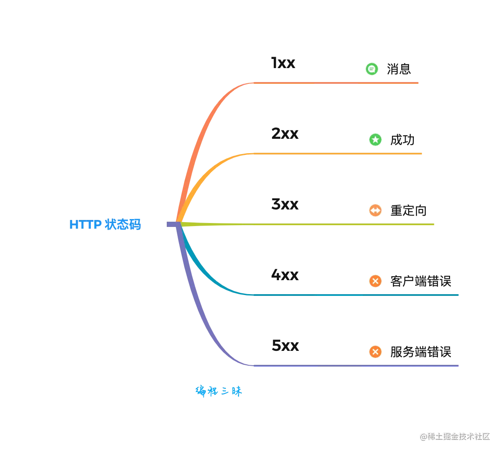

# HTTP状态码

> 来源：
> - HTTP状态码：[https://juejin.cn/post/6992532580188815390#heading-21](https://juejin.cn/post/6992532580188815390#heading-21)


## 前言
通过前面的总结，我们都知道，当客户端通过 HTTP 向服务端发送了一个请求之后，总是期望服务端能够进行响应。而在服务端的响应结果中，信息头会包含一个叫 **Status Code** 的属性，其值为一个三位数的数字，我们将这个数字称为 **HTTP 状态码**。
**HTTP 状态码** 是 HTTP 协议的重要组成部分，它用来表示服务端对当前请求的**响应状态**。
## 概念
**HTTP 状态码**（英语：HTTP Status Code）是用来表示网页服务器 HTTP 协议响应状态的 3 位数字代码。
它由 RFC 2616 规范定义的，并得到 RFC 2518、RFC 2817、RFC 2295、RFC 2774 与 RFC 4918 等规范扩展。
所有状态码的第一个数字代表了响应的五种状态之一。所示的消息短语是典型的，但是可以提供任何可读取的替代方案。
## 分类
HTTP 状态码分为五类，如下图所示：

## 1xx 消息
100-199 用于指定客户端应相应的某些动作。
这一类型的状态码，代表请求已被接受，需要继续处理。有以下特性：

- 这类响应是**临时响应**，只包含状态行和某些可选的响应头信息，并以空行结束。
- 由于HTTP/1.0协议中没有定义任何1xx状态码，所以除非在某些试验条件下，服务器**禁止**向此类客户端发送1xx响应。
- 这些状态码代表的响应都是**信息性**的，标示客户应该等待服务器采取进一步行动。
- 

### 100 Continue
服务器已经接收到请求头，并且客户端应继续发送请求主体（在需要发送身体的请求的情况下：例如，POST请求），或者如果请求已经完成，忽略这个响应。
服务器必须在请求完成后向客户端发送一个最终响应。
要使服务器检查请求的头部，客户端必须在其初始请求中发送 Expect: 100-continue 作为头部，并在发送正文之前接收100 Continue状态代码。
### 101 Switching Protocols
服务器已经理解了客户端的请求，并将通过Upgrade消息头通知客户端采用不同的协议来完成这个请求。在发送完这个响应最后的空行后，服务器将会切换到在Upgrade消息头中定义的那些协议。
只有在切换新的协议更有好处的时候才应该采取类似措施。例如，切换到新的HTTP版本（如[HTTP/2](https://link.juejin.cn?target=https%3A%2F%2Fzh.wikipedia.org%2Fwiki%2FHTTP%2F2)）比旧版本更有优势，或者切换到一个实时且同步的协议（如[WebSocket](https://link.juejin.cn?target=https%3A%2F%2Fzh.wikipedia.org%2Fwiki%2FWebSocket)）以传送利用此类特性的资源。
### 102 Processing
WebDAV请求可能包含许多涉及文件操作的子请求，需要很长时间才能完成请求。该代码表示服务器已经收到并正在处理请求，但无响应可用。这样可以防止客户端超时，并假设请求丢失。
### 103 Early Hints
用来在最终的HTTP消息之前返回一些响应头。
## 2xx 成功
200-299 用于表示请求成功，代表请求已成功被服务器接收、理解、并接受。
### 200 OK
请求已成功，请求所希望的**响应头**或**数据体**将随此响应返回。出现此状态码是表示正常状态。
### 201 Created
请求已经被实现，而且有一个新的资源已经依据请求的需要而建立，且其 URI 已经随Location 头信息返回。
假如需要的资源无法及时建立的话，应当返回 '202 Accepted'。
### 202 Accepted
服务器已接受请求，但尚未处理。
正如它可能被拒绝一样，最终该请求可能会也可能不会被执行。在异步操作的场合下，没有比发送这个状态码更方便的做法了。
返回202状态码的响应的目的是**允许服务器接受其他过程的请求**（例如某个每天只执行一次的基于批处理的操作），而不必让客户端一直保持与服务器的连接直到批处理操作全部完成。
接受请求处理并返回202状态码的响应，应当在返回的实体中包含一些指示处理当前状态的信息，以及指向处理状态监视器或状态预测的指针，以便用户能够估计操作是否已经完成。
### 203 Non-Authoritative Information
非授权信息 
服务器已成功处理了请求，但返回的实体头部元信息不是在原始服务器上有效的确定集合，而是来自本地或者第三方的拷贝。当前的信息可能是原始版本的子集或者超集。
例如，包含资源的元数据可能导致原始服务器知道元信息的超集。使用此状态码不是必须的，而且只有在响应不使用此状态码便会返回200 OK的情况下才是合适的。
### 204 No Content
无内容
服务器成功处理了请求，但不需要返回任何实体内容，并且希望返回更新了的元信息。响应可能通过实体头部的形式，返回新的或更新后的元信息。如果存在这些头部信息，则应当与所请求的变量相呼应。
如果客户端是浏览器的话，那么用户浏览器应保留发送了该请求的页面，而不产生任何文档视图上的变化，即使按照规范新的或更新后的元信息应当被应用到用户浏览器活动视图中的文档。
由于204响应**被禁止包含任何消息体**，因此它始终以消息头后的第一个空行结尾。
例如：跨域请求的CORS设置，预检请求需要返回204
[nginx跨域设置](https://www.yuque.com/geng.ff/hiur8n/xnv9t2?view=doc_embed)
### 205 Reset Content
重置内容
服务器成功处理了请求，且没有返回任何内容。
但是与204响应不同，返回此状态码的响应要求请求者重置文档视图。该响应主要是被用于接受用户输入后，立即重置表单，以便用户能够轻松地开始另一次输入。
与204响应一样，该响应也**被禁止包含任何消息体**，且以消息头后的第一个空行结束。
### 206 Partial Content
部分内容
服务器已经成功处理了部分 GET 请求。
类似于 FlashGet 或者迅雷这类的 HTTP下载工具都是使用此类响应实现断点续传或者将一个大文档分解为多个下载段同时下载。
该请求必须包含 Range 头信息来指示客户端希望得到的内容范围，并且可能包含 If-Range 来作为请求条件。
响应必须包含如下的头部域：

- Content-Range 用以指示本次响应中返回的内容的范围；如果是 Content-Type 为 multipart/byteranges 的多段下载，则每一 multipart 段中都应包含 Content-Range 域用以指示本段的内容范围。假如响应中包含 Content-Length，那么它的数值必须匹配它返回的内容范围的真实字节数。
- Date
- ETag 和/或 Content-Location，假如同样的请求本应该返回200响应。
- Expires, Cache-Control，和/或 Vary，假如其值可能与之前相同变量的其他响应对应的值不同的话。

假如本响应请求使用了 If-Range 强缓存验证，那么本次响应不应该包含其他实体头；假如本响应的请求使用了 If-Range 弱缓存验证，那么本次响应禁止包含其他实体头；这避免了缓存的实体内容和更新了的实体头信息之间的不一致。否则，本响应就应当包含所有本应该返回200响应中应当返回的所有实体头部域。
假如 ETag 或 Last-Modified 头部不能精确匹配的话，则客户端缓存应禁止将206响应返回的内容与之前任何缓存过的内容组合在一起。
### 207 Multi-Status
由WebDAV(RFC 2518)扩展的状态码，代表之后的消息体将是一个XML消息，并且可能依照之前子请求数量的不同，包含一系列独立的响应代码。
### 208 Already Reported
DAV绑定的成员已经在（多状态）响应之前的部分被列举，且未被再次包含。
### 226 IM Used
服务器已经满足了对资源的请求，对实体请求的一个或多个实体操作的结果表示。
## 3xx 重定向
300-399 
这类状态码代表需要客户端采取进一步的操作才能完成请求。通常，这些状态码用来重定向，后续的请求地址（重定向目标）在本次响应的 Location 域中指明。
当且仅当后续的请求所使用的方法是 GET 或者 HEAD 时，用户浏览器才可以在没有用户介入的情况下自动提交所需要的后续请求。
客户端应当自动监测无限循环重定向（例如：A->A，或者A->B->C->A），因为这会导致服务器和客户端大量不必要的资源消耗。
按照 HTTP/1.0 版规范的建议，浏览器不应自动访问超过5次的重定向。
### 300 Multiple Choices
被请求的资源有一系列可供选择的回馈信息，每个都有自己特定的地址和浏览器驱动的商议信息。用户或浏览器能够自行选择一个首选的地址进行重定向。
除非这是一个 HEAD 请求，否则该响应应当包括一个资源特性及地址的列表的实体，以便用户或浏览器从中选择最合适的重定向地址。这个实体的格式由 Content-Type 定义的格式所决定。浏览器可能根据响应的格式以及浏览器自身能力，自动作出最合适的选择。当然，RFC 2616规范并没有规定这样的自动选择该如何进行。
如果服务器本身已经有了首选的回馈选择，那么在 Location 中应当指明这个回馈的 URI；浏览器可能会将这个 Location 值作为自动重定向的地址。此外，除非额外指定，否则这个响应也是可缓存的。
### 301 Moved Permanently
永久移动/永久重定向 
请求的网页已永久移动到新位置。 服务器返回此响应（对 GET 或 HEAD 请求的响应）时，会自动将请求者转到新位置。
### 302 Found
临时移动/临时重定向
 服务器目前从不同位置的网页响应请求，但请求者应继续使用原有位置来进行以后的请求。
### 303 See Other
查看其他位置 
请求者应当对不同的位置使用单独的 GET 请求来检索响应时，服务器返回此代码。
### 304 Not Modified
未修改/命中协商缓存
表示资源在由请求头中的`If-Modified-Since`或`If-None-Match`参数指定的这一版本之后，未曾被修改。
在这种情况下，由于客户端仍然具有以前下载的副本，因此不需要重新传输资源。
服务器返回此响应时，不会返回网页内容。
[HTTP缓存机制](https://www.yuque.com/geng.ff/hiur8n/cmtngm?view=doc_embed)
### 305 Use Proxy
使用代理
请求者只能使用代理访问请求的网页。 如果服务器返回此响应，还表示请求者应使用代理。  
### 306 Switch Proxy
在最新版的规范中，306状态码已经不再被使用。最初是指“后续请求应使用指定的代理”。
## 4xx 客户端错误
400-499 用于指出客户端的错误。 （自己电脑这边的问题） 自己电脑这边的问题） 
这类的状态码代表了客户端看起来可能发生了错误，妨碍了服务器的处理。除非响应的是一个 HEAD 请求，否则服务器就应该返回一个解释当前错误状况的实体，以及这是临时的还是永久性的状况。这些状态码适用于任何请求方法。浏览器应当向用户显示任何包含在此类错误响应中的实体内容。
如果错误发生时客户端正在传送数据，那么使用TCP的服务器实现应当仔细确保在关闭客户端与服务器之间的连接之前，客户端已经收到了包含错误信息的数据包。如果客户端在收到错误信息后继续向服务器发送数据，服务器的TCP栈将向客户端发送一个重置数据包，以清除该客户端所有还未识别的输入缓冲，以免这些数据被服务器上的应用程序读取并干扰后者。

400 （错误请求） 服务器不理解请求的语法。 
401 （未授权） 请求要求身份验证。 对于需要登录的网页，服务器可能返回此响应。 
403 （禁止） 服务器拒绝请求。
404 （未找到） 服务器找不到请求的网页
405 （方法禁用） 禁用请求中指定的方法。 
406 （不接受） 无法使用请求的内容特性响应请求的网页。 
407 （需要代理授权） 此状态代码与 
408 （请求超时） 服务器等候请求时发生超时。 


### 400 Bad Request
有两种可能：

- 语义有误，当前请求无法被服务器理解。除非进行修改，否则客户端不应该重复提交这个请求。
- 请求参数有误。
### 401 Unauthorized
当前请求需要用户验证。该响应必须包含一个适用于被请求资源的 WWW-Authenticate 信息头用以询问用户信息。客户端可以重复提交一个包含恰当的 Authorization 头信息的请求。如果当前请求已经包含了 Authorization 证书，那么401响应代表着服务器验证已经拒绝了那些证书。如果401响应包含了与前一个响应相同的身份验证询问，且浏览器已经至少尝试了一次验证，那么浏览器应当向用户展示响应中包含的实体信息，因为这个实体信息中可能包含了相关诊断信息。
### 403 Forbidden
服务器已经理解请求，但是拒绝执行它。（一般可理解为系统权限问题）
与401响应不同的是，身份验证并不能提供任何帮助，而且这个请求也不应该被重复提交。如果这不是一个 HEAD 请求，而且服务器希望能够讲清楚为何请求不能被执行，那么就应该在实体内描述拒绝的原因。当然服务器也可以返回一个404响应，假如它不希望让客户端获得任何信息。
### 404 Not Found
请求失败，请求所希望得到的资源未被在服务器上发现。（可以理解为：请求不存在）
没有信息能够告诉用户这个状况到底是暂时的还是永久的。假如服务器知道情况的话，应当使用410状态码来告知旧资源因为某些内部的配置机制问题，已经永久的不可用，而且没有任何可以跳转的地址。404这个状态码被广泛应用于当服务器不想揭示到底为何请求被拒绝或者没有其他适合的响应可用的情况下。出现这个错误的最有可能的原因是服务器端没有这个页面。
### 405 Method Not Allowed
请求行中指定的请求方法不能被用于请求相应的资源。该响应必须返回一个Allow 头信息用以表示出当前资源能够接受的请求方法的列表。
鉴于 PUT，DELETE 方法会对服务器上的资源进行写操作，因而绝大部分的网页服务器都不支持或者在默认配置下不允许上述请求方法，对于此类请求均会返回405错误。
### 406 Not Acceptable
请求的资源的内容特性无法满足请求头中的条件，因而无法生成响应实体。
除非这是一个 HEAD 请求，否则该响应就应当返回一个包含可以让用户或者浏览器从中选择最合适的实体特性以及地址列表的实体。实体的格式由 Content-Type 头中定义的媒体类型决定。浏览器可以根据格式及自身能力自行作出最佳选择。但是，规范中并没有定义任何作出此类自动选择的标准。
### 408 Request Timeout
请求超时。客户端没有在服务器预备等待的时间内完成一个请求的发送。客户端可以随时再次提交这一请求而无需进行任何更改。
### 409 Conflict
冲突 
服务器在完成请求时发生冲突。 服务器必须在响应中包含有关冲突的信息。 
### 410 Gone
已删除 
如果请求的资源已永久删除，服务器就会返回此响应。 
410不同于404，如果资源以前有现在被永久删除了可使用410代码，网站设计人员可通过301代码指定资源的新位置
### 411 Length Required
需要有效长度 
服务器不接受不含有效内容长度标头字段的请求。 
### 412 Precondition Failed
未满足前提条件
服务器未满足请求者在请求中设置的其中一个前提条
### 413 Request Entity Too Large
请求实体过大 
服务器无法处理请求，因为请求实体过大，超出服务器的处理能力。
例如：

- NPM发包时，如果文件过大，可能会返回413
- 文件上传，如果文件过大，可能会返回413

常用解决方法

- 设置服务器的 `body_size`

nginx的设置
```nginx
client_max_body_size 50M;
```
K8S的ingress设置
```
key: nginx.ingress.kubernetes.io/proxy-body-size 
value: 300M
```
### 414 Request-URI Too Large
请求的 URI（通常为网址）过长，服务器无法处理。 
### 415 Unsupported Media Type
不支持的媒体类型
请求的格式不受请求页面的支持。 
> 这种情况一般会执行浏览器的下载行为

[Content-Type](https://www.yuque.com/geng.ff/hiur8n/wyzayq?view=doc_embed)
[include及mime.type](https://www.yuque.com/geng.ff/hiur8n/ukulb9?view=doc_embed)
### 416 Requested range not satisfiable
请求范围不符合要求
### 417 Expectation Failed
 服务器未满足"期望"请求标头字段的要求。 
### 499 Client Has Closed Connection
客户端主动断开了连接。
## 5xx 服务端错误
500-599 用于支持服务器错误。 （对方的问题） 对方的问题）
这类状态码代表了服务器在处理请求的过程中有错误或者异常状态发生，也有可能是服务器意识到以当前的软硬件资源无法完成对请求的处理。除非这是一个HEAD 请求，否则服务器应当包含一个解释当前错误状态以及这个状况是临时的还是永久的解释信息实体。浏览器应当向用户展示任何在当前响应中被包含的实体。
这些状态码适用于任何响应方法。
### 500 Internal Server Error
服务器遇到了一个未曾预料的状况，导致了它无法完成对请求的处理。一般来说，这个问题都会在服务器端的源代码出现错误时出现。
### 501 Not Implemented
尚未实施  
服务器不支持当前请求所需要的某个功能。当服务器无法识别请求的方法，并且无法支持其对任何资源的请求。
### 502 Bad Gateway
错误网关 
作为网关或者代理工作的服务器尝试执行请求时，从上游服务器接收到无效的响应。
### 503 Service Unavailable
服务不可用 
由于临时的服务器维护或者过载，服务器当前无法处理请求。
这个状况是临时的，并且将在一段时间以后恢复， 重启业务应该可以恢复。如果能够预计延迟时间，那么响应中可以包含一个 Retry-After 头用以标明这个延迟时间。如果没有给出这个 Retry-After 信息，那么客户端应当以处理500响应的方式处理它。
注意：503状态码的存在并不意味着服务器在过载的时候必须使用它。某些服务器只不过是希望拒绝客户端的连接。
### 504 Gateway Timeout
网关超时 
作为网关或者代理工作的服务器尝试执行请求时，未能及时从上游服务器（URI标识出的服务器，例如HTTP、FTP、LDAP）或者辅助服务器（例如DNS）收到响应。
注意：某些代理服务器在DNS查询超时时会返回400或者500错误
### 505 HTTP Version Not Supported
505 （HTTP 版本不受支持） 
服务器不支持，或者拒绝支持在请求中使用的 HTTP 版本。
这暗示着服务器不能或不愿使用与客户端相同的版本。响应中应当包含一个描述了为何版本不被支持以及服务器支持哪些协议的实体。
### 507 Insufficient Storage
服务器无法存储完成请求所必须的内容。这个状况被认为是临时的。
### 511 Network Authentication Required
客户端需要进行身份验证才能获得网络访问权限，旨在限制用户群访问特定网络。


