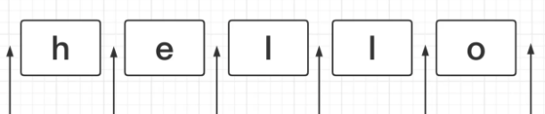
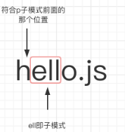
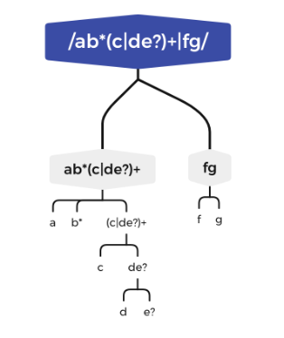

# 正则表达式.快速入门

## 前言

什么是正则表达式，我们可以理解为一种浏览器可以识别的规则，有了这种规则，浏览器就可以帮助我们判断某些字符是否满足符合我们特定场景的业务需求。为啥我们要去学习正则呢，如果我们熟练的使用正则就会在某些业务场景下，那我们的代码量会明显的减少，而且会更具有可读性。

举个简单的例子，如何数字进行千分位分隔符呢

```javascript
/** 首先我们得了解业务场景下的规则，比如实现千分位分隔符：
*/
const num = 12345678
// 123，456，78
// 不使用正则
function splitNum(str) {
  if (!str) return false
  const arr1 = str.split('').reverse()
  // 12345678
  // 876,543,21
  // ,123,456,78
  const arr2 = []
  for (let index = 0; index < arr1.length; index++) {
    if (index % 3 === 0 && index !== 0) {
      arr2.push(',')
    }
    arr2.push(arr1[index])
  }
  return arr2.reverse().join('')
}
splitNum(num.toString()) // 12,345,678

// 使用正则
const numReg = /(?!^)(?=(\d{3})+$)/g
num.toString().replace(numReg, ',')

```

上面这个简单的例子可以看出，如果使用正则，代码量明显变少了，而且也更加的直观

那我们如何去学习和使用正则呢：

正则表达式是匹配模式，要么匹配字符，要么匹配位置

字符大家应该都清楚，那位置呢，可以看下图：


咱们可以将位置理解为相邻字符间的位置

## 一、正则的创建

### 创建方法

在 `JavaScript`中有两种方式创建一个正则表达式
（1）通过调用 RegExp 对象的构造函数创建

```javascript
const regExp = new RegExp(正则表达式, 标志);
```

问：正则表达式中如何使用变量？

（2）利用字面量创建正则表达式
使用一个正则表达式**字面量**，其由包含在斜杠之间的模式组成。
脚本加载后，正则表达式字面量就会被编译。
当正则表达式保持不变时，使用此方法可获得**更好的性能**。

```javascript
const reg = /正则表达式/[可选的标志];
```

### 修饰符

**前端小伙伴最熟悉的标签：img**

| `i` | **忽略大小写**

| 如果u标志也被启用，使用 `Unicode`大小写折叠。                                                        |                    |
| ------------------------------------------------------------------------------------------------------ | ------------------ |
| `m`                                                                                                  | **多行匹配** |
| 更改 `^`和 `$`的含义，使它们分别在任意一行的行首和行尾匹配，而不仅仅在整个字符串的开头和结尾匹配。 |                    |
| (在此模式下,`$`的精确含意是:匹配 `\\n`或 `\\r`之前的位置以及字符串结束前的位置.)                 |                    |
| g                                                                                                      | **全局匹配** |
| 找到所有的匹配，而不是在第一个匹配之后停止。                                                           |                    |

## 二、正则表达式中的位置

 **元字符**

| 元字符                                                        | 描述                                                   |
| ------------------------------------------------------------- | ------------------------------------------------------ |
| `.`                                                         | 句号匹配任意单个字符除了换行符。                       |
| `[ ]`                                                       | 字符种类。匹配方括号内的任意字符。                     |
| `[^ ]`                                                      | 否定的字符种类。匹配除了方括号里的任意字符             |
| `*`                                                         | 匹配>=0个重复的在 `*`号之前的字符。                  |
| `+`                                                         | 匹配>=1个重复的+号前的字符。                           |
| `?`                                                         | 标记?之前的字符为可选.                                 |
| `{n,m}`                                                     | 匹配num个大括号之前的字符或字符集 (`n <= num <= m`). |
| `(xyz)`                                                     | 字符集，匹配与 xyz 完全相等的字符串.                   |
| `&#124;`                                                    | 或运算符，匹配符号前或后的字符.                        |
| `\\`                                                        | 转义字符,用于匹配一些保留的字符                        |
| ` [ ] ( ) { } . * + ? ^ $ \\ &#124;`                        |                                                        |
| `^`                                                         | 用来检查匹配的字符串是否在所匹配字符串的开头.          |
| `$` | 同理于 `^` 号，`$` 号用来匹配字符是否是最后一个。 |                                                        |

**简写字符集**
正则表达式提供一些常用的字符集简写。如下:

| 简写                     | 描述                                                                                                                                                                                                                                                                                                                                                     |
| ------------------------ | -------------------------------------------------------------------------------------------------------------------------------------------------------------------------------------------------------------------------------------------------------------------------------------------------------------------------------------------------------- |
| `.`                    | 除换行符外的所有字符                                                                                                                                                                                                                                                                                                                                     |
| `\b`                   | 匹配单词的开始或结束                                                                                                                                                                                                                                                                                                                                     |
| `\B`                   | 匹配不是单词开头或结束的位置                                                                                                                                                                                                                                                                                                                             |
| `\cX`                  | 当 X 是处于 A 到 Z 之间的字符的时候，匹配字符串中的一个控制符。例如，/\cM/ 匹配字符串中的 control-M (U+000D)。                                                                                                                                                                                                                                           |
| `\d`                   | 匹配数字： [0-9]                                                                                                                                                                                                                                                                                                                                         |
| `\D`                   | 匹配非数字： [^\d]                                                                                                                                                                                                                                                                                                                                       |
| `\f`                   | 匹配一个换页符(U+000C)                                                                                                                                                                                                                                                                                                                                   |
| `\n`                   | 匹配一个换行符 (U+000A)                                                                                                                                                                                                                                                                                                                                  |
| `\r`                   | 匹配一个回车符(U+000D)                                                                                                                                                                                                                                                                                                                                   |
| `\s`                   | 匹配一个空白字符，包括空格、制表符、换页符和换行符。等价于 [\f\n\r\t\v\u0020\u00a0\u1680\u180e\u2000-\u200a\u2028\u2029\u202f\u205f\u3000\ufeff]。例如，/\s\w*/ 匹配"foo bar."中的' bar'。经测试，\s不匹配"[\u180e](https://unicode-table.com/cn/180E/)"，在当前版本 Chrome(v80.0.3987.122) 和 Firefox(76.0.1) 控制台输入/\s/.test("\u180e") 均返回 false。 |
| `\S`                   | 匹配所有非空格字符： [^\s]                                                                                                                                                                                                                                                                                                                               |
| `\t`                   | 匹配一个水平制表符 (U+0009)                                                                                                                                                                                                                                                                                                                              |
| `\v`                   | 匹配一个垂直制表符 (U+000B)                                                                                                                                                                                                                                                                                                                              |
| `\w`                   | 匹配所有字母数字，等同于 [a-zA-Z0-9_]                                                                                                                                                                                                                                                                                                                    |
| `\W`                   | 匹配所有非字母数字，即符号，等同于： [^\w]                                                                                                                                                                                                                                                                                                               |
| `\p`                   | 匹配 CR/LF（等同于 \r\n），用来匹配 DOS 行终止符                                                                                                                                                                                                                                                                                                         |
| `\0`                   | 匹配 NULL（U+0000）字符，不要在这后面跟其他小数，因为 `\0 \<digits\>` 是一个八进制转义序列。                                                                                                                                                                                                                                                           |
| `\xhh`                 | 匹配一个两位十六进制数（\x00-\xFF）表示的字符                                                                                                                                                                                                                                                                                                            |
| `\uhhhh`               | 匹配一个四位十六进制数表示的 UTF-16 代码单元。                                                                                                                                                                                                                                                                                                           |
| `\u{hhhh} 或\u{hhhhh}` | （仅当设置了 u 标志时）匹配一个十六进制数表示的 Unicode 字符                                                                                                                                                                                                                                                                                             |

**详细解释**
1、`^` 脱字符，用于匹配行的开头

```javascript
const str = 'hello'
str.replace(/^/, '*') 
// '*hello'
```

2、`$` 美元符号，匹配行的结尾

```javascript
const str = 'hello'
str.replace(/$/, '*') 
// 'hello*'
```

3、`\b` 单词的边界
\w是字符组[0-9a-zA-Z_]的简写形式，即\w是字母数字或者下划线的中任何一个字符。
而\W是排除字符组[^0-9a-zA-Z_]的简写形式，即\W是\w以外的任何一个字符。

单词边界有三大规则：
1、`^`和 `\w之`间的位置
2、`\w`和 `\W`之间的位置
3、`\w`和 `$`之间的位置

可以看图理解


```javascript
// hello_1.js => *hello_1*.*js*
const str = 'hello_1.js'
str.replace(/\b/g, '*')
```

4、`\B`非单词的边界，即扣掉 `\b`，剩下的都是 `\B`

5、`(?=p)` 学名叫做**正向先行断言**，其中p是子模式，即p前面的那个位置


```javascript
// hello.js => h*ello.js
const str = 'hello.js'
str.replace(/(?=ell)/g, '*')
```

6、`(?!p)`学名叫做**负向先行断言**，可以理解为 `(?=p)`匹配到的位置之外的位置都是属于 `(?!p)`

```javascript
// h*ello.js => '*he*l*l*o*.*j*s*'
const str = 'hello.js'
str.replace(/(?!ell)/g, '*')
```

7、`(?<=p)`符合p子模式后面的那个位置

```javascript
// hello.js => hell*o.js
const str = 'hello.js'
str.replace(/(?<=ell)/g, '*')
```

8、`(?<!p)` 其实就是 `(?<=p)`取非集，我们可以这样理解 `(?<=p)`匹配到的位置之外的位置

```javascript
// hell*o.js => *h*e*l*lo*.*j*s*
const str = 'hello.js'
str.replace(/(?<!ell)/g, '*')
```

## 三、正则表达式括号的作用

### () - 小括号：分组

- **分组/子表达式：**使用小括号指定一个子表达式后，**匹配这个子表达式的文本**	(也就是此分组捕获的内容)可以在表达式或其它程序中作进一步的处理。默认情况下，每个分组会自动拥有一个**组号。
  例如：**对于匹配连续多次出现单个字符 `"c"`，`/c+/`，如果要匹配连续出现的 `"code"`时，则使用 `/(code)+/`，其中括号是提供分组功能，量词 `"+"`作用与 `"code"`这个整体
- **规则：**从左往右
- **后向引用**/捕获(身在其中的斜杠青年)：`\1`、`\2`、`\3`
- **分组匹配(**只认结果的美元小组**): **`$1`、`$\2`、`$3`

```javascript
// 后向引用.应用于正则表达式的模式中
/\b(\w+)\b\s+\1\b/.test('go go')

// 分组匹配.应用于正则表达式模式匹配的结果中
var re = /(\w+)\s(\w+)/;
var str = "John Smith";
var newstr = str.replace(re, "$2, $1");
// Smith, John
console.log(newstr);
```

### `[]` - 中括号: 集合/字符集

用于匹配没有预定义的元字符字符集合(比如元音字母a,e,i,o,u)，例如

- `[aeiou]`	就匹配	任何一个英文元音字母
- `[.?!]`	匹配	标点符号(.或?或!)

指定一个字符**范围**

- `[0-9]`	代表的含意与, \d 就是完全一致的。
- `[a-z0-9A-Z_]`	也完全等同于, \w（如果只考虑英文的话）

### `{}` - 大括号: 重复/限定符

| **代码/语法** | **说明**   |
| ------------------- | ---------------- |
| `*`               | 重复零次或更多次 |
| `+`               | 重复一次或更多次 |
| `?`               | 重复零次或一次   |
| `{n}`             | 重复n次          |
| `{n,}`            | 重复n次或更多次  |
| `{n,m}`           | 重复n到m次       |

**口诀：“星加问，零一零一”**

## 四、贪婪与懒惰

当正则表达式中包含能接受重复的限定符时，通常的行为是（在使整个表达式能得到匹配的前提下）匹配**尽可能多**的字符。以这个表达式为例：`a.*b`，它将会匹配最长的以a开始，以b结束的字符串。如果用它来搜索 `_aabab_`的话，它会匹配整个字符串 `aabab`。这被称为**贪婪**匹配。
有时，我们更需要**懒惰**匹配，也就是匹配**尽可能少**的字符。前面给出的限定符都可以被转化为懒惰匹配模式，只要在它后面加上一个问号 `?`。这样 `.*?`就意味着匹配任意数量的重复，但是在能使整个匹配成功的前提下使用最少的重复。现在看看懒惰版的例子吧：
`a.*?b`匹配最短的，以a开始，以b结束的字符串。如果把它应用于 `_aabab_`的话，它会匹配 `aab`（第一到第三个字符）和 `ab`（第四到第五个字符）。

| 代码/语法  | 说明                            |
| ---------- | ------------------------------- |
| `*?`     | 重复任意次，但尽可能少重复      |
| `+?`     | 重复1次或更多次，但尽可能少重复 |
| `??`     | 重复0次或1次，但尽可能少重复    |
| `{n,m}?` | 重复n到m次，但尽可能少重复      |
| `{n,}?`  | 重复n次以上，但尽可能少重复     |

## 五、分支条件

- 正则表达式里的	**分支条件**	指的是有几种规则，如果满足其中任意一种规则都应该当成匹配，具体方法是用 `|`把不同的规则分隔开
- **使用分支条件时，要注意各个条件的顺序**
- 匹配分枝条件时，将会从左到右地测试每个条件，如果满足了某个分枝的话，就不会去再管其它的条件了

```javascript
// 这个表达式能匹配两种以连字号分隔的电话号码：一种是三位区号，8位本地号(如010-12345678)，一种是4位区号，7位本地号(0376-2233445)。
/0\d{2}-\d{8}|0\d{3}-\d{7}/.test('010-12345678')

// 这个表达式匹配3位区号的电话号码，其中区号可以用小括号括起来，也可以不用，区号与本地号间可以用连字号或空格间隔，也可以没有间隔。你可以试试用分枝条件把这个表达式扩展成也支持4位区号的。
/\(0\d{2}\)[- ]?\d{8}|0\d{2}[- ]?\d{8}/.test('029-12345678')

// 这个表达式用于匹配美国的邮政编码。美国邮编的规则是5位数字，或者用连字号间隔的9位数字。之所以要给出这个例子是因为它能说明一个问题：使用分枝条件时，要注意各个条件的顺序。
/\d{5}-\d{4}|\d{5}/.test('12345-6789')

// 如果你把它改成\d{5}|\d{5}-\d{4}的话，那么就只会匹配5位的邮编(以及9位邮编的前5位)。原因是匹配分枝条件时，将会从左到右地测试每个条件，如果满足了某个分枝的话，就不会去再管其它的条件了。

```

## 六、正则表达式常用方法

正则表达式是用于匹配字符串中字符组合的模式。
在 JavaScript中，**正则表达式也是对象**。
这些模式被用于 `RegExp` 的 `exec` 和 `test` 方法,
以及 `String` 的 `match`、`matchAll`、`replace`、`search` 和 `split` 方法

### 1、`replace`

替换字符串，用来替换的参数可以是一个字符串或者一个正则表达式

```javascript
str.replace(regexp/substr,replacement)
```

第一个参数：被替换的字符串 或者 正则表达式
第二个参数：替换为的字符串
返回值是一个替换完毕的新字符串。

### 2、`test`

检索字符串，检索正则表达式与指定的字符串是否匹配

```javascript
regexObj.test(str)
```

返回true或者false

### 3、`match`

检索返回一个字符串匹配正则表达式的结果。

```javascript
str.match(regexp)

const str = '2021-12-01'
const reg1 = /(\d{4})-(\d{2})-(\d{2})/g

str.match(reg1)
// ['2021-12-01']

const reg2 = /(\d{4})-(\d{2})-(\d{2})/
str.match(reg2)
// ['2021-12-01', '2021', '12', '01', index: 0, input: '2021-12-01',  groups: undefined]
```

返回值：
如果使用 `“g”`标志，则将返回与完整正则表达式匹配的所有结果，但不返回捕获组
如果未使用 `“g”`标志，则仅返回第一个完整匹配及其相关的捕获组（`Array`）。 在这种情况下，返回的项目将具有如下所述的其他属性。
（1）第0个元素是匹配结果。
（2）第1个元素是第一个引用型分组匹配的子字符串。
（3）第2个元素存放的是第二个引用型分组匹配的子字符串，依次类推。

- `group`：一个捕获组数组或 `undefined`
- `index`：匹配的结果的开始位置
- `input`：搜索的字符串

### 4、`search`

执行正则表达式和字符串的搜索匹配

```javascript
str.search(regexp)
```

如果匹配成功，则search()返回正则表达式在字符串中首次匹配项的索引；否则，返回-1。

## 七、正则表达式的拆分

正则表达式就像一个个火星文一样，单个的还比较容易理解，一大段那种简直就是折磨，因此如何正确的把一大串火星文拆分成小粒度，就成为了关键，如何拆分呢

### 7.1、结构

**字面量**：匹配一个具体字符，包括转义或者非转义的，如匹配字符 `c`, `\n`换行符，`\.`小数点等等
**字符组**：匹配一个一个字符，可以是多种可能之一，如 `[a-z]`、`[123]`等等
**量词**：表示连续的出现 `{m,n}`
**锚点**：匹配一个位置，而非上述的字符；如：`^`以啥开头，`(?=code)`，code前面的位置
**分枝**：多个子表示多选一；如：`code1|code2`
**分组**：用括号表示一个整体；如：`(code)+`，表示 `code`字符连续出现多次
**反向引用**：如 `\2`、`\3`等，表示引用第2、第3个分组

### 7.2、操作符

1、转义符 `\`
2、括号和方括号 `(....)`、`[...]`
3、量词限定符，`{m,n}`、 `?` 、`*`、`+`
4、位置和序列，`^`、`$`、`\`元字符、一般字符
5、管道符，`|`
**PS：**上述操作符**优先级由高到低**

### 7.3、来个栗子：

`/ab*(c|de?)+|fg/`
1、因为括号的原因，`(c|de?)`是一个整体
2、在括号的内容里边 `de?`中的 `?`，e是一个整体
3、括号中有 `|`，所以 `c`是一个整体，`de?`又是一个整体
4、以此类推，整个正则分为：`a`、`b*`、`(.....)+`、`f`、`g`；
除此之外，由于分支 `|`的原因，也可以拆为 `ab*(c|de?)`和 `fg`这两个部分


## 八、正则表达式的构建

### 8.1、前提

1、能否使用正则
如匹配类似'ababbabbbabbbb......'这样的字符，看起来有规律，但是咱没法用正则来解决

2、有没有必要使用正则
如果咱们能使用API能解决问题，就没必要使用正则
比如在日期里面提取年月日

```javascript
const str = '2021-12-01'
const reg2 = /(\d{4})-(\d{2})-(\d{2})/
str.match(reg2)
// ['2021-12-01', '2021', '12', '01', index: 0, input: '2021-12-01',  groups: undefined]

//不使用正则
const res = str.split('-')
// ['2021', '12', '01']

```

### 8.2、构建

如何构建一个正则呢，我们需要先了解目标的组成规则，明确规则之后，再把这些规则按位置拆分，拆分成一个个的子模块，最后将这些子模块组合起来；

### 8.3、来个简单的栗子

匹配固定电话，有以下格式：
1、085912345678
2、0859-12345678
3、(0859)12345678

分析：
1、首先了解各个格式的组成规则
分为区号和号码部分，区号由0加上3位数字组成，号码由非0的一位数字加上7位任意数字组成
区号：`/0\d{3}/`
号码：`/[1-9]\d{7}/`
因此第一个格式的正则为：`/^0\d{3}[1-9]\d{7}$/`
第二个的格式为：`/^0\d{3}-[1-9]\d{7}$/`
第三个的格式为：`/^\(0\d{3}\)[1-9]\d{7}$/`
所以最终的正则为：`/^(0\d{3}|0\d{3}-|\(0\d{3}\)[1-9]\d{7})$/`

## 九、常见正则表达式收集

[https://mp.weixin.qq.com/s/aF-D3Qr23QxNP8kMZrI0QQ](https://mp.weixin.qq.com/s/aF-D3Qr23QxNP8kMZrI0QQ)

**☆ 身份证号**

```
^[1-9]\d{5}(18|19|([23]\d))\d{2}((0[1-9])|(10|11|12))(([0-2][1-9])|10|20|30|31)\d{3}[0-9Xx]$
```

 示例: `42112319870115371X`

**☆ 用户名**

```
^[a-zA-Z0-9_-]{4,16}$
```

示例: `abclove`。验证 **数字**、**字母**、**_**、**-**，不包含特殊字符，长度 4-16 之间。

**☆ 微信号**

```
^[a-zA-Z]([-_a-zA-Z0-9]{5,19})+$
```

示例: `jslite`。微信号正则，6至20位，以字母开头，字母，数字，减号，下划线。

**☆ 密码强度(宽松)**

```
^(?=.*\d)(?=.*[a-z])(?=.*[A-Z]).{8,10}$
```

示例: diaoD123, Wgood123。必须是包含大小写字母和数字的组合，长度在 8-10 之间。

```
^[0-9a-zA-Z\u4E00-\uFA29]*$
```

示例: diaoD123, Wgood123。数字字母中文。

**☆ 密码强度(包含特殊字符)**

```
^.*(?=.{6,})(?=.*\d)(?=.*[A-Z])(?=.*[a-z])(?=.*[!@#$%^&*? ]).*$
```

示例: diaoD123#, Wgood123#$。密码强度正则，最少6位，包括至少1个大写字母，1个小写字母，1个数字，1个特殊字符。

**☆ 火车车次**

```
^[GCDZTSPKXLY1-9]\d{1,4}$
```

示例: G2868, D22, D9, Z5, Z24, Z17

**☆ 汉字中文**

```
^[\u4e00-\u9fa5]{0,}$
```

示例: 中文, 湖北, 黄冈。不限制文字长度。

```
^[\u4e00-\u9fa5]{2,6}$
```

示例: 中文, 湖北黄冈。2到6位汉字

**☆ 中文名字**

```
^(?:[\u4e00-\u9fa5·]{2,16})$
```

示例: 周杰伦, 古丽娜扎尔·拜合提亚尔, 拉希德·本·穆罕默德·本·拉希德。

**☆ 英文姓名**

```
(^[a-zA-Z][a-zA-Z\s]{0,20}[a-zA-Z]$)
```

示例: Gene Kelly, Fred Astaire, Humphrey Bogart, GaryCooper, Cary Grant, Joan Crawford

**☆ URL**

```
^[a-zA-Z]+:\/\/
```

示例: http://www.abc.com, http://, https://

```
^((https?|ftp|file):\/\/)?([\da-z\.-]+)\.([a-z\.]{2,6})([\/\w \.-]*)*\/?$
```

示例: https://github.com, https://github.com/abc

```
^([a-zA-Z0-9]([a-zA-Z0-9\-]{0,61}[a-zA-Z0-9])?\.)+[a-zA-Z]{2,6}$
```

示例: blog.baidu.com

**☆ Mac地址匹配**

```
^([0-9a-fA-F][0-9a-fA-F]:){5}([0-9a-fA-F][0-9a-fA-F])$
```

示例: dc:a9:04:77:37:20

**☆ 图片后缀**

```
(.jpg|.gif|.png|.jpeg)+(\?|\#|$)
```

示例: a/b/c.jpg?, a/b/c.png, a/b/c.png?good=1

**☆ 传真号码**

```
^(([0\+]\d{2,3}-)?(0\d{2,3})-)(\d{7,8})(-(\d{3,}))?$
```

示例: 086-021-5055452, 021-5055452。国家代码(2到3位)，区号(2到3位)，电话号码(7到8位)，分机号(3位)

**☆ 手机号码**

```
^1[34578]\d{9}$
```

示例: 13611778887

```
^((\+?[0-9]{1,4})|(\(\+86\)))?(13[0-9]|14[57]|15[012356789]|17[03678]|18[0-9])\d{8}$
```

示例: 13611779993, +8613611779993

**☆ IPv4 地址**

```
(\b25[0-5]|\b2[0-4][0-9]|\b[01]?[0-9][0-9]?)(\.(25[0-5]|2[0-4][0-9]|[01]?[0-9][0-9]?)){3}
```

示例: 192.168.1.1, 127.0.0.1, 0.0.0.0, 255.255.255.255, 1.2.3.4

```
^(?:(?:25[0-5]|2[0-4][0-9]|[01]?[0-9][0-9]?)\.){3}(?:25[0-5]|2[0-4][0-9]|[01]?[0-9][0-9]?)$
```

示例: 192.168.1.1, 127.0.0.1, 0.0.0.0, 255.255.255.255, 1.2.3.4

**☆ IPv6**

```
(([0-9a-fA-F]{1,4}:){7,7}[0-9a-fA-F]{1,4}|([0-9a-fA-F]{1,4}:){1,7}:|([0-9a-fA-F]{1,4}:){1,6}:[0-9a-fA-F]{1,4}|([0-9a-fA-F]{1,4}:){1,5}(:[0-9a-fA-F]{1,4}){1,2}|([0-9a-fA-F]{1,4}:){1,4}(:[0-9a-fA-F]{1,4}){1,3}|([0-9a-fA-F]{1,4}:){1,3}(:[0-9a-fA-F]{1,4}){1,4}|([0-9a-fA-F]{1,4}:){1,2}(:[0-9a-fA-F]{1,4}){1,5}|[0-9a-fA-F]{1,4}:((:[0-9a-fA-F]{1,4}){1,6})|:((:[0-9a-fA-F]{1,4}){1,7}|:)|fe80:(:[0-9a-fA-F]{0,4}){0,4}%[0-9a-zA-Z]{1,}|::(ffff(:0{1,4}){0,1}:){0,1}((25[0-5]|(2[0-4]|1{0,1}[0-9]){0,1}[0-9])\.){3,3}(25[0-5]|(2[0-4]|1{0,1}[0-9]){0,1}[0-9])|([0-9a-fA-F]{1,4}:){1,4}:((25[0-5]|(2[0-4]|1{0,1}[0-9]){0,1}[0-9])\.){3,3}(25[0-5]|(2[0-4]|1{0,1}[0-9]){0,1}[0-9]))
```

示例: 2001:0db8:85a3:0000:0000:8a2e:0370:7334, FE80:0000:0000:0000:0202:B3FF:FE1E:8329。

**☆ Email**

```
^([A-Za-z0-9_\-\.])+\@([A-Za-z0-9_\-\.])+\.([A-Za-z]{2,4})$
```

示例: wowohoo@qq.com

```
^[a-z0-9]+([._\\-]*[a-z0-9])*@([a-z0-9]+[-a-z0-9]*[a-z0-9]+.){1,63}[a-z0-9]+$
```

示例: wowohoo@qq.com

**☆ 十六进制颜色**

```
^#?([a-fA-F0-9]{6}|[a-fA-F0-9]{3})$
```

示例: #b8b8b8, #333

```
^#?([0-9a-fA-F]{3}|[0-9a-fA-F]{6})$
```

示例: #b8b8b8, #333

**☆ 日期**

```
^(?:(?!0000)[0-9]{4}-(?:(?:0[1-9]|1[0-2])-(?:0[1-9]|1[0-9]|2[0-8])|(?:0[13-9]|1[0-2])-(?:29|30)|(?:0[13578]|1[02])-31)|(?:[0-9]{2}(?:0[48]|[2468][048]|[13579][26])|(?:0[48]|[2468][048]|[13579][26])00)-02-29)$
```

示例: 2017-02-29。对月份及日期验证。

**☆ 版本号**

```
^\d+(?:\.\d+){2}$
```

示例: 0.1.2。格式必须为 X.Y.Z。

**☆ 车牌号**

```
^[京津沪渝冀豫云辽黑湘皖鲁新苏浙赣鄂桂甘晋蒙陕吉闽贵粤青藏川宁琼使领][A-HJ-NP-Z](?:((\d{5}[A-HJK])|([A-HJK][A-HJ-NP-Z0-9][0-9]{4}))|[A-HJ-NP-Z0-9]{4}[A-HJ-NP-Z0-9挂学警港澳])$
```

示例: 鄂A34324, 沪E13359F。包含新能源车牌。

```
^[京津沪渝冀豫云辽黑湘皖鲁新苏浙赣鄂桂甘晋蒙陕吉闽贵粤青藏川宁琼使领][A-HJ-NP-Z][A-HJ-NP-Z0-9]{4}[A-HJ-NP-Z0-9挂学警港澳]$
```

示例: 鄂A34324, 沪E13595。不包含新能源车牌。

**☆ 小数点后几位**

```
^[0-9]+(.[0-9]{2})?$
```

示例: 1.22, 0223.23。精确到 2 位小数

**☆ 小数**

```
^\d+\.\d+$
```

示例: 0.0, 0.23, 10.54。

```
(-?\d+)(\.\d+)?
```

示例: -0.0, 0.23, -10.54。

**☆ 正整数**

```
[0-9]*[1-9][0-9]*
```

示例: 23

**☆ 负整数**

```
-[0-9]*[1-9][0-9]*
```

示例: -23, -2.34

**☆ 整数**

```
-?\d+
```

示例: 23, 12, -12.55

**☆ 非负整数(正整数或零)**

```
\d+
```

示例: 23, 3.322

**☆ 数字**

```
^\d{1,}$
```

示例: 0120，234234。不包含小数。

```
^\d{32}$
```

示例: 12232324444757575757575757575759。32位纯数字。

**☆ 数字(QQ号码)**

```
^[1-9][0-9]{4,10}$
```

示例: 398188661。QQ号正则，5至11位。

```
^\d{5,11}$
```

示例: 398188661。更简单的 QQ 号码正则，5~11位数字组成。

**☆ 中国邮政编码**

```
[1-9]\d{5}(?!\d)
```

示例: 200000。中国邮政编码为 6 位数字。

**☆ 英文字母**

```
^[A-Z]+$
```

示例: ABC，WANG。大写英文字母。

```
^[a-z]+$
```

示例: abc，wang。小写英文字母。

```
(^[a-z]|[A-Z0-9])[a-z]*
```

示例: Tests，JavaScript，RegEx。大驼峰。

**☆ 端口号**

```
^((6553[0-5])|(655[0-2][0-9])|(65[0-4][0-9]{2})|(6[0-4][0-9]{3})|([1-5][0-9]{4})|([0-5]{0,5})|([0-9]{1,4}))$
```

示例: 8080，3000，65535

**☆ 迅雷链接**

```
^thunderx?:\/\/[a-zA-Z\d]+=$
```

示例: 8080。

**☆ ed2k链接**

```
^ed2k:\/\/\|file\|.+\|\/$
```

示例: ed2k://|file|[xxx.com][%E8%8B%B1%E9%9B%84%E6%9C%AC%E8%89%B23.mp4|/。

**☆ 磁力链接**

```
^magnet:\?xt=urn:btih:[0-9a-fA-F]{40,}.*$
```

示例: magnet:?xt=urn:btih:608FA22181A2614BAE9160763F04FCB7ED296B9E

**☆ 时间**

```
^(?:[01]\d|2[0-3]):[0-5]\d:[0-5]\d$
```

示例: 21:54:55，00:23:23。24 小时制时间格式 HH:mm:ss，并且验证时间。

```
^(?:1[0-2]|0?[1-9]):[0-5]\d:[0-5]\d$
```

示例: 12:54:55，01:23:23。12 小时制时间格式 HH:mm:ss，并且验证时间。

**☆ HTML标记**

```
<(\S*?)[^>]*>.*?</\1>|<.*?/>
```

示例: `<div>`title`</div>`, `<head>`title`</head>`

## 十、实用学习工具及参考资料

> **实用工具**
>
> - **Learn regex the easy way（**这个仓库教程被翻译成十几种语言了，包含了中文翻译，它通过极其简单的实例，帮助你理解正则基础语法规则**）：**[https://github.com/ziishaned/learn-regex/blob/master/translations/README-cn.md](https://github.com/ziishaned/learn-regex/blob/master/translations/README-cn.md)
> - 从零基础到高阶-通过X步骤，X道题：[https://regexlearn.com/zh-cn](https://regexlearn.com/zh-cn)
> - 逐步学习正则（含实战在线练习题）：[https://regexlearn.com/zh-cn](https://regexlearn.com/zh-cn)
> - 正则可视化(边写边能看出匹配的规则内容):
>   - 在线地址：[https://jex.im/regulex/](https://jex.im/regulex/#!flags=&re=%5E(a%7Cb)*%3F%24)
>   - 仓库地址：[https://github.com/features/copilot/](https://github.com/features/copilot/)

> **参考资料**
>
> - 资料1：[https://developer.mozilla.org/zh-CN/docs/Web/JavaScript/Guide/Regular_Expressions](https://developer.mozilla.org/zh-CN/docs/Web/JavaScript/Guide/Regular_Expressions)
> - 资料2：[https://developer.mozilla.org/zh-CN/docs/Web/JavaScript/Reference/Global_Objects/RegExp/RegExp](https://developer.mozilla.org/zh-CN/docs/Web/JavaScript/Reference/Global_Objects/RegExp/RegExp)
> - 资料3：[https://deerchao.cn/tutorials/regex/regex.htm](https://deerchao.cn/tutorials/regex/regex.htm)
