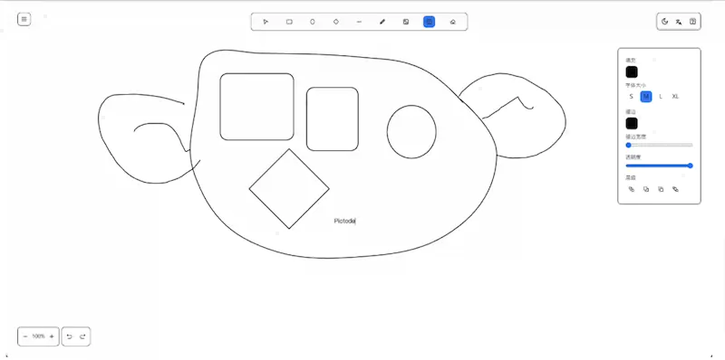
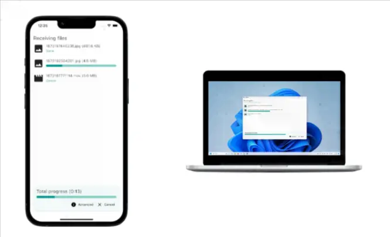
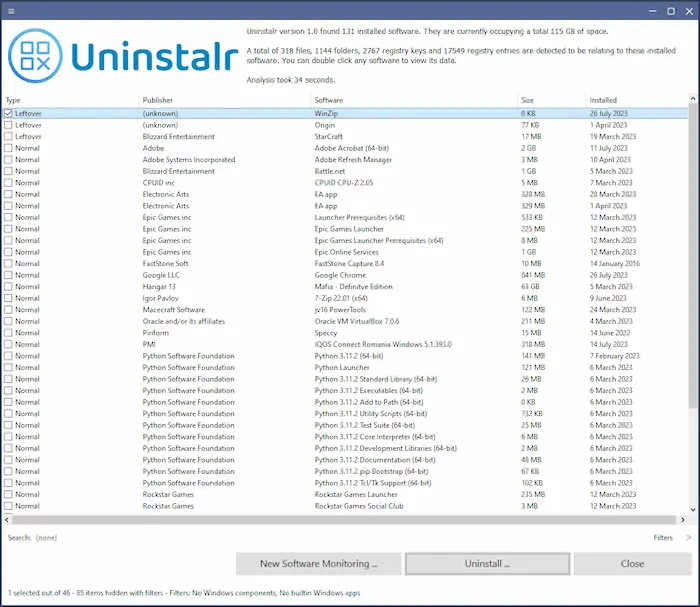
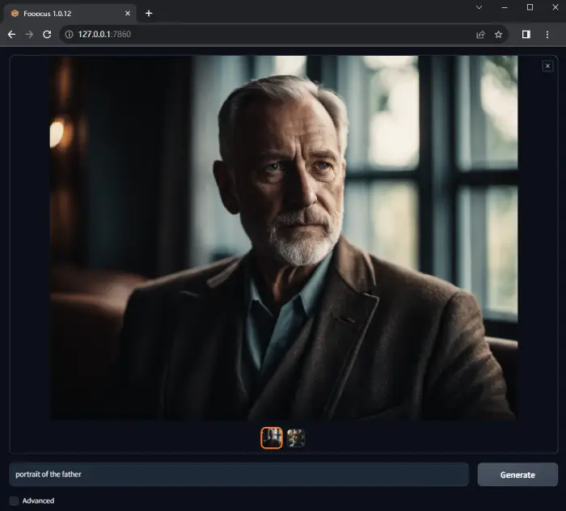

# 工具收集

### 通用工具
[**Pictode**](https://github.com/JessYan0913/pictode)**：一个开源的网页绘图编辑器** 

[**LocalSend**](https://localsend.org/)**：一款开源的跨平台文件传送软件，不需要互联网连接，依靠共享 Wifi 分享文件** 

### Windows
[**Uninstallr**](https://uninstalr.com/)**：一个免费的 Windows 卸载程序** 号称可以准确、完整地卸载各种 Windows 软件，残留最少。参见[作者自述](https://jv16powertools.com/blog/comparing-windows-uninstallers-and-making-uninstalr/) 

### AI相关
[**Fooocus**](https://github.com/lllyasviel/Fooocus)**：一个桌面应用，可以在离线条件下，通过文本生成图片** 

