# 工具收集

### 通用工具

#### [**Pictode**](https://github.com/JessYan0913/pictode)

一个开源的网页绘图编辑器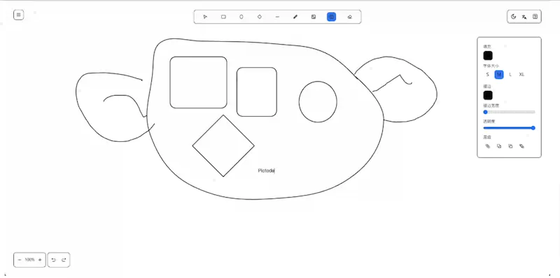

#### [**LocalSend**](https://localsend.org/)

一款开源的跨平台文件传送软件，不需要互联网连接，依靠共享 Wifi 分享文件**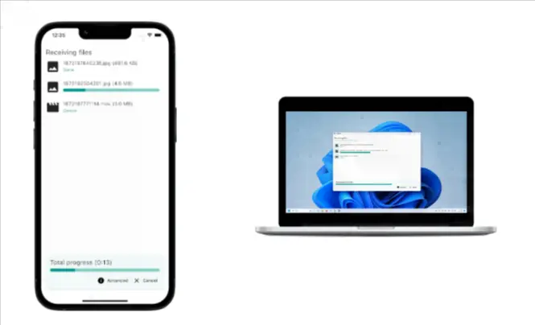

#### [Bun](https://bun.sh/)

一个 JS/TS 的服务器运行环境，兼容 Node.js 的所有 API，完全是从头实现的，运行速度大大快于 Node.js。

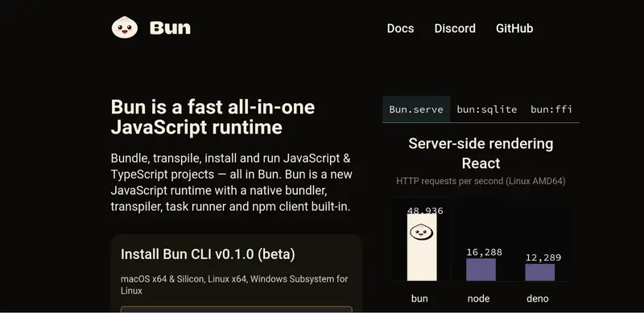

#### [LazyVim](https://www.lazyvim.org/)

neovim 的一套配置文件，让其快速变成一个 IDE

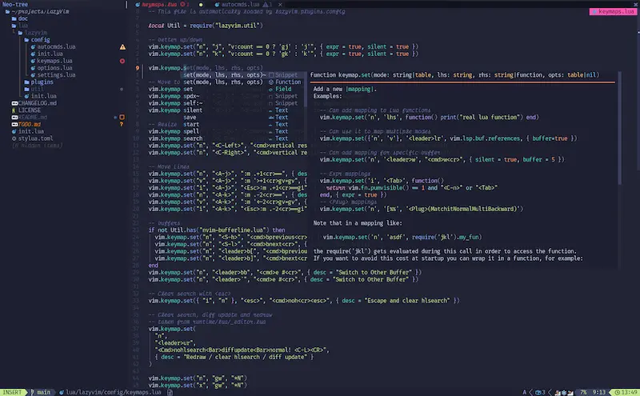

#### [CodeGeeX](https://keg.cs.tsinghua.edu.cn/codegeex/index_zh.html)

一个国产的代码生成的人工智能工具，跟 GitHub Copilot 类似，可以将一种语言的代码翻译成另一种，并提供 VS Code 插件。

#### [FlinClip SDK](https://www.finclip.com/ "官网")

FinClip 提供一套 SDK，不仅支持手机（iPhone、Android），还支持桌面（Windows、Linux、macOS）、手表、车机等各种平台。你的 App 只要加载了这套 SDK，就能直接运行微信小程序（以及小游戏），一行代码也不用修改。

#### [SirTunnel](https://github.com/anderspitman/SirTunnel)

一个开源软件，只需要50行代码，就能建立一条隧道，将你的内网电脑可以被公网访问，这里有一篇[教程](https://eighty-twenty.org/2023/01/27/sirtunnel-personal-ngrok)。

#### 安全：[browserscan.net](https://www.browserscan.net/)

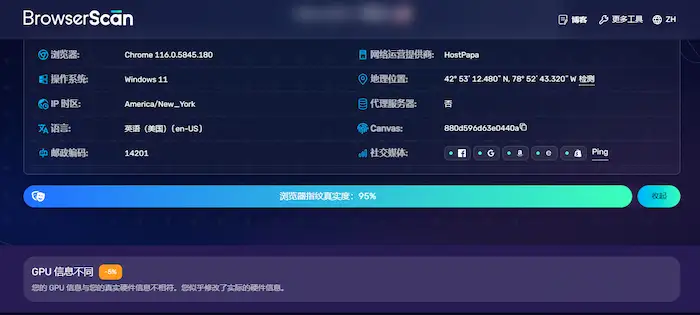

该网站检测浏览器指纹、IP 地址、WebRTC 泄露，DNS 泄露等信息。

### Windows

#### [**Uninstallr**](https://uninstalr.com/)

一个免费的 Windows 卸载程序**
号称可以准确、完整地卸载各种 Windows 软件，残留最少。参见[作者自述](https://jv16powertools.com/blog/comparing-windows-uninstallers-and-making-uninstalr/) 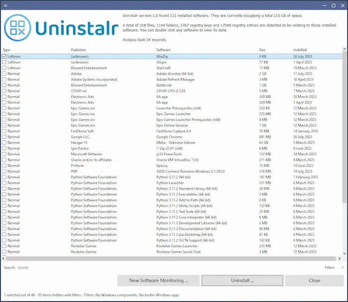

#### [DevToys](https://devtoys.app/)

一款 Windows 的小工具集合，收入了开发者会用到的许多小工具。

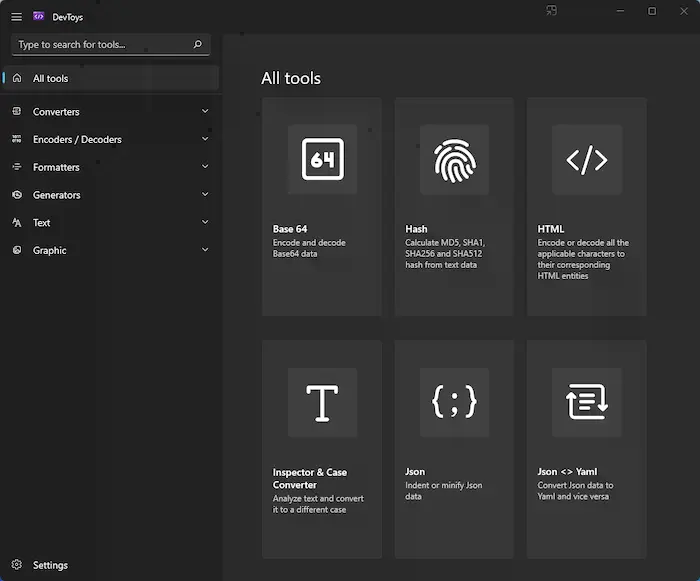

### AI相关

#### [**ChatGPT 中文网页版**](https://github.com/Yidadaa/ChatGPT-Next-Web)

一个开源的 ChatGPT 中文网页版，做得非常精致，可以自己部署。这里是 [Demo](https://chatgpt.gitapp.cn/)。

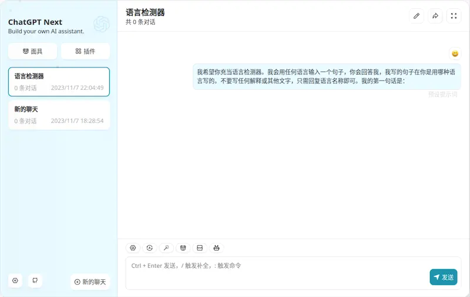

#### [Inke](https://github.com/yesmore/inke)

Notion 风格的开源 Web 笔记本，集成了 AI 自动补全（需要 OpenAI Key）。

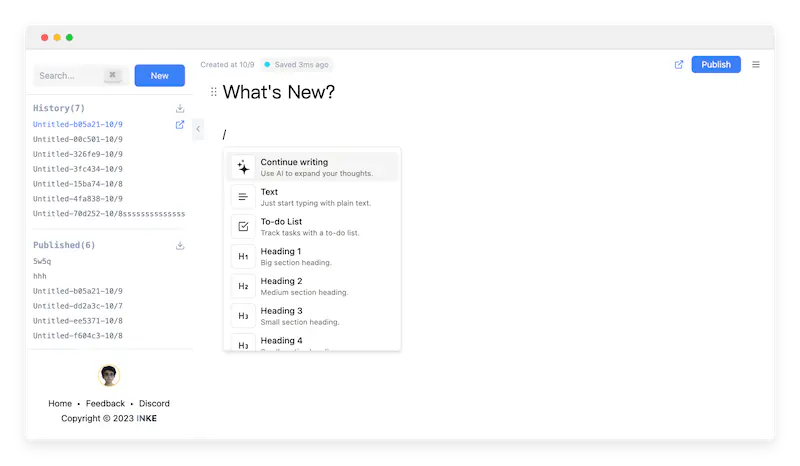

### AI/图像/图片.处理

#### [**Fooocus**](https://github.com/lllyasviel/Fooocus)

一个桌面应用，可以在离线条件下，通过文本生成图片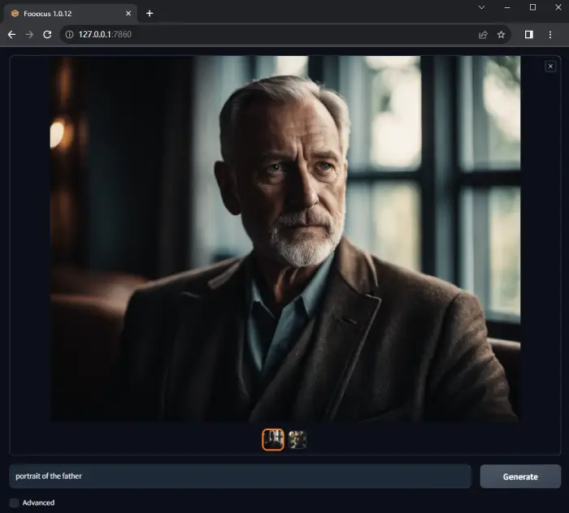

#### [Upscayl](https://github.com/upscayl/upscayl)

一个开源软件，可以将图片从低分辨率变成高分辨率，变得更清晰。

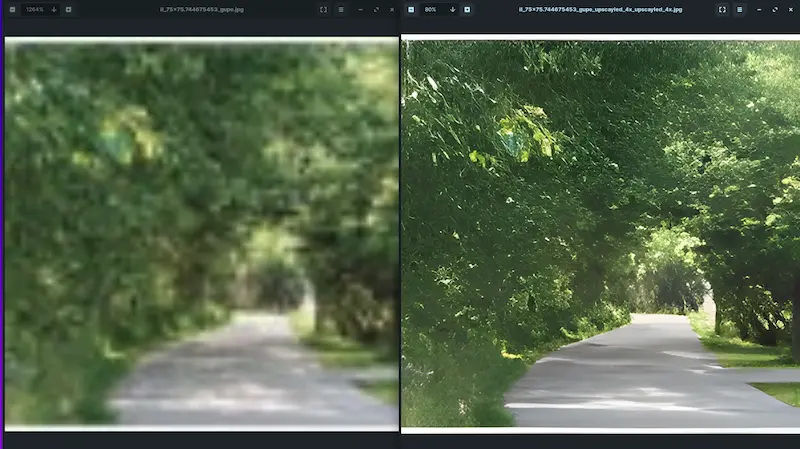

#### [Lama Cleaner](https://github.com/Sanster/lama-cleaner)

一个开源的 AI 工具，可以从图片上擦除任何不需要的物体。

#### [background-erase.xyz](https://background-erase.xyz/)

去除图片背景的免费网站，使用最新的删除图片背景的 AI 模型 RMBG-v1.4，所有计算都在本地完成，不用上传图片。

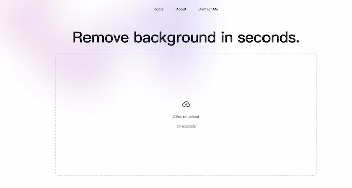

#### [ImageTools](https://ai-image.tools/home)

AI 一键抠图（去除背景）的在线工具。

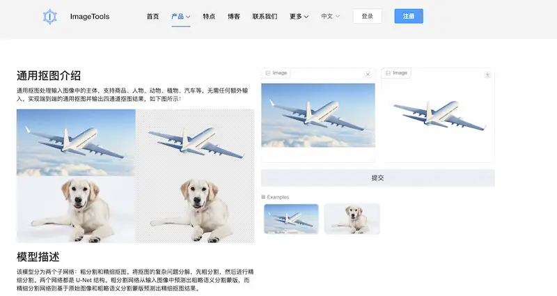

#### [Photo Relay](https://github.com/zobor/photo-relay)

一个封面图片制作的在线工具。 [Demo](https://www.duelpeak.com/pages/poster)。

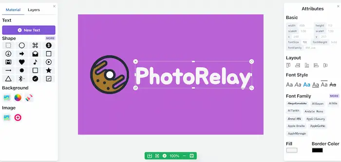

### 音视频相关

#### H5视频增强脚本

* 官网地址：[h5player.anzz.top(opens new window)](https://h5player.anzz.top/)
* GitHub地址：[github.com/xxxily/h5player(opens new window)](https://github.com/xxxily/h5player)
* GreasyFork：[greasyfork.org/scripts/381682](https://greasyfork.org/scripts/381682)

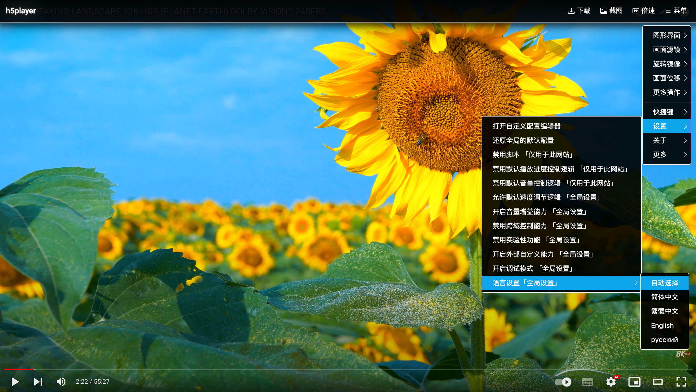

### TypeScript

#### [TSDiagram](https://tsdiagram.com/)

一个在线工具，让你用 TypeScript 写类型关系，自动生成图表。

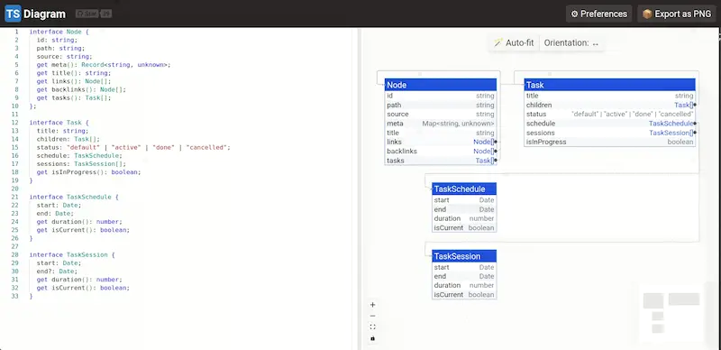

### React

#### [react-exercise-playground](https://github.com/fewismuch/react-playground)

一个开源的 React 练习场（playground）

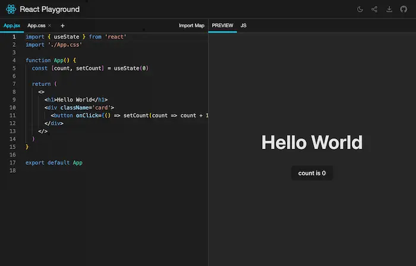

### 框架

#### [gin-vue-admin](https://www.gin-vue-admin.com/)

使用gin+vue进行急速开发的全栈开发基础平台(基础语言：后端/Go，前端/Javascript)

### 其他

#### [IconGo](https://icongo.github.io/)

开源的图标搜索引擎

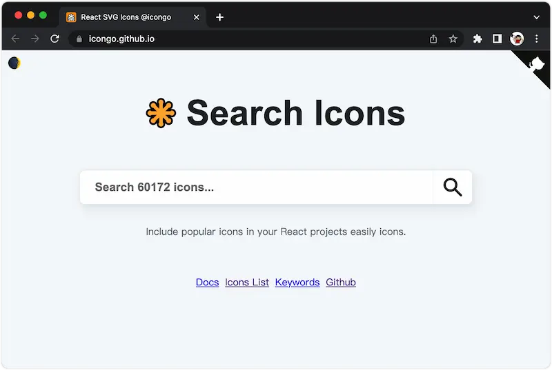

#### [Dexie.js](https://github.com/dexie/Dexie.js)

浏览器原生数据库 IndexedDB 的包装库，提供易于操作的 API。

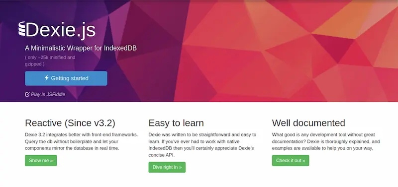

#### [Earthly](https://earthly.dev/)

一个开源的 CI/CD 框架，可以在本地架设自动构建服务。

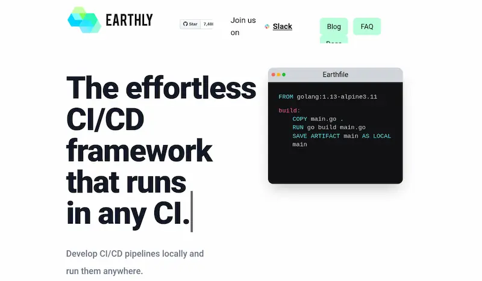

#### [opfs-tools](https://github.com/hughfenghen/opfs-tools)

浏览器私有文件系统 OPFS API 的一个封装库，提供更简单好用的 API。

OPFS（Origin Private File System）API是一个设计用于浏览器环境的Web API，它允许网页访问一个沙盒文件系统，用来存储用户数据。这个API是在浏览器中实现的，目的是为了在客户端提供一个更安全和私有的方式来处理文件数据。

Node.js是一个服务器端的JavaScript运行环境，有自己的一套文件系统API，即 `fs`模块。`fs`模块提供了丰富的文件操作API，允许Node.js应用读取、写入、修改文件系统中的文件。

因此，OPFS API并不直接适用于Node.js环境。Node.js的 `fs`模块是专门为服务器端设计的，而OPFS是为运行在浏览器中的Web应用设计的。

如果需要在Node.js中处理文件，应该使用 `fs`模块或者其他Node.js支持的文件处理库。如果你需要在浏览器中处理文件，并希望使用OPFS API，需要确保代码是在支持该API的浏览器中执行。

#### 开箱即用的 Obsidian / Typora 简历

#### [TypeScript 互动教程](https://www.learn-ts.org/)

通过一个个小练习，讲授 TypeScript 语法

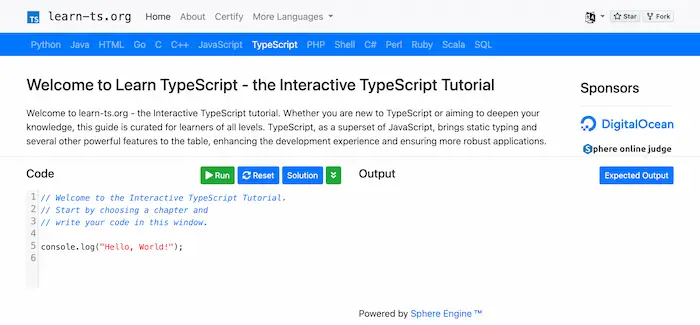

#### [Earthworm](https://github.com/cuixueshe/earthworm)

一个开源的 Web 程序，通过连词造句的方式，经过不断重复练习英语，[线上体验](https://earthworm.cuixueshe.com/)。

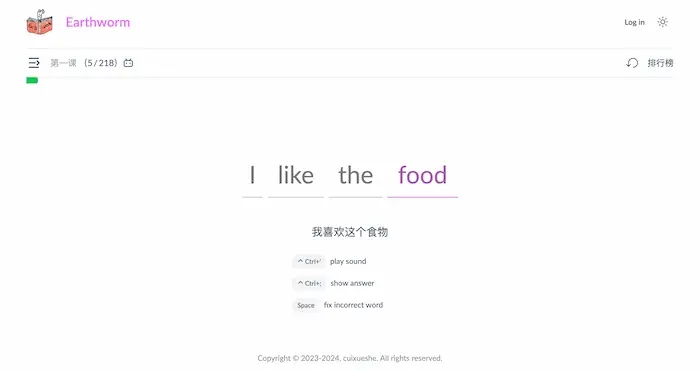

#### [git-diff-view](https://github.com/MrWangJustToDo/git-diff-view)

一个 React/Vue 组件，用来显示 git diff 的结果，类似于 GitHub 的样式。

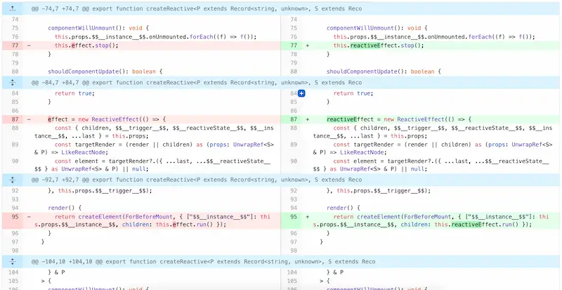

#### [LapisCV](https://github.com/BingyanStudio/LapisCV)

基于 Obsidian / Typora 编辑器的 Markdown 简历模板，可以导出 PDF 文件

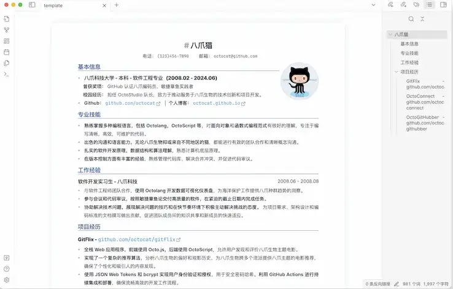
